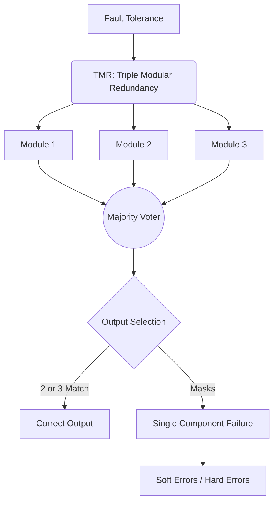

+++
title = "TMR (Triple Modular Redundancy, 삼중 모듈 중복)"
weight = 455
+++

> **Insight**
> - TMR(Triple Modular Redundancy)은 결함 허용(Fault Tolerance) 시스템을 구축하기 위한 다중화 기법 중 하나로, 동일한 작업을 수행하는 3개의 독립적인 모듈과 이들의 결과를 비교하는 다수결 투표기(Majority Voter)로 구성됩니다.
> - 하나의 모듈에 하드웨어 결함이나 일시적인 오류(Soft Error)가 발생하더라도, 나머지 두 모듈의 정상적인 결과가 투표를 통해 채택되므로 시스템 전체는 오류 없이 작동을 계속할 수 있습니다.
> - 생명과 직결되는 우주 항공(Spacecraft), 원자력 발전소 제어, 자율 주행 자동차 등 극도의 신뢰성이 요구되는 미션 크리티컬(Mission Critical) 시스템에서 필수적으로 채택되는 아키텍처입니다.

## Ⅰ. TMR의 개요 및 동작 원리

### 1. TMR(Triple Modular Redundancy)의 정의
TMR은 N-Modular Redundancy(NMR)의 가장 대표적인 형태로, 단일 장애점(SPOF)을 제거하고 하드웨어 오류를 마스킹(Masking)하기 위해 3개의 동일한 컴포넌트(모듈)를 병렬로 배치하는 설계 기법입니다.

### 2. 다수결 투표기 (Majority Voter)
TMR의 핵심은 3개의 모듈에서 출력된 결과를 취합하여 다수결의 원칙(2:1 또는 3:0)에 따라 최종 출력을 결정하는 투표기 회로(Voter Circuit)입니다. 만약 3개의 결과 중 2개가 일치하고 1개가 다르다면, 일치하는 2개의 결과를 정답으로 간주하고 최종 출력으로 내보냅니다. 이를 통해 단일 모듈의 결함(Single Fault)을 완벽하게 은폐(Masking)할 수 있습니다.

> 📢 **섹션 요약 비유:**
> 아주 중요한 수학 문제를 풀 때, 천재 수학자 한 명(단일 모듈)에게만 맡기면 실수할 수 있으니, 똑똑한 수학자 3명(TMR)에게 각자 풀게 한 다음, 최소 2명 이상이 똑같이 적어낸 답(다수결 투표)을 최종 정답으로 채택하는 방식입니다.

## Ⅱ. TMR 시스템 아키텍처

TMR 시스템은 입력 신호를 3개의 독립된 처리 장치로 복사하여 전달하고, 그 결과를 투표기가 검증하는 구조를 가집니다.

```ascii
             +-----------+
         +-->| Module 1  |--+ Result 1
         |   +-----------+  |
         |                  V
         |   +-----------+  |    +----------------+
 Input --+-->| Module 2  |--+--->| Majority Voter |--> Final Correct Output
         |   +-----------+  |    | (다수결 투표기) |
         |                  V    +----------------+
         |   +-----------+  |
         +-->| Module 3  |--+ Result 3
             +-----------+
```

* **입력 분배:** 동일한 입력(Input) 데이터와 클럭(Clock)이 세 모듈에 동시에 공급됩니다.
* **독립 처리:** 각 모듈(CPU, 메모리 뱅크, 센서 등)은 독립적으로 연산을 수행합니다.
* **오류 마스킹 (Error Masking):** Module 2에 방사선 충돌로 인한 일시적 오류(Single Event Upset)가 발생하여 잘못된 값이 출력되더라도, 정상인 Module 1과 Module 3의 출력값이 투표기를 거쳐 최종 출력으로 선택되므로 시스템은 오류를 인지하지 못하고 정상 작동합니다.

> 📢 **섹션 요약 비유:**
> 세 명의 재판관이 동시에 같은 증거를 보고 판결을 내릴 때, 한 재판관이 졸아서 엉뚱한 판결을 내려도, 나머지 두 재판관의 의견이 일치하면 그 의견이 최종 판결이 되는 3심 합의부 시스템과 같습니다.

## Ⅲ. TMR의 장단점 분석

결함 허용 관점에서 TMR은 매우 강력하지만, 뚜렷한 트레이드오프를 가집니다.

| 구분 | 특징 및 내용 |
| :--- | :--- |
| **장점 (Pros)** | **1. 무중단 오류 정정:** 오류 탐지 및 복구를 위한 시간 지연(Interrupt, Rollback 등) 없이 실시간으로 오류를 마스킹합니다.<br>**2. 투명성(Transparency):** 소프트웨어나 사용자는 하드웨어 오류가 발생했는지조차 알 필요 없이 정상 작동을 경험합니다.<br>**3. 단일 결함 완벽 방어:** 3개 중 1개의 모듈에 영구적/일시적 결함이 생겨도 100% 정상 작동합니다. |
| **단점 (Cons)** | **1. 엄청난 비용 (Overhead):** 하드웨어 면적(Area), 칩 크기, 전력 소모(Power), 비용이 최소 3배 이상 증가합니다.<br>**2. 투표기(Voter)가 SPOF가 될 위험:** 투표기 회로 자체에 결함이 생기면 전체가 실패합니다. (이를 방지하기 위해 투표기도 3중화하는 아키텍처 적용 가능).<br>**3. 다중 오류 취약성:** 동시에 2개 이상의 모듈에 다른 종류의 오류가 발생하거나 같은 오류(Common Mode Failure)가 발생하면 방어할 수 없습니다. |

> 📢 **섹션 요약 비유:**
> TMR은 완벽한 안전을 위해 쌍둥이 비행기 3대를 쇠사슬로 묶어 날게 하는 것과 같습니다. 비행기 1대가 고장나도 나머지 2대가 끌고 갈 수 있어 엄청나게 안전하지만, 기름값과 비행기 제작비가 3배 이상 드는 확실한 단점이 있습니다.

## Ⅳ. TMR의 주요 적용 분야

비용과 전력 소모의 제약에도 불구하고, 치명적인 실패(Catastrophic Failure)를 절대 용납할 수 없는 분야에 널리 쓰입니다.

1. **우주 항공 (Aerospace):** 인공위성이나 탐사선(예: 스페이스 셔틀, 화성 탐사 로버)은 우주 방사선에 의한 메모리 비트 반전(SEU, Soft Error)이 자주 발생하므로 CPU와 메모리에 TMR을 적용합니다.
2. **원자력 발전 및 산업 제어:** 원자로 냉각 시스템 제어기기 등 오작동 시 대규모 재난으로 이어지는 산업용 제어 시스템(ICS).
3. **자율 주행 시스템:** 차량의 센서 데이터 융합 및 조향/제동을 결정하는 핵심 두뇌 프로세서에서 하드웨어 결함에 대비하기 위해 논리적/물리적 TMR 아키텍처를 도입합니다.

> 📢 **섹션 요약 비유:**
> 고장 났다고 해서 우주 한가운데서 우주선을 정비소에 맡길 수 없고, 자율 주행 중인 자동차를 껐다 켤 수 없기 때문에, 스스로 살아남을 수 있는 불사신의 심장(TMR)을 장착하는 것입니다.

## Ⅴ. TMR의 발전 및 변형 모델

기본적인 TMR의 비용 문제를 해결하거나 신뢰성을 더 높이기 위한 발전된 모델들이 존재합니다.

1. **소프트웨어 TMR (Software TMR):** 하드웨어를 3배로 늘리지 않고, 동일한 입력 데이터를 3개의 서로 다른 알고리즘이나 프로세스(스레드)로 처리한 후 결과를 비교하는 방식입니다. 시간적 이중화(Time Redundancy)를 활용합니다.
2. **N-Modular Redundancy (NMR):** 요구되는 신뢰성 수준에 따라 3중(TMR)을 넘어 5중, 7중(예: 5MR) 모듈을 사용하여 다수결을 진행하는 극단적인 고신뢰성 아키텍처입니다.
3. **투표기 다중화 (TMR with Triplicated Voters):** TMR 시스템에서 투표기 자체가 단일 장애점(SPOF)이 되는 것을 막기 위해, 투표 회로 자체도 3개로 구성하여 다음 단계의 모듈로 전달하는 아키텍처입니다.

> 📢 **섹션 요약 비유:**
> 하드웨어 3개를 사는게 너무 비싸다면 컴퓨터 한 대로 시간을 두고 똑같은 계산을 세 번 반복하게 시킬 수도 있고(소프트웨어 TMR), 3명도 불안하다면 5명, 7명의 심사위원(NMR)을 앉혀서 더욱 깐깐하게 검증하는 것으로 발전시킬 수 있습니다.

---

### 💡 Knowledge Graph & Child Analogy



> **👶 Child Analogy (어린이 비유):**
> 마법의 성을 지키기 위해 똑같이 생긴 경비병 3명을 세워두는 거예요. 어떤 마녀가 나타나서 경비병 한 명에게 최면을 걸어 헛소리를 하게 만들어도, 나머지 두 명의 제정신인 경비병이 "저 친구가 지금 헛소리를 하고 있어! 우리 둘의 말이 맞아!"라고 외치면, 성문은 안전하게 지켜질 수 있답니다. 이것이 바로 TMR의 마법이에요!
