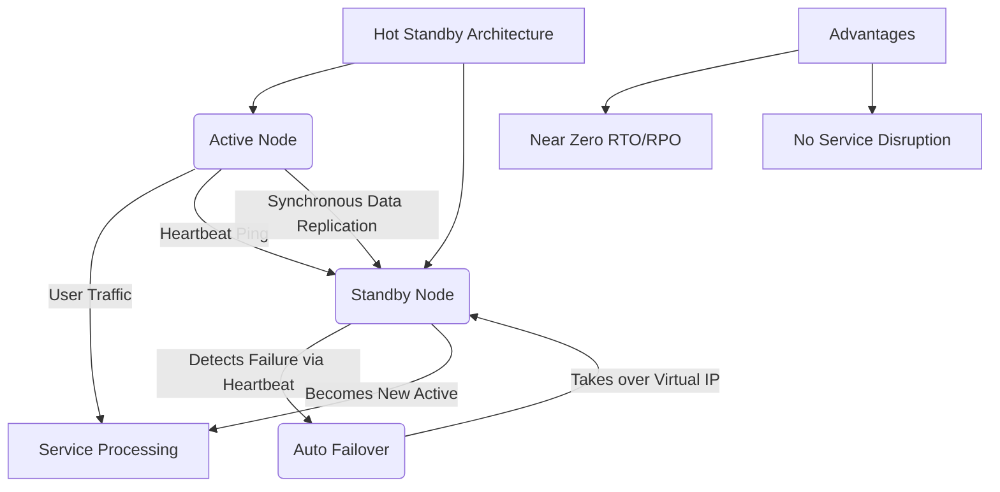

+++
title = "핫 스탠바이 (Hot Standby)"
weight = 457
+++

> **Insight**
> - 핫 스탠바이(Hot Standby)는 고가용성(High Availability) 클러스터 환경에서 주 서버(Active)의 장애에 대비하여 예비 서버(Standby)가 즉시 서비스를 인계받을 수 있도록 '전원이 켜진 상태로 주 서버와 데이터를 실시간으로 동기화하며 대기'하는 이중화 방식입니다.
> - 장애 발생 시 서비스 중단 시간(Downtime)을 수 초 이내로 최소화(RTO ≈ 0)하고 데이터 손실을 방지(RPO ≈ 0)할 수 있는 가장 높은 수준의 결함 복구 메커니즘을 제공합니다.
> - 주로 금융 결제 시스템, 대규모 통신망, 엔터프라이즈 데이터베이스 등 무중단 서비스가 필수적인 Mission Critical 환경에 적용됩니다.

## Ⅰ. 핫 스탠바이의 개요 및 핵심 개념

### 1. 핫 스탠바이(Hot Standby)의 정의
핫 스탠바이는 두 개 이상의 시스템 노드로 구성된 Active-Standby 아키텍처에서, 대기(Standby) 노드가 운영(Active) 노드와 완전히 동일한 하드웨어 및 소프트웨어 구성을 갖추고 실시간으로 상태 및 데이터를 동기화하며 가동 중인 상태를 말합니다. 주 시스템에 결함이 발생하면 예비 시스템이 즉각적으로 트래픽과 서비스 권한을 탈취(Takeover)하여 중단 없는 서비스를 이어갑니다.

### 2. 무중단 서비스의 핵심: RTO와 RPO
재해 복구 및 고가용성 설계에서 가장 중요한 두 가지 지표를 핫 스탠바이는 극한까지 최적화합니다.
* **RTO (Recovery Time Objective, 목표 복구 시간):** 장애 발생 후 서비스가 다시 재개될 때까지 허용되는 최대 시간. 핫 스탠바이는 이를 **수 초 내외**로 줄입니다.
* **RPO (Recovery Point Objective, 목표 복구 시점):** 장애 발생 시 허용되는 데이터 손실량. 실시간 동기화를 통해 RPO를 **거의 0(Zero)** 에 가깝게 만듭니다.

> 📢 **섹션 요약 비유:**
> 연극 무대에서 주연 배우(Active)가 연기하는 동안, 대역 배우(Hot Standby)가 무대 바로 뒤에서 주연과 똑같은 대본을 외우고 의상을 완전히 갖춰 입은 채로 대기하다가 주연이 쓰러지면 1초의 지체 없이 무대에 뛰어들어 연기를 이어가는 것과 같습니다.

## Ⅱ. 핫 스탠바이 시스템 아키텍처 및 동작 매커니즘

핫 스탠바이 환경은 실시간 동기화와 심장 박동 모니터링이 핵심입니다.

```ascii
[ User Traffic ]
       |
+---------------------+
|    Load Balancer    | (Virtual IP 라우팅)
+---------------------+
       |        | (장애 발생 시 트래픽 자동 전환)
       V        X
+-----------+  +-----------+
| Active    |  | Standby   | <-- 핫 스탠바이 노드 (전원 ON, 앱 구동 중)
| Node      |  | Node      |
| (Primary) |  | (Backup)  |
+-----------+  +-----------+
      |              |
      +----[ Heartbeat Link ]----> 주기적인 상태 체크 (Ping/Keepalive)
      |              |
      +----[ Data Replication ]--> 트랜잭션 데이터 실시간 동기화 (Sync)
      |              |
+-----------------------------------+
|         Shared Storage (SAN)      | (선택적: 스토리지 레벨 동기화 시)
+-----------------------------------+
```

### 1. 상태 동기화 (State & Data Replication)
Active 노드에서 발생하는 모든 트랜잭션, 세션 정보, 데이터베이스 변경 사항이 실시간으로 Standby 노드로 미러링(Mirroring)되거나 복제됩니다.
### 2. 하트비트(Heartbeat)와 헬스 체크
두 노드 간에 전용 네트워크 라인(Heartbeat Link)을 통해 1초 단위로 생존 여부 핑(Ping)을 주고받습니다. 만약 Standby 노드가 연속적으로 하트비트 신호를 받지 못하면 주 노드의 장애로 간주합니다.
### 3. 자동 장애 조치 (Auto Failover / Takeover)
장애 감지 시, Standby 노드는 주 노드의 역할(Virtual IP, MAC 주소, 스토리지 접근 권한 등)을 강제로 탈취하여 자신이 새로운 Active 노드로 승격(Promotion)됩니다.

> 📢 **섹션 요약 비유:**
> 심박 측정기(Heartbeat)를 달아놓은 주치의가 환자의 심장이 멈추는 것을 감지하자마자, 대기 중이던 똑같은 환자 로봇을 깨워 원래 환자의 이름표(Virtual IP)를 붙여주고 활동하게 하는 자동화된 수술실과 같습니다.

## Ⅲ. 핫 스탠바이 vs 콜드 스탠바이 vs 웜 스탠바이

대기 시스템의 준비 상태에 따라 세 가지로 분류됩니다.

| 비교 항목 | Hot Standby (핫 스탠바이) | Warm Standby (웜 스탠바이) | Cold Standby (콜드 스탠바이) |
| :--- | :--- | :--- | :--- |
| **시스템 전원** | ON (항상 켜져 있음) | ON (켜져 있음) | OFF (꺼져 있거나 대기 상태) |
| **애플리케이션 상태** | 구동 중, 세션/데이터 실시간 동기화 | 구동 중이거나 대기, 주기적 백업 적용 | 종료 상태, OS 부팅부터 시작 필요 |
| **장애 조치 (Failover) 전환** | 자동 (수 초 이내 즉각 전환) | 자동/수동 (수 분 ~ 수십 분 소요) | 수동 (수 시간 ~ 수 일 소요) |
| **데이터 손실 (RPO)** | 거의 없음 (Zero) | 백업 주기에 따라 약간 발생 | 백업 시점에 따라 크게 발생 |
| **구축 및 유지 비용** | 매우 높음 (이중 인프라 100% 가동) | 높음 | 낮음 (최소 인프라 유지) |

> 📢 **섹션 요약 비유:**
> 핫 스탠바이는 '엔진을 켜고 옆 차선에서 같이 달리는 대기 차량', 웜 스탠바이는 '휴게소에서 시동만 걸어둔 대기 차량', 콜드 스탠바이는 '차고에 주차되어 있어 키를 꽂고 예열부터 해야 하는 대기 차량'입니다.

## Ⅳ. 주요 적용 기술 및 사례

1. **데이터베이스 이중화:**
   * **Oracle Data Guard:** Active DB의 트랜잭션 로그(Redo Log)를 실시간으로 Standby DB로 전송하여 동일한 상태를 유지합니다.
   * **PostgreSQL / MySQL Replication:** 동기식(Synchronous) 복제를 구성하여 트랜잭션 커밋 전에 양쪽 노드의 동기화를 보장합니다.
2. **네트워크 인프라 (L4/L7 스위치, 라우터):** VRRP (Virtual Router Redundancy Protocol)나 HSRP를 사용하여 마스터 라우터가 죽으면 즉시 백업 라우터가 가상 IP를 인계받아 통신을 유지합니다.
3. **클라우드 환경:** AWS의 Multi-AZ (Availability Zone) RDS 배포나 동기식 클러스터링을 통해 존 단위의 재해에 핫 스탠바이 방식으로 대비합니다.

> 📢 **섹션 요약 비유:**
> 은행 계좌의 돈이 이동하는 순간(DB 트랜잭션)을 두 대의 금고 장부가 0.001초의 오차도 없이 동시에 기록하는 기술이 핫 스탠바이의 가장 대표적인 활약상입니다.

## Ⅴ. 핫 스탠바이 구축 시 고려사항 (한계점)

완벽에 가까운 가용성을 제공하지만, 극복해야 할 시스템적 한계도 존재합니다.

* **비용의 비효율성:** 항상 2대의 서버를 최고 성능으로 구동하지만, 평상시 Standby 서버는 트래픽을 처리하지 않으므로 자원 활용률이 50%에 불과합니다. (이 단점을 보완하기 위해 읽기 전용 트래픽만 분산시키는 Read Replica 형태로 응용하기도 합니다.)
* **스플릿 브레인 (Split-Brain) 위험:** 두 노드 모두 정상이나 하트비트 네트워크 회선만 끊어진 경우, 서로 상대방이 죽었다고 판단하여 자신이 Active 노드라고 주장하는 뇌 기능 분열 현상이 발생할 수 있습니다. 이를 막기 위해 제3의 감시자(Tie-breaker)를 두거나 스토리지를 펜싱(STONITH)하는 장치가 필수입니다.
* **소프트웨어 버그 전파:** Active 노드에 치명적인 소프트웨어 버그나 잘못된 쿼리(예: DROP TABLE)가 실행되면, 실시간 동기화로 인해 Standby 노드에도 즉시 재앙이 복제되어 두 노드가 동시에 파괴될 수 있습니다.

> 📢 **섹션 요약 비유:**
> 핫 스탠바이는 완벽한 복제 인간 비서를 두는 것과 같아서 비서 유지비가 두 배로 들고, 만약 두 사람이 서로 자기가 진짜라고 싸우는 문제(스플릿 브레인)를 중재할 완벽한 감시자 시스템이 추가로 필요합니다.

---

### 💡 Knowledge Graph & Child Analogy



> **👶 Child Analogy (어린이 비유):**
> 축구 경기에서 골키퍼(Active)가 공을 막고 있을 때, 골대 바로 옆에서 유니폼과 장갑을 완벽하게 끼고 몸까지 다 푼 대기 선수(Hot Standby)가 서 있는 거예요. 만약 주전 골키퍼가 앗! 하고 넘어지면, 대기 선수가 1초도 안 걸리고 휙 뛰어들어와서 날아오는 공을 대신 막아주는 아주 든든한 방어 시스템이랍니다!
