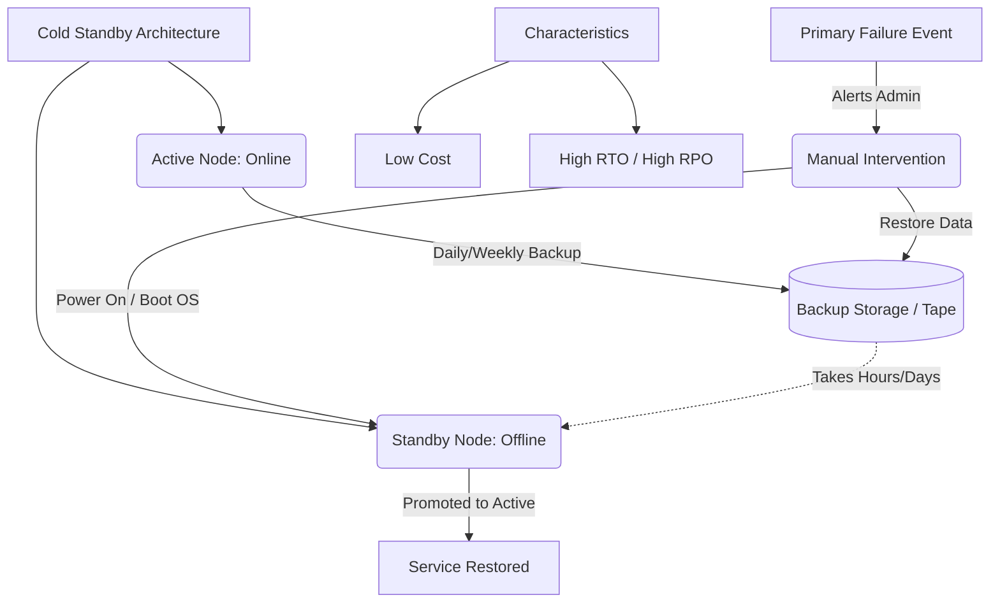

+++
title = "콜드 스탠바이 (Cold Standby)"
weight = 458
+++

> **Insight**
> - 콜드 스탠바이(Cold Standby)는 장애 복구를 위해 예비 시스템을 마련해 두지만, 평상시에는 전원을 끄거나 서비스를 중단한 상태로 대기시키는 가장 기본적인 형태의 시스템 이중화 방식입니다.
> - 주 시스템(Active)에 장애가 발생하면, 관리자가 수동으로 예비 장비의 전원을 켜고 OS를 부팅하며 백업된 데이터를 복원하는 과정을 거쳐 서비스를 재개합니다.
> - 복구에 수 시간에서 길게는 며칠이 소요되어 RTO(복구 시간 목표)가 길고 데이터 손실(RPO) 위험이 크지만, 구축 및 유지 보수 비용이 가장 저렴하여 비핵심 업무 시스템에 널리 사용됩니다.

## Ⅰ. 콜드 스탠바이의 개요 및 목적

### 1. 콜드 스탠바이(Cold Standby)의 정의
콜드 스탠바이는 고가용성(HA) 및 재해 복구(DR) 아키텍처 중 가장 낮은 수준의 준비 상태를 유지하는 모델입니다. 대기 노드(Standby Node)는 주 노드(Active Node)와 유사한 하드웨어를 갖추고 있으나, 평상시에는 오프라인 상태이거나 핵심 애플리케이션 서비스가 구동되지 않는 상태로 유휴(Idle) 대기합니다. 

### 2. 설계 목적
모든 시스템이 1초의 중단도 허용하지 않는 무중단 서비스(Hot Standby)를 요구하는 것은 아닙니다. 사내 인트라넷 게시판, 주간/월간 배치 리포팅 서버, 아카이브 시스템 등은 몇 시간 정도 멈춰도 비즈니스에 치명적인 타격을 주지 않습니다. 콜드 스탠바이는 이러한 비핵심 서비스에 대해 막대한 이중화 유지 비용을 절감하면서도, 치명적인 하드웨어 파손 시 최소한의 복구 대책을 마련하기 위한 가성비 높은 보험 전략입니다.

> 📢 **섹션 요약 비유:**
> 평소에 타고 다니는 자동차가 고장 났을 때를 대비해 창고에 예비 타이어와 부품을 사두었지만, 실제로 고장 나면 창고 문을 열고 직접 조립해서 시동을 걸어야 하는 아날로그 방식의 대비책입니다.

## Ⅱ. 콜드 스탠바이의 장애 복구 매커니즘 (Failover Process)

콜드 스탠바이 환경에서 장애가 발생했을 때 서비스를 복구하는 절차는 대부분 '수동(Manual)' 개입에 의존하며 여러 단계를 거칩니다.

```ascii
[ Active Node (장애 발생!) ]  --X-- (서비스 중단)
       |
       v
1. 시스템 관리자 알림 수신 (장애 인지)
2. Standby 장비 구동 결단
       |
       v
[ Standby Node (콜드 스탠바이 가동 시작) ]
  (1) 장비 전원 인가 (Power ON) 및 OS 부팅
  (2) 네트워크 및 IP 설정 변경 (기존 주 서버 IP 할당)
  (3) 애플리케이션 설치 또는 서비스 데몬(Daemon) 실행
  (4) 테이프, 외장 하드, 원격지 백업본에서 최신 데이터 복원 (Restore)
  (5) 데이터 정합성 검증 후 서비스 재개 (트래픽 라우팅 복구)
```

이 모든 절차를 수행하는 데 소요되는 시간은 시스템의 규모와 백업 데이터 크기에 따라 수 시간(Hours)에서 길게는 수 일(Days)이 걸릴 수 있습니다.

> 📢 **섹션 요약 비유:**
> 주방장이 아파서 쓰러지면, 집에서 자고 있던 예비 요리사에게 전화를 걸고(수동 인지), 요리사가 출근해서 옷을 갈아입고, 재료를 다시 다듬은 뒤에야 비로소 주문받은 요리를 다시 만들 수 있는(긴 복구 시간) 과정입니다.

## Ⅲ. 콜드 스탠바이의 한계: RTO와 RPO 관점

재해 복구의 핵심 지표인 RTO(Recovery Time Objective)와 RPO(Recovery Point Objective) 관점에서 콜드 스탠바이는 매우 취약합니다.

* **긴 RTO (복구 시간 목표):** 앞선 복구 절차로 인해 서비스 중단 시간(Downtime)이 깁니다. 즉시 서비스 복구가 불가능합니다.
* **큰 데이터 손실, 긴 RPO (복구 시점 목표):** 실시간 데이터 동기화가 이루어지지 않으므로, 마지막으로 수행한 정기 백업(예: 어젯밤 12시 일일 백업) 시점 이후부터 장애 발생 시점 사이의 데이터는 영구적으로 유실됩니다.

| 비교 항목 | Hot Standby | Warm Standby | Cold Standby |
| :--- | :--- | :--- | :--- |
| **비용 (CAPEX / OPEX)** | 매우 높음 (실시간 구동) | 중간 (주기적 동기화) | **가장 낮음 (대기 장비만 유지)** |
| **RTO (복구까지 걸리는 시간)** | 수 초 이내 (거의 없음) | 수 분 ~ 수십 분 | **수 시간 ~ 수 일 (매우 김)** |
| **RPO (유실되는 데이터 량)** | 0 (Zero Data Loss) | 백업 주기에 따라 약간 | **마지막 백업 시점 이후 모두 유실** |

> 📢 **섹션 요약 비유:**
> 문서를 작성할 때 10분에 한 번씩 수동으로 USB에 저장(백업)하다가 컴퓨터가 고장나면, 새 컴퓨터를 켜고 USB를 꽂아 복사해야 하므로 시간도 오래 걸리고(RTO), 마지막 저장 이후에 쓴 글(RPO)은 다 날아가는 것과 똑같습니다.

## Ⅳ. 콜드 스탠바이의 주요 활용 사례 및 발전

저렴한 비용이라는 명확한 장점 때문에 특정 시나리오에서는 여전히 매력적인 아키텍처입니다.

1. **클라우드 기반 재해 복구(DR) 사이트:** 온프레미스 메인 센터가 셧다운되는 대형 재난에 대비하기 위해 클라우드에 인프라(VPC, 서브넷 등) 뼈대만 만들어 놓고, 실제 가상 머신(VM) 인스턴스는 꺼둔(Stop) 상태로 요금을 최소화하는 전략. (필요 시에만 VM을 부팅하고 백업 스토리지를 마운트).
2. **비핵심 백오피스 시스템:** 장애가 발생해도 기업의 매출이나 고객 서비스에 즉각적인 피해를 주지 않는 내부망 직원용 시스템, 또는 문서 아카이브 서버.
3. **오프라인 하드웨어 스페어(Spare):** 서버 랙(Rack)에 남는 여분의 물리 서버를 장착만 해두고, 고장 난 장비에서 하드디스크만 빼서 예비 장비에 꽂아 부팅시키는 물리적 차원의 콜드 스탠바이.

> 📢 **섹션 요약 비유:**
> 비싼 별장을 1년 내내 보일러를 켜고 관리인(핫 스탠바이)을 두는 대신, 문을 잠가두고 전기와 수도를 끊어 유지비를 아끼다가(콜드 스탠바이) 여름 휴가철에 방문할 때만 하루 전날 가서 청소하고 불을 켜는 실용적인 경제 전략입니다.

## Ⅴ. 콜드 스탠바이 설계 시 유의점 (Best Practices)

콜드 스탠바이를 운영하더라도 장애 상황에서 신속하고 정확하게 대응하기 위한 대비책이 필요합니다.

* **런북(Runbook)의 문서화:** 장애 발생 시 담당자가 패닉에 빠지지 않도록 장비 부팅부터 네트워크 설정, 데이터 복원, 서비스 오픈까지의 매뉴얼이 스크립트 수준으로 상세히 문서화되어 있어야 합니다.
* **정기적인 모의 훈련 (DR Drill):** 콜드 장비가 실제로 잘 켜지는지, 백업된 테이프나 스토리지가 손상되지 않고 정상 복원되는지 최소 연 1~2회 오프라인 환경에서 복구 훈련을 수행해야 합니다.
* **설정 표류(Configuration Drift) 방지:** 주 서버(Active)에서 OS 패치나 방화벽 설정이 변경되었을 때, 꺼져 있는 콜드 서버에는 이 내역이 반영되지 않아 막상 장애 시 부팅하면 서비스가 구동되지 않는 현상을 각별히 방지해야 합니다.

> 📢 **섹션 요약 비유:**
> 소화기(콜드 스탠바이)를 벽에 걸어만 둔다고 끝나는 게 아니라, 정기적으로 압력을 체크하고(훈련) 위치와 사용법(런북)을 모든 직원이 알아야 진짜 불이 났을 때 쓸모가 있는 것과 같습니다.

---

### 💡 Knowledge Graph & Child Analogy



> **👶 Child Analogy (어린이 비유):**
> 매일 타고 다니는 멋진 파란 자전거(Active)가 있는데, 혹시 바퀴가 완전히 망가질까 봐 창고에 포장도 안 뜯은 예비 빨간 자전거(Cold Standby)를 사두었어요. 파란 자전거가 망가지면 곧바로 자전거를 탈 수는 없어요. 창고 열쇠를 찾아서, 빨간 자전거 박스를 뜯고, 핸들도 조립하고, 타이어에 바람까지 빵빵하게 넣은(수동 복구) 다음에서야 다시 신나게 달릴 수 있답니다. 대신 파란 자전거 두 대를 동시에 굴리는 것보다는 용돈을 아낄 수 있죠!
