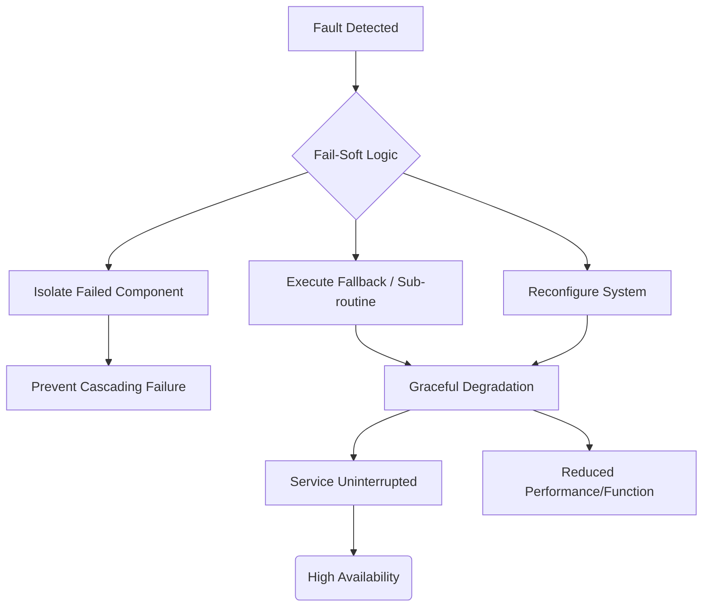

+++
title = "페일 소프트 (Fail-Soft)"
weight = 460
+++

> **Insight**
> - 페일 소프트(Fail-Soft)는 시스템의 일부 구성 요소에 장애가 발생했을 때 시스템 전체를 중단시키지 않고, 성능이나 기능을 제한적인 수준(Degraded Mode)으로 낮추어 지속적으로 핵심 서비스를 제공하는 결함 허용(Fault Tolerance) 설계 기법입니다.
> - "모 아니면 도(All or Nothing)" 방식의 완전한 서비스 중단(Fail-Stop)을 방지하며, 사용자 경험 저하를 최소화하면서도 시스템의 생존성을 극대화하는 데 목적이 있습니다.
> - 클라우드 마이크로서비스(Microservices), 항공기 제어 시스템, 대규모 분산 스토리지 등에서 시스템 가용성(Availability)을 보장하는 핵심 아키텍처 원칙입니다.

## Ⅰ. 페일 소프트(Fail-Soft)의 개요 및 설계 철학

### 1. 페일 소프트(Fail-Soft)의 정의
페일 소프트는 하드웨어 결함, 소프트웨어 버그, 또는 네트워크 단절 등으로 인해 시스템의 일부분이 정상 작동하지 않을 때, 즉시 전체 시스템을 다운(Shutdown)시키는 대신 장애가 발생한 모듈을 격리(Isolation)하고 남은 정상 자원만을 활용하여 제한된 기능(Reduced Functionality) 또는 저하된 성능(Degraded Performance)으로 운영을 계속하는 시스템 특성입니다. 다른 말로 **우아한 성능 저하(Graceful Degradation)** 라고도 불립니다.

### 2. 설계 철학 (Design Philosophy)
복잡한 현대 시스템에서는 100% 무결점을 보장하는 것이 불가능합니다. 따라서 페일 소프트는 '장애는 반드시 발생한다'는 전제하에, 장애의 영향을 국소화(Localization)하고 가장 중요한 핵심 기능(Mission-Critical Functions)을 끝까지 유지하는 것에 초점을 맞춥니다. 부가적인 기능은 과감히 포기(Shedding)하더라도 시스템의 본질적인 목적은 달성하도록 설계합니다.

> 📢 **섹션 요약 비유:**
> 배가 고장 나 기관실에 물이 들어올 때, 배 전체가 가라앉게 내버려 두는 대신 기관실 문만 꽉 닫아버리고 남은 엔진과 돛을 이용해 속도는 느리지만 어떻게든 항구까지 안전하게 항해하는 생존 전략과 같습니다.

## Ⅱ. 페일 소프트 시스템의 아키텍처 및 메커니즘

페일 소프트 아키텍처는 장애 탐지, 격리, 재구성의 3단계를 거쳐 저하된 모드(Degraded Mode)로 진입합니다.

```ascii
[ User Request ]
       |
+---------------------------------------------------+
|               Load Balancer / API Gateway         |
+---------------------------------------------------+
       |                   |                   |
       v                   v                   v
+--------------+    +--------------+    +--------------+
| Service A    |    | Service B    |    | Service C    |
| (Core Func)  |    | (Sub Func)   |    | (Extra Func) |
| [ OK ]       |    | [ FAILED! ]  |    | [ OK ]       |
+--------------+    +--------------+    +--------------+
       |                   X                   |
       |             (Isolated/Shed)           |
       +---------------------------------------+
       |
       v
[ Graceful Degradation / Degraded Mode ]
 -> Service B 기능 비활성화 또는 캐시(Cache)된 과거 데이터 제공.
 -> 전체 서비스는 중단되지 않음!
```

### 동작 메커니즘
1. **장애 탐지 (Fault Detection):** 하트비트(Heartbeat), 타임아웃(Timeout), 오류율 모니터링을 통해 컴포넌트의 이상을 감지합니다.
2. **격리 및 차단 (Isolation):** 서킷 브레이커(Circuit Breaker) 패턴 등을 사용하여 고장 난 모듈로 향하는 트래픽을 차단하여 연쇄 장애(Cascading Failure)를 막습니다.
3. **재구성 및 우회 (Reconfiguration & Fallback):** 대체 경로를 찾거나, 해당 기능을 비활성화하고 기본값(Default Value)이나 캐시(Cache) 데이터를 반환하도록 시스템을 재구성합니다.

> 📢 **섹션 요약 비유:**
> 레스토랑에서 오븐이 고장 났을 때 식당 문을 아예 닫는 것이 아니라, "죄송하지만 오늘은 오븐 요리는 안 되고 샐러드와 차가운 샌드위치만 주문 가능합니다"라고 메뉴판(시스템 구성)을 바꿔 영업을 계속하는 것과 같습니다.

## Ⅲ. 페일 소프트(Fail-Soft) vs 페일 세이프(Fail-Safe) vs 페일 스톱(Fail-Stop)

결함 처리 방식은 시스템의 목적에 따라 다르게 설계됩니다.

| 설계 기법 | 정의 및 특징 | 적용 예시 |
| :--- | :--- | :--- |
| **Fail-Soft (페일 소프트)** | 장애 시 **성능/기능을 낮춰서라도 작동을 계속**함 (가용성 우선). 우아한 성능 저하(Graceful Degradation). | 영상 스트리밍(화질 저하), 쇼핑몰(추천 기능만 정지), 다발 엔진 항공기 |
| **Fail-Safe (페일 세이프)** | 장애 시 시스템 작동을 멈추되, **안전한 상태(Safe State)로 유도**함 (안전성 우선). 인간과 환경 보호. | 철도 건널목 차단기(고장 시 차단기가 내려감), 엘리베이터(고장 시 멈춤) |
| **Fail-Stop (페일 스톱)** | 장애 발생 즉시 **시스템을 완전히 중단**하고 오류를 보고함 (데이터 무결성 우선). | 데이터베이스 트랜잭션 오류, 파일 시스템 커럽션 방지 |

> 📢 **섹션 요약 비유:**
> 자동차 브레이크에 문제가 생겼을 때, Fail-Soft는 '속도를 30km 이하로 제한해서 달리기'이고, Fail-Safe는 '엔진을 끄고 갓길에 안전하게 정차하기'이며, Fail-Stop은 '그 자리에서 즉시 바퀴를 락(Lock) 걸어버리기'입니다.

## Ⅳ. 페일 소프트 구현 기법 및 적용 사례

### 1. 마이크로서비스 아키텍처 (MSA)
* **서킷 브레이커 (Circuit Breaker):** 특정 서비스(예: 리뷰 서버)가 응답하지 않으면 해당 연결을 끊고, 메인 페이지(상품 상세)는 정상적으로 로딩하되 리뷰 영역만 비워두거나 '나중에 다시 시도하세요' 메시지를 띄웁니다.
* **폴백 (Fallback):** 추천 알고리즘 서버가 죽으면, 개인화 추천 대신 '주간 베스트셀러'라는 고정된 정적 데이터를 반환하여 빈 화면을 방지합니다.

### 2. 대규모 분산 스토리지 (RAID, Ceph)
스토리지 노드 하나가 죽으면, 전체 스토리지를 오프라인으로 전환하는 대신 읽기/쓰기 성능(IOPS)이 떨어지더라도 남은 노드들에서 데이터를 복원해내며 무중단 서비스를 제공합니다.

### 3. 멀티 코어 프로세서 (Multi-Core CPU)
CPU의 특정 코어(Core)가 하드웨어 결함으로 작동을 멈추면, 운영체제(OS)가 해당 코어를 격리(Offlining)하고 남은 정상 코어들로만 스케줄링을 진행하여 컴퓨터가 멈추지 않게 합니다. 성능은 떨어지지만 시스템은 유지됩니다.

> 📢 **섹션 요약 비유:**
> 축구 경기 중 한 선수가 퇴장당했다고 경기를 취소하는 게 아니라, 10명의 선수가 전술을 바꿔 수비 위주로 뛰더라도 남은 시간 동안 경기를 끝까지 치러내는 것과 완벽히 같습니다.

## Ⅴ. 페일 소프트 설계 시 고려사항 (Trade-offs)

페일 소프트를 완벽하게 구현하기 위해서는 철저한 시스템 분석이 선행되어야 합니다.

* **핵심 기능과 부가 기능의 분리:** 시스템 설계 시 무엇이 결코 멈춰서는 안 되는 'Core'인지, 무엇이 멈춰도 되는 'Extra'인지 명확한 도메인 분리가 필요합니다.
* **복잡성 증가 (Increased Complexity):** 모든 예외 상황(Fallback)에 대한 로직을 개발해야 하므로 코드의 복잡도가 극도로 높아지고, 테스트(Chaos Engineering)가 어렵습니다.
* **사용자 경험 (UX) 설계:** 기능이 저하되었을 때 이를 사용자에게 어떻게 투명하게 알리고 양해를 구할 것인지에 대한 UI/UX 설계가 기술적 구현만큼 중요합니다.

> 📢 **섹션 요약 비유:**
> 비상식량을 준비할 때, 며칠이나 버틸 수 있을지 계산해서 꼭 필요한 물(핵심 기능)과 있으면 좋은 초콜릿(부가 기능)을 미리 분류해놓고 배분 계획을 철저히 짜두어야 비상시 당황하지 않는 것과 같습니다.

---

### 💡 Knowledge Graph & Child Analogy



> **👶 Child Analogy (어린이 비유):**
> 장난감 로봇이 양쪽 다리로 멋지게 걷고 있었는데, 갑자기 왼쪽 다리 부품이 고장 났어요! 이때 로봇이 완전히 전원을 끄고 쓰러져 버리면 너무 슬프겠죠? 페일 소프트 로봇은 쓰러지지 않고, 고장 난 다리는 끌면서라도 오른쪽 다리로 깽깽이를 뛰어서 조심조심 주인에게 다가오는 똑똑한 로봇이랍니다. 비록 걷는 속도는 느려졌지만, 멈추지 않고 끝까지 움직이는 게 중요하니까요!
