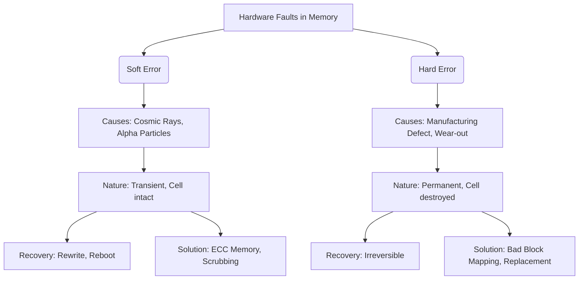

+++
title = "소프트 에러 (Soft Error)와 하드 에러 (Hard Error)"
weight = 462
+++

> **Insight**
> - 반도체 메모리 및 마이크로프로세서에서 발생하는 오류는 물리적인 영구 손상 여부에 따라 소프트 에러(Soft Error)와 하드 에러(Hard Error)로 명확히 구분됩니다.
> - 소프트 에러는 하드웨어 자체의 손상 없이 우주 방사선이나 알파 입자 등 외부 요인에 의해 데이터의 '상태(Bit)'만 일시적으로 뒤집히는(Flip) 현상으로, 전원을 껐다 켜거나 덮어쓰면 복구됩니다.
> - 하드 에러는 실리콘 칩의 물리적 파괴나 마모로 인해 셀(Cell)이 영구적으로 고장 나 데이터를 저장할 수 없는 상태를 의미하며, 부품 교체 없이는 복구가 불가능합니다.

## Ⅰ. 하드 에러(Hard Error)의 개요 및 특징

### 1. 하드 에러(Hard Error)의 정의
하드 에러는 반도체 칩, 메모리 모듈(DRAM, SRAM, Flash), 또는 스토리지 매체의 물리적인 결함으로 인해 특정 비트나 블록에 데이터를 영구적으로 읽거나 쓸 수 없게 된 상태를 말합니다. 이러한 오류는 고정된 패턴을 보이며 반복적으로 발생합니다(Permanent Fault).

### 2. 하드 에러의 주요 발생 원인
* **제조 결함 (Manufacturing Defects):** 웨이퍼 가공 과정에서의 불순물, 미세한 배선 단락(Short) 등 초기 불량.
* **마모 및 노화 (Wear-out & Aging):** 특히 NAND Flash 메모리의 경우 셀의 산화막이 지속적인 쓰기/지우기 주기로 인해 닳아 없어지면서 수명이 다하는 현상(Endurance Limit).
* **물리적 충격 및 환경 요인:** 과도한 열, 진동, 전압 스파이크(과전압)로 인한 실리콘 다이(Die)의 파괴(Burn-out).

> 📢 **섹션 요약 비유:**
> 공책(메모리)의 한 페이지가 찢어지거나 잉크가 쏟아져서, 지우개로 아무리 지워도 다시는 그곳에 글씨(데이터)를 쓸 수 없게 된 영구적인 훼손 상태입니다.

## Ⅱ. 소프트 에러(Soft Error)의 개요 및 동작 메커니즘

### 1. 소프트 에러(Soft Error)의 정의
소프트 에러는 하드웨어 칩 자체에는 아무런 물리적 손상이 없으나, 셀에 저장된 전하(Charge) 상태가 외부 요인에 의해 교란되어 비트 값이 일시적으로 변하는(0이 1로, 1이 0으로) 현상입니다. 이를 단일 사건 전도(SEU, Single Event Upset)라고도 부릅니다. 

### 2. 소프트 에러의 주요 발생 원인
소프트 에러의 가장 큰 원인은 '방사선'입니다. 현대 반도체 공정이 나노 단위로 미세해지면서, 셀에 저장되는 전자의 양이 극도로 적어져 아주 작은 에너지 충격에도 데이터가 쉽게 변형됩니다.
* **우주 방사선 (Cosmic Rays):** 대기권 밖에서 날아온 고에너지 중성자(Neutron) 입자가 실리콘 원자핵과 충돌하여 이온화 궤적을 만들고 전하를 교란시킵니다. (항공기나 우주 환경에서 특히 심각하며, 지상 데이터센터에도 영향을 미칩니다.)
* **알파 입자 (Alpha Particles):** 반도체 패키징 재료 자체에 미량 포함된 방사성 동위원소에서 방출되는 알파 입자가 메모리 셀을 타격하여 발생합니다. (과거 초기 DRAM에서 큰 문제였으나, 현재는 재료 정제로 많이 완화됨).

> 📢 **섹션 요약 비유:**
> 공책은 멀쩡한데, 창문 밖에서 불어온 거센 바람(우주 방사선) 때문에 책상 위에 놓아둔 주사위(비트)가 1에서 6으로 뒤집힌 것과 같습니다. 주사위를 다시 1로 돌려놓으면(재기록) 아무 문제 없이 사용할 수 있는 일시적인 착시 현상입니다.

## Ⅲ. 소프트 에러 vs 하드 에러 비교 분석

두 오류는 성격이 완전히 다르므로 대응 체계도 다르게 설계되어야 합니다.

| 구분 | Soft Error (소프트 에러) | Hard Error (하드 에러) |
| :--- | :--- | :--- |
| **물리적 손상** | 없음 (칩은 정상) | 있음 (회로나 셀의 영구 파괴) |
| **지속성** | 일시적 (Transient), 일회성 (SEU) | 영구적 (Permanent), 고정적 |
| **복구 가능성** | 새로운 데이터를 덮어쓰거나(Rewrite), 시스템 재부팅(Reset) 시 100% 복구됨 | 복구 불가능 (해당 셀이나 섹터를 논리적으로 격리해야 함) |
| **주요 원인** | 우주 방사선(중성자), 알파 입자 타격, 노이즈 | 제조 불량, 전기적 과전압, Flash 메모리 마모 |
| **해결 / 방어 기술** | **ECC 메모리**, 패리티 비트, TMR(삼중화) | **배드 블록 매핑(Bad Block Management)**, 웨어 레벨링(Wear Leveling), 부품 교체 |

> 📢 **섹션 요약 비유:**
> 소프트 에러는 컴퓨터가 잠깐 기절했다가 찬물을 맞으면(재부팅) 멀쩡히 일어나는 '일사병'이고, 하드 에러는 뼈가 부러져서 수술이나 깁스(부품 교체/격리)가 필요한 '골절상'입니다.

## Ⅳ. 현대 컴퓨팅에서 소프트 에러가 급증하는 이유 (기술적 트렌드)

과거에는 우주선에서나 걱정하던 소프트 에러가 지상의 거대 데이터센터와 자율주행차에서 심각한 이슈로 대두되고 있습니다. 그 이유는 반도체 미세공정의 진화와 밀접한 관련이 있습니다.

1. **미세 공정화 (Technology Scaling):** 트랜지스터 크기가 7nm, 3nm 등으로 작아지면서, 데이터 1비트를 표현하는 데 필요한 전하량(Capacitance)이 기하급수적으로 줄어들었습니다. 과거에는 방사선이 부딪혀도 끄떡없던 전하량이, 이제는 방사선 한 방에 0과 1이 뒤집힐 만큼 민감해졌습니다.
2. **낮은 동작 전압 (Low Supply Voltage):** 전력 소모를 줄이기 위해 동작 전압을 낮추면서, 0과 1을 구분하는 노이즈 마진(Noise Margin)이 좁아져 소프트 에러에 더 취약해졌습니다.
3. **대용량 메모리 탑재 (Massive Capacity):** 서버 한 대에 수백 GB에서 테라바이트 단위의 RAM이 꽂히게 되면서, 시스템 전체로 볼 때 방사선에 맞을 확률(단면적)이 엄청나게 커졌습니다. (데이터센터 단위에서는 하루에도 수십~수백 건의 소프트 에러가 발생합니다).

> 📢 **섹션 요약 비유:**
> 예전에는 볼링공(큰 전하량)을 굴려 세워둔 핀(데이터)이라서 바람이 불어도 안 넘어갔지만, 칩이 작아지면서 탁구공(작은 전하량)으로 핀을 세워놓게 되어 작은 입김(방사선)에도 핀이 우수수 쓰러지게 된 상황입니다.

## Ⅴ. 오류 방어 및 결함 허용 기술

시스템 신뢰성을 위해 두 오류를 각기 다른 계층에서 방어합니다.

### 1. 소프트 에러 방어 전략
* **ECC (Error-Correcting Code) 메모리:** 서버나 워크스테이션에 필수적으로 탑재되며, 메모리에서 데이터를 읽을 때 1비트의 오류(Single-bit Error)를 실시간으로 탐지하고 하드웨어적으로 즉시 정정합니다.
* **메모리 스크러빙 (Memory Scrubbing):** 백그라운드 프로세스가 메모리 전체를 주기적으로 순회하며 잠복해 있는 소프트 에러를 찾아내고 ECC를 통해 덮어써서 교정합니다. (다중 비트 오류로 발전하는 것을 막음).

### 2. 하드 에러 방어 전략
* **배드 블록 매핑 (Bad Block Mapping):** SSD나 HDD에서 특정 블록에 하드 에러가 발생하면, 컨트롤러가 해당 블록을 'Bad'로 마킹하고, 예비(Spare) 블록으로 논리적 주소를 대체(Remapping)하여 시스템이 고장 난 셀에 접근하지 못하게 격리합니다.
* **웨어 레벨링 (Wear Leveling):** 플래시 메모리에서 특정 블록만 집중적으로 지워져 하드 에러가 빨리 발생하는 것을 막기 위해, 데이터 쓰기 작업을 메모리 전체 블록에 골고루 분산시키는 컨트롤러 기술입니다.

> 📢 **섹션 요약 비유:**
> 소프트 에러는 오타가 났을 때 자동으로 교정해 주는 맞춤법 검사기(ECC)로 방어하고, 하드 에러는 잉크가 번져 못 쓰게 된 페이지를 찢어버리고 맨 뒤의 새 페이지(Spare Block)를 대신 쓰도록 번호표를 바꿔 다는 것(Bad Block Mapping)으로 방어합니다.

---

### 💡 Knowledge Graph & Child Analogy

> **👶 Child Analogy (어린이 비유):**
> 칠판에 예쁜 그림을 그려놨어요!
> **소프트 에러**는 지나가던 친구가 실수로 칠판을 쓱 스쳐서 그림 일부가 지워진 거예요. 이건 칠판 자체는 멀쩡하니까, 지워진 부분을 다시 분필로 덧그리기만 하면 완벽하게 원래대로 돌아와요.
> 하지만 **하드 에러**는 누군가 망치로 칠판을 쾅! 때려서 칠판이 푹 파이고 깨져버린 거예요. 거긴 아무리 분필로 칠해도 그림이 그려지지 않아요. 그래서 깨진 부분에는 '사용 금지' 스티커를 붙이고 다른 멀쩡한 곳에 그림을 그려야 한답니다.
