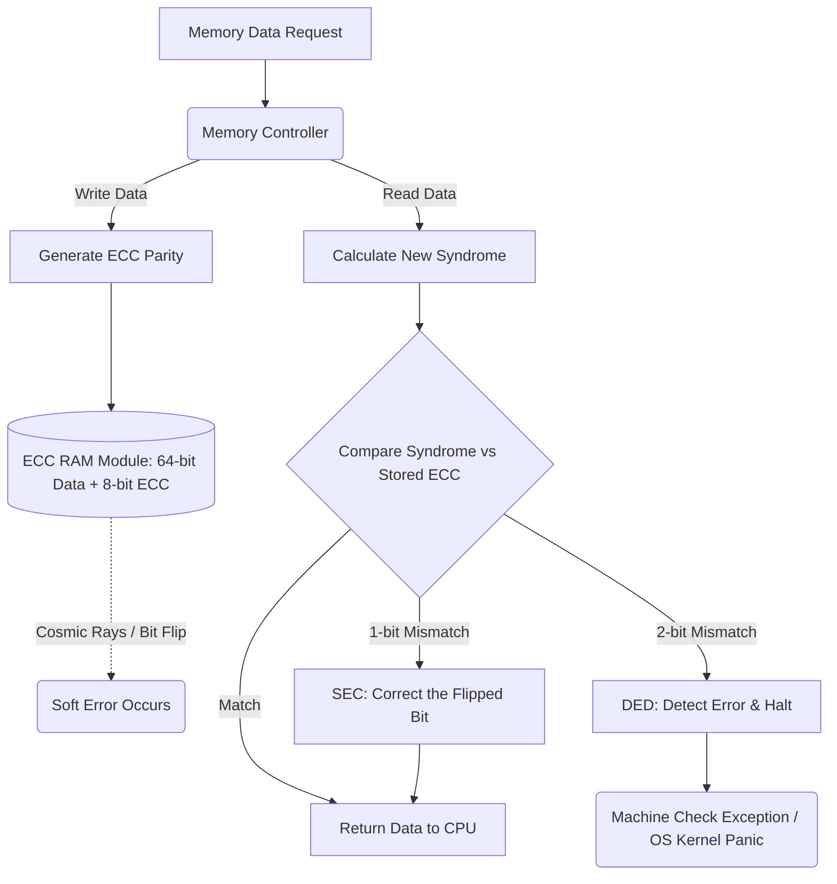

+++
title = "ECC 메모리 (Error-Correcting Code)"
weight = 463
+++

> **Insight**
> - ECC(Error-Correcting Code) 메모리는 데이터 저장 및 전송 과정에서 발생하는 데이터 손상(주로 소프트 에러)을 하드웨어 수준에서 실시간으로 탐지(Detect)하고 스스로 교정(Correct)할 수 있는 특수한 기능의 DRAM입니다.
> - 서버, 워크스테이션, 우주/항공 시스템 등 단 한 비트(Bit)의 오류로도 시스템 다운이나 치명적인 금융 사고가 발생할 수 있는 미션 크리티컬(Mission Critical) 환경에서 필수적으로 사용됩니다.
> - 추가적인 패리티 비트(Parity Bits)와 해밍 코드(Hamming Code) 알고리즘을 사용하여, 단일 비트 오류 정정(SEC) 및 이중 비트 오류 탐지(DED)를 수행합니다.

## Ⅰ. ECC 메모리의 개요 및 등장 배경

### 1. ECC 메모리(Error-Correcting Code Memory)의 정의
ECC 메모리는 일반적인 Non-ECC 메모리 모듈에 오류 검출 및 정정을 위한 추가 메모리 칩과 로직이 결합된 RAM(Random Access Memory)입니다. CPU 메모리 컨트롤러와 협력하여, 메모리에 데이터를 쓰고 읽을 때 실시간으로 데이터의 무결성(Integrity)을 검증하고 손상된 비트를 원래의 값으로 되돌려 놓습니다.

### 2. 왜 ECC가 필요한가? (소프트 에러의 위협)
반도체 미세 공정이 발달함에 따라 메모리 셀의 크기가 극도로 작아졌습니다. 이로 인해 우주에서 날아오는 고에너지 중성자(Cosmic Rays)나 패키징 물질의 알파 입자 등 미세한 방사선 충격에도 메모리 셀의 전하 상태가 0에서 1로, 또는 1에서 0으로 뒤집히는 **단일 사건 전도(SEU, 소프트 에러)** 가 빈번하게 발생합니다. 이러한 비트 플립(Bit Flip)이 OS 커널이나 DB 트랜잭션 영역에서 발생하면 시스템 블루스크린(BSOD), 커널 패닉, 또는 무결성 없는 잘못된 계산 결과를 초래하므로, 이를 원천 차단하기 위해 ECC 메모리가 도입되었습니다.

> 📢 **섹션 요약 비유:**
> 일반 메모리가 문서에 오타가 생겨도 그대로 읽어버리는 사람이라면, ECC 메모리는 문서를 읽으면서 머릿속 문법 사전을 통해 실시간으로 오타를 찾아내고 올바른 글자로 고쳐서 읽어내는 아주 깐깐하고 똑똑한 교정 전문가입니다.

## Ⅱ. ECC 메모리의 동작 원리와 아키텍처

### 1. 패리티 비트와 추가 메모리 칩
일반적인 데스크톱용 Non-ECC RAM은 64비트(bit) 데이터 버스를 사용합니다. 반면, ECC RAM은 데이터를 검증하기 위해 8비트의 추가 공간(Redundant Bits)을 사용하여 **총 72비트 버스(64비트 데이터 + 8비트 ECC)** 로 동작합니다. 물리적으로도 일반 RAM 모듈이 8개의 메모리 칩을 달고 있다면, ECC RAM은 오류 교정을 위한 1개의 칩이 추가된 9개의 칩 구조를 가집니다.

```ascii
[ Non-ECC Memory Module ]
[ Chip 1 ] [ Chip 2 ] [ Chip 3 ] [ Chip 4 ] [ Chip 5 ] [ Chip 6 ] [ Chip 7 ] [ Chip 8 ]
  ( 8 bits x 8 chips = 64 bits Data )

[ ECC Memory Module ]
[ Chip 1 ] [ Chip 2 ] [ Chip 3 ] [ Chip 4 ] [ Chip 5 ] [ Chip 6 ] [ Chip 7 ] [ Chip 8 ] | [ Chip 9 (ECC) ]
  ( 8 bits x 8 chips = 64 bits Data ) + ( 8 bits ECC / Parity Code ) = 72 bits Total
```

### 2. 해밍 코드 (Hamming Code) 및 SEC-DED 알고리즘
ECC 메모리는 주로 리차드 해밍(Richard Hamming)이 고안한 '해밍 코드' 알고리즘을 사용합니다. 이를 통해 **SEC-DED (Single Error Correction, Double Error Detection)** 기능을 수행합니다.
* **데이터 쓰기 (Write):** CPU가 64비트 데이터를 메모리에 쓸 때, 메모리 컨트롤러는 해밍 코드 알고리즘을 사용해 8비트의 ECC 코드를 계산하여 72비트를 메모리에 저장합니다.
* **데이터 읽기 (Read):** 데이터를 읽을 때 저장된 64비트를 바탕으로 다시 ECC 코드를 계산합니다. 이 값을 저장되어 있던 8비트 ECC 코드와 비교(Syndrome 계산)합니다.
* **오류 교정 (SEC):** 비교 결과 특정 위치의 1개 비트가 뒤집힌 것을 발견하면(Single-bit Error), CPU에 인터럽트를 걸지 않고 컨트롤러가 즉시 해당 비트를 반전시켜 올바른 데이터로 교정 후 시스템에 전달합니다.
* **오류 탐지 (DED):** 만약 방사선 충격이 커서 2개의 비트가 동시에 변형되었다면(Double-bit Error), 교정은 불가능하지만 '오류가 발생했다'는 사실을 정확히 탐지하여 치명적인 잘못된 데이터 처리를 막고 머신 체크 예외(MCE, Machine Check Exception)를 발생시켜 시스템을 안전하게 중지(Fail-Stop)시킵니다.

> 📢 **섹션 요약 비유:**
> 금고(메모리)에 64개의 골드바(데이터)를 넣을 때, 복잡한 수학 공식으로 계산된 암호 자물쇠 8개(ECC 비트)를 같이 채워두는 겁니다. 나중에 금고를 열었을 때 골드바 1개가 가짜로 바뀌어 있어도 자물쇠의 암호 공식을 역산하면 어느 골드바가 가짜인지 정확히 짚어내서 진짜로 바꿔치기할 수 있는 마법의 시스템입니다.

## Ⅲ. ECC vs Non-ECC 메모리 비교

| 비교 항목 | Non-ECC Memory (Unbuffered / 일반 RAM) | ECC Memory (주로 Registered / 서버용 RAM) |
| :--- | :--- | :--- |
| **주요 사용처** | 일반 PC, 노트북, 게이밍 데스크톱 | 기업용 서버, 데이터센터, 딥러닝 워크스테이션 |
| **오류 정정 능력** | 없음 (비트 플립 발생 시 시스템 충돌 위험) | 1-bit 교정 (SEC), 2-bit 이상 탐지 (DED) |
| **데이터 버스 폭** | 64-bit | 72-bit |
| **성능 (속도)** | 연산 로직이 없어 상대적으로 미세하게 더 빠름 | ECC 코드 계산(Syndrome) 오버헤드로 인해 약 1~2% 정도 미세하게 느림 |
| **비용 및 가격** | 저렴함 | 추가 메모리 칩 및 복잡한 PCB 기판 설계로 비쌈 |
| **메인보드 지원** | 대부분의 소비자용 보드/CPU에서 지원 | 제온(Xeon), 에픽(EPYC) 등 서버용 CPU와 ECC 지원 특수 메인보드 필요 |

> 📢 **섹션 요약 비유:**
> 일반 메모리는 가볍고 빠른 일반 승용차이고, ECC 메모리는 속도는 1~2% 느려지고 차값은 비싸지만, 주행 중 타이어 하나가 터져도 스스로 복구하며 절대 전복되지 않는 튼튼한 장갑차입니다.

## Ⅳ. 메모리 스크러빙 (Memory Scrubbing)과의 결합

ECC는 데이터를 '읽을 때(Read)' 오류를 교정합니다. 하지만 오랫동안 읽지 않고 저장만 되어 있는 데이터(Cold Data) 영역에 우주 방사선이 두 번 맞아 2비트 오류(Double-bit Error)로 누적 발전하면 ECC로도 복구할 수 없는 치명적 장애가 됩니다.
이를 방지하기 위해 서버 시스템은 하드웨어 백그라운드에서 주기적으로 메모리 전체를 순차적으로 스캔하며 읽어보는 **메모리 스크러빙(Memory Scrubbing, Patrol Scrubbing)** 기법을 ECC와 결합합니다. 스크러빙 중 1비트 오류가 발견되면 즉시 ECC가 이를 교정하고 다시 정상 데이터로 덮어씌워(Rewrite) 다중 비트 오류로의 '진화'를 사전에 차단합니다.

> 📢 **섹션 요약 비유:**
> 도서관의 책이 오래되어 글씨가 흐려지는 걸(소프트 에러) 막기 위해, 사서(메모리 컨트롤러)가 손님이 책을 빌릴 때만 오타를 고쳐주는 게 아니라, 손님이 없어도 밤마다(백그라운드 스크러빙) 서고를 돌면서 책을 다 읽어보고 글씨가 지워지려는 찰나에 펜으로 선명하게 덧칠해두는 철저한 예방 작업입니다.

## Ⅴ. On-Die ECC (DDR5 시대의 변화)

최신 DDR5 메모리 규격부터는 **On-Die ECC**라는 기술이 기본적으로 탑재되었습니다. 
기존 서버용 ECC가 CPU 컨트롤러와 메모리 모듈 전체를 보호하는 'End-to-End' 보호라면, DDR5의 On-Die ECC는 미세공정 한계로 인해 DRAM 칩 내부에서 자체적으로 발생하는 오류율이 너무 높아져, **DRAM 칩 내부 셀에서 출력 핀으로 나가기 직전까지만 오류를 1차로 정정**하는 기술입니다.
따라서 DDR5 일반 램의 On-Die ECC가 기존의 완벽한 서버용 ECC(Side-band ECC)를 대체하는 것은 아니며, 진정한 미션 크리티컬 서버를 위해서는 칩 내부(On-Die ECC)와 버스 채널(전통적 ECC) 양쪽 모두에서 오류를 정정하는 구조가 채택됩니다.

> 📢 **섹션 요약 비유:**
> 식당에서 요리사(DRAM 칩)가 주방에서 음식을 내보내기 전에 스스로 간을 한 번 보는 것(On-Die ECC)이 기본이 되었지만, 손님(CPU) 식탁에 가기 전 웨이터(메모리 버스)가 쏟지 않았는지 지배인(서버용 ECC)이 한 번 더 확인해야 완벽한 최고급 레스토랑(서버)이 완성되는 것과 같습니다.

---

### 💡 Knowledge Graph & Child Analogy



> **👶 Child Analogy (어린이 비유):**
> 8명의 요정(데이터 칩)이 어깨동무를 하고 징검다리를 건너고 있어요. 그런데 심술궂은 바람(방사선)이 불어서 요정 한 명이 넘어질 뻔했죠. 일반 징검다리였다면 그대로 물에 빠졌겠지만, ECC 징검다리에는 요정들을 든든하게 받쳐주는 '경호원 요정(ECC 칩)'이 1명 더 맨 끝에 서 있어요! 그래서 누가 비틀거려도 경호원 요정이 재빨리 밧줄로 잡아당겨서 원래 자세로 똑바로 세워준 덕분에 9명이 무사히 다리를 건널 수 있답니다!
