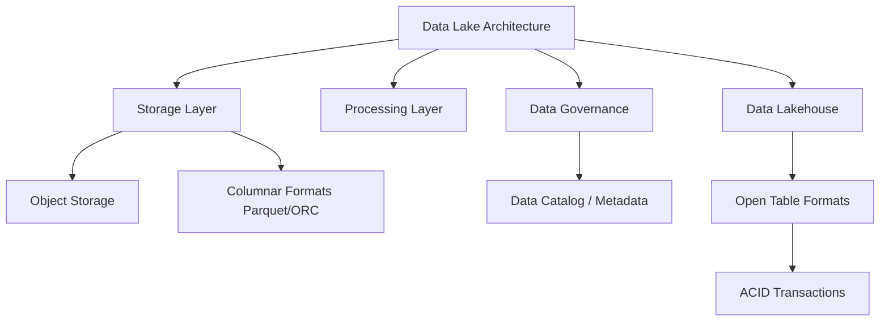

+++
title = "641. 데이터 레이크 (Data Lake) 스토리지 아키텍처"
weight = 641
+++

> **3-line Insight**
> *   데이터 레이크(Data Lake)는 정형, 반정형, 비정형 데이터를 원시 형태(Raw Data)로 저장하는 중앙 집중식 스토리지 저장소(Centralized Storage Repository)입니다.
> *   비용 효율적인 확장성(Cost-effective Scalability)과 다양한 데이터 분석(Data Analytics) 워크로드를 지원하기 위해 주로 객체 스토리지(Object Storage)와 분산 파일 시스템(Distributed File System)을 기반으로 구축됩니다.
> *   데이터 늪(Data Swamp) 현상을 방지하기 위해 엄격한 데이터 거버넌스(Data Governance) 체계와 동적 메타데이터 관리(Metadata Management)가 필수적입니다.

# Ⅰ. 데이터 레이크 스토리지 아키텍처의 개요

## 1. 데이터 레이크(Data Lake)의 정의와 필요성
데이터 레이크(Data Lake)는 기업 내에서 생성되는 모든 형태의 데이터(정형, 반정형, 비정형)를 변환 과정 없이 원시 형태(Raw Data) 그대로 보관하는 거대한 단일 저장소(Single Source of Truth)입니다. 기존의 데이터 웨어하우스(Data Warehouse, DW)가 사전에 정의된 스키마(Schema-on-Write)에 맞추어 데이터를 정제하고 적재(ETL)했던 것과 달리, 데이터 레이크는 데이터가 읽히는 시점에 스키마를 적용하는 스키마 온 리드(Schema-on-Read) 방식을 채택합니다. 이는 기계 학습(Machine Learning) 및 인공지능(Artificial Intelligence) 모델 학습용 데이터 확보, 그리고 예측 분석(Predictive Analytics) 등 현대적인 데이터 워크로드의 요구사항을 충족시키기 위해 등장했습니다. 

## 2. 데이터 레이크와 기존 스토리지 모델의 비교
데이터 레이크는 하둡 분산 파일 시스템(Hadoop Distributed File System, HDFS)이나 클라우드 기반의 객체 스토리지(Object Storage) 서비스(예: Amazon S3, Azure Data Lake Storage)를 핵심 인프라로 사용합니다. 데이터 웨어하우스(DW)가 고비용의 고성능 블록 스토리지(Block Storage)를 사용하여 트랜잭션 무결성(Transaction Integrity)과 빠른 쿼리 성능을 보장하는 반면, 데이터 레이크는 페타바이트(Petabyte) 급 이상의 데이터를 경제적으로 저장할 수 있는 수평적 확장성(Horizontal Scalability)에 초점을 맞춥니다.

📢 섹션 요약 비유: 데이터 레이크는 강물(다양한 소스)이 흘러들어와 모이는 커다란 '자연 호수'입니다. 물고기(데이터)의 종류에 상관없이 모두 살 수 있으며, 필요할 때 그물을 던져(Schema-on-Read) 원하는 물고기를 잡아 요리(분석)할 수 있습니다. 반면 데이터 웨어하우스는 특정 물고기만 손질해서 넣어두는 '수족관'과 같습니다.

# Ⅱ. 데이터 레이크 스토리지의 핵심 구조 및 설계

## 1. 스토리지 계층 아키텍처 (Storage Tiering Architecture)
데이터 레이크 아키텍처는 데이터의 상태와 처리 단계에 따라 다중 계층(Multi-tier) 구조로 설계됩니다. 일반적인 물리적/논리적 구조는 다음과 같습니다.

```text
+-------------------------------------------------------------------+
|                     Data Consumption Layer                        |
|   (BI Tools, Machine Learning Models, Ad-hoc Query Engines)       |
+-------------------------------------------------------------------+
                                ^
                                | (Curated Data)
+-------------------------------------------------------------------+
|                 Data Processing & Analytics Layer                 |
|            (Apache Spark, Flink, Presto, Hive, Databricks)        |
+-------------------------------------------------------------------+
                                ^
                                | (Data Processing Pipeline)
+===================================================================+
|                    DATA LAKE STORAGE LAYER                        |
|                                                                   |
|  [ Bronze Zone (Raw) ] --> [ Silver Zone (Cleansed) ]             |
|  - 원시 데이터 원본 보존    - 필터링, 정제, 스키마 적용             |
|  - Append-Only           - Parquet, ORC 등 컬럼너 포맷          |
|                                     |                             |
|                                     v                             |
|                          [ Gold Zone (Curated) ]                  |
|                          - 비즈니스 레벨 집계 및 최적화             |
|                          - 높은 쿼리 성능 보장                      |
+===================================================================+
                                ^
                                | (Ingestion)
+-------------------------------------------------------------------+
|                        Data Ingestion Layer                       |
|          (Kafka, Fluentd, Apache NiFi, AWS Kinesis)               |
+-------------------------------------------------------------------+
```

## 2. 객체 스토리지(Object Storage) 기반 아키텍처
최신 데이터 레이크는 주로 객체 스토리지(Object Storage)를 기반으로 합니다. 객체 스토리지는 파일과 디렉터리 구조를 사용하는 파일 시스템(File System)과 달리, 데이터를 플랫(Flat)한 네임스페이스(Namespace)에 객체(Object) 단위로 저장합니다. 각 객체는 데이터 자체, 확장 가능한 메타데이터(Extensible Metadata), 그리고 고유 식별자(Unique Identifier)로 구성됩니다. 이 아키텍처는 컴퓨팅 자원과 스토리지 자원을 독립적으로 확장할 수 있는 컴퓨팅-스토리지 분리(Compute-Storage Separation) 원칙을 실현하여 리소스 활용률을 극대화합니다.

📢 섹션 요약 비유: 데이터 레이크의 영역(Zone) 구성은 큰 물류 창고와 같습니다. '브론즈 존'은 외부에서 들어온 화물을 포장도 뜯지 않고 쌓아두는 하역장이고, '실버 존'은 물건의 먼지를 털고 분류해둔 진열대이며, '골드 존'은 고객이 바로 사갈 수 있도록 예쁘게 포장해둔 VIP 쇼룸입니다.

# Ⅲ. 스토리지 포맷 및 성능 최적화 기술

## 1. 컬럼 지향 스토리지 포맷 (Column-Oriented Storage Format)
데이터 레이크에서 분석 쿼리 성능을 높이기 위해서는 저장 포맷의 최적화가 필수적입니다. JSON이나 CSV와 같은 행 지향(Row-Oriented) 포맷은 원시 데이터 적재에는 유리하지만, 집계(Aggregation) 연산 시 불필요한 I/O를 유발합니다. 따라서 파케이(Apache Parquet)나 ORC(Optimized Row Columnar)와 같은 컬럼 지향 포맷(Columnar Format)을 사용합니다. 이는 동일한 데이터 타입의 컬럼 데이터를 연속된 디스크 공간에 저장하여, 효율적인 데이터 압축(Data Compression)을 가능하게 하고 분석 쿼리 시 필요한 컬럼만 읽어들이는 프로젝션 푸시다운(Projection Pushdown)을 지원합니다.

## 2. 데이터 파티셔닝(Partitioning) 및 프루닝(Pruning)
대규모 데이터 세트에서 스캔(Scan) 비용을 줄이기 위해 파티셔닝(Partitioning) 전략이 적용됩니다. 주로 날짜, 지역, 부서 등의 논리적 단위로 디렉터리 구조를 나누어 데이터를 저장합니다. 쿼리 엔진은 쿼리 조건(Predicate)을 분석하여 관련 없는 파티션을 스캔 대상에서 제외하는 파티션 프루닝(Partition Pruning)을 수행합니다. 또한 데이터 파일 내의 메타데이터(최소/최대값 등)를 활용하여 특정 파일 읽기를 건너뛰는 파일 레벨 프루닝(File-level Pruning) 기술을 통해 I/O 성능을 극대화합니다.

📢 섹션 요약 비유: 컬럼형 포맷은 전화번호부에서 '이름'만 모아둔 책, '전화번호'만 모아둔 책을 따로 만드는 것과 같습니다. 특정 지역의 전화번호만 쫙 뽑아서 통계를 내고 싶을 때, 전화번호만 모아둔 얇은 책 하나만 빠르게 훑어보면 되므로 전체 두꺼운 책을 다 읽을 필요가 없어집니다.

# Ⅳ. 데이터 거버넌스와 메타데이터 관리

## 1. 데이터 거버넌스(Data Governance)의 중요성
통제되지 않은 데이터 레이크는 유용한 정보를 찾을 수 없는 데이터 늪(Data Swamp)으로 전락하기 쉽습니다. 이를 방지하기 위한 체계가 데이터 거버넌스(Data Governance)입니다. 이는 데이터의 수명 주기(Lifecycle), 접근 제어(Access Control), 데이터 계보(Data Lineage), 품질 관리(Quality Management)를 포괄하는 정책 및 기술적 프레임워크입니다. 올바른 거버넌스를 통해 데이터의 신뢰성을 확보하고 규제 준수(Regulatory Compliance, 예: GDPR, CCPA)를 달성할 수 있습니다.

## 2. 데이터 카탈로그(Data Catalog)와 메타데이터(Metadata)
데이터 레이크의 핵심 내비게이션 시스템은 데이터 카탈로그(Data Catalog)입니다. 카탈로그는 스토리지에 저장된 모든 데이터 자산에 대한 논리적 뷰(Logical View)를 제공합니다. 스키마 정보, 데이터 생성 위치, 소유자 정보 등 기술적 메타데이터(Technical Metadata)뿐만 아니라 비즈니스 용어집(Business Glossary)과 같은 비즈니스 메타데이터(Business Metadata)를 매핑하여 데이터 탐색(Data Discovery)을 용이하게 합니다. Apache Atlas나 AWS Glue Data Catalog가 대표적인 도구입니다.

📢 섹션 요약 비유: 데이터 카탈로그와 거버넌스는 거대한 국립 도서관의 '도서 검색 시스템'과 '사서' 역할을 합니다. 책(데이터)이 아무리 많아도 검색 시스템(카탈로그)이 없으면 원하는 책을 찾을 수 없고, 규칙을 정해 관리하는 사서(거버넌스)가 없으면 도서관은 곧 쓰레기장(데이터 늪)이 되어버립니다.

# Ⅴ. 차세대 진화: 데이터 레이크하우스 (Data Lakehouse)

## 1. 데이터 레이크하우스의 등장 배경
데이터 레이크는 비정형 데이터 처리와 확장성에서 강점이 있지만, 동시성 처리나 트랜잭션 보장(ACID Properties)에는 한계가 있었습니다. 이를 극복하기 위해 등장한 개념이 데이터 레이크하우스(Data Lakehouse)입니다. 이는 데이터 레이크의 유연한 스토리지 구조 위에 데이터 웨어하우스(DW)의 트랜잭션 관리 및 스키마 강제(Schema Enforcement) 기능을 결합한 차세대 아키텍처입니다.

## 2. 오픈 테이블 포맷(Open Table Formats) 기술
레이크하우스를 가능하게 하는 핵심 기술은 아파치 아이스버그(Apache Iceberg), 델타 레이크(Delta Lake), 아파치 후디(Apache Hudi)와 같은 오픈 테이블 포맷(Open Table Formats)입니다. 이 포맷들은 객체 스토리지 위의 메타데이터 레이어로 동작하여, 여러 사용자가 동시에 데이터를 읽고 쓰더라도 데이터의 일관성(Consistency)을 유지해주는 ACID 트랜잭션을 지원합니다. 또한 시간 여행(Time Travel, 과거 특정 시점의 데이터 조회) 기능과 스키마 진화(Schema Evolution) 기능을 제공하여 데이터 관리의 복잡성을 획기적으로 줄여줍니다.

📢 섹션 요약 비유: 데이터 레이크하우스는 '자연 호수'의 장점과 수질과 환경이 완벽하게 통제되는 '수족관'의 장점을 합친 '최첨단 스마트 생태 공원'입니다. 아무 물고기나 자유롭게 살 수 있으면서도, 첨단 센서와 관리 시스템(테이블 포맷)을 통해 언제든 물고기의 상태를 파악하고 완벽하게 관리할 수 있습니다.

---

### 💡 Knowledge Graph 및 초등학생 비유

**Knowledge Graph**


**초등학생 비유**
데이터 레이크는 커다란 '장난감 상자'와 같아요. 레고 블록, 인형, 자동차 등 모든 장난감(데이터)을 일단 한 상자에 다 담아두는 곳이죠. 그런데 상자가 너무 크면 원하는 장난감을 찾기 힘드니까, 장난감에 이름표(메타데이터)를 붙여서 관리해야 해요. 최근에는 장난감이 망가지지 않고 친구들과 동시에 싸우지 않고 가지고 놀 수 있도록 도와주는 마법의 규칙(데이터 레이크하우스)도 생겨났답니다.
