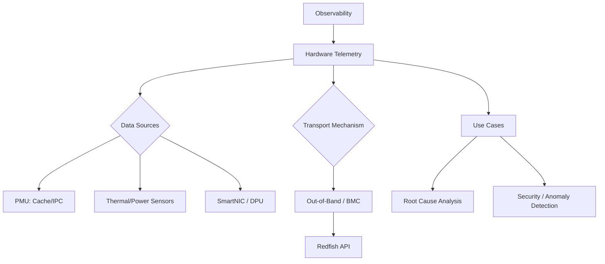

+++
title = "642. 옵저버빌리티 (Observability) HW 텔레메트리"
weight = 642
+++

> **3-line Insight**
> *   옵저버빌리티(Observability)는 시스템의 외부 출력(External Outputs)을 통해 내부 상태(Internal States)를 추론할 수 있는 측정 가능성을 의미하며, 모니터링(Monitoring)을 넘어선 사전 예방적 통찰을 제공합니다.
> *   하드웨어 텔레메트리(Hardware Telemetry)는 CPU, 메모리, 네트워크 인터페이스 카드(NIC), 스토리지 장치 등 물리적 컴포넌트 내부의 미세한 동작과 성능 지표(Metrics)를 실시간으로 수집하는 기술입니다.
> *   소프트웨어 기반 모니터링의 한계를 극복하고 나노초(Nanosecond) 단위의 병목 현상(Bottleneck) 분석 및 마이크로아키텍처(Microarchitecture) 레벨의 이상 탐지를 가능하게 하는 핵심 기반입니다.

# Ⅰ. 옵저버빌리티와 하드웨어 텔레메트리의 개념

## 1. 옵저버빌리티(Observability) 패러다임
옵저버빌리티(Observability)는 제어 이론(Control Theory)에서 유래한 개념으로, 시스템 외부에서 관측 가능한 데이터(주로 로그, 메트릭, 트레이스)를 기반으로 시스템 내부의 복잡한 상태와 잠재적 문제를 정확히 이해하는 능력을 말합니다. 기존의 모니터링(Monitoring)이 "어떤 시스템 컴포넌트가 고장 났는가?(What is broken?)"를 사후에 알려준다면, 옵저버빌리티는 "왜 이런 성능 저하가 발생했으며, 내부에서 무슨 일이 일어나고 있는가?(Why is this happening?)"를 근본적으로 파악할 수 있게 해줍니다.

## 2. 하드웨어 텔레메트리(Hardware Telemetry)의 필요성
클라우드 컴퓨팅(Cloud Computing)과 마이크로서비스 아키텍처(Microservices Architecture)의 발전으로 시스템이 극도로 복잡해지면서, 소프트웨어 스택(OS, Hypervisor, Application)에서 수집하는 데이터만으로는 완벽한 가시성(Visibility)을 확보하기 어려워졌습니다. 하드웨어 텔레메트리(Hardware Telemetry)는 반도체 다이(Die) 내부에 내장된 센서나 성능 모니터링 유닛(Performance Monitoring Unit, PMU)을 통해 캐시 미스(Cache Miss), 분기 예측 실패(Branch Prediction Miss), 열(Thermal) 변화, 전력 소비량 등의 데이터를 직접 추출합니다. 이는 OS 오버헤드(OS Overhead) 없이 가장 로우 레벨(Low-level)의 순수 데이터를 제공하여 블라인드 스팟(Blind Spot)을 제거합니다.

📢 섹션 요약 비유: 모니터링이 환자의 겉모습과 체온만 보고 "아프다"고 판단하는 것이라면, 옵저버빌리티는 혈액 검사와 MRI를 통해 몸 속 장기의 상태를 파악하는 것입니다. 이때 '하드웨어 텔레메트리'는 혈관 속에 직접 초소형 센서를 넣어 실시간으로 혈류량과 세포의 상태를 정밀하게 측정하는 최첨단 의료 장비와 같습니다.

# Ⅱ. 하드웨어 텔레메트리 아키텍처 및 수집 메커니즘

## 1. 아키텍처 구성 및 데이터 파이프라인
하드웨어 텔레메트리 시스템은 실리콘(Silicon) 레벨의 수집기부터 상위 분석 플랫폼까지 이어지는 견고한 파이프라인으로 구성됩니다.

```text
[ Hardware Layer (Silicon) ]
  +-----------------------------------------------------------+
  |  CPU / GPU / SmartNIC / SSD Controller                    |
  |  [PMU] [Thermal Sensors] [Power Sensors] [Telemetry IP]   |
  +-----------------------------------------------------------+
        | (Raw Telemetry Data: Signals, Counters, Events)
        v
[ Out-of-Band Management / BMC (Baseboard Management Controller) ]
  +-----------------------------------------------------------+
  |  Telemetry Agent (Data Aggregation & Filtering)           |
  |  [Redfish API] / [PLDM over MCTP]                         |
  +-----------------------------------------------------------+
        | (Streamed Metrics, Events - e.g., gRPC, Kafka)
        v
[ Telemetry Collector & Analytics Platform (Software Layer) ]
  +-----------------------------------------------------------+
  |  [Prometheus] / [OpenTelemetry Collector]                 |
  |  [AIOps Engine (Anomaly Detection, Root Cause Analysis)]  |
  +-----------------------------------------------------------+
```

## 2. 핵심 수집 메커니즘: PMU와 텔레메트리 IP
하드웨어 텔레메트리의 심장부는 성능 모니터링 유닛(Performance Monitoring Unit, PMU)과 전용 텔레메트리 지적재산권(Telemetry Intellectual Property, IP) 블록입니다. PMU는 프로세서 파이프라인(Processor Pipeline) 내에서 발생하는 수백 가지의 마이크로아키텍처 이벤트(Microarchitectural Events)를 하드웨어 카운터(Hardware Counters)를 통해 오버헤드 없이 계산합니다. 최근에는 CPU뿐만 아니라 스마트 네트워크 인터페이스 카드(SmartNIC)나 데이터 처리 장치(Data Processing Unit, DPU)에도 텔레메트리 전용 로직이 탑재되어, 네트워크 패킷의 나노초 단위 지연 시간(Latency)이나 마이크로버스트(Microburst) 트래픽 현상을 실시간으로 캡처합니다.

📢 섹션 요약 비유: 공장 생산 라인(CPU 파이프라인) 곳곳에 사람(소프트웨어) 대신 초정밀 고속 카메라와 계량기(PMU, 텔레메트리 IP)를 설치해 두는 것입니다. 사람의 눈으로는 놓칠 수 있는 0.001초의 찰나에 발생하는 불량(성능 저하)까지 모두 기록하여 중앙 통제실(분석 플랫폼)로 쉴 새 없이 보고하는 시스템입니다.

# Ⅲ. 주요 하드웨어 텔레메트리 지표(Metrics)

## 1. 마이크로아키텍처 성능 지표
가장 대표적인 지표는 명령어 처리 효율성과 관련된 데이터입니다. IPC(Instructions Per Cycle), L1/L2/L3 캐시(Cache) 적중률 및 미스율(Miss Rate), 메모리 대역폭(Memory Bandwidth) 활용도, TLB(Translation Lookaside Buffer) 플러시 횟수 등이 포함됩니다. 이러한 지표는 소프트웨어 애플리케이션의 성능 병목이 하드웨어 리소스 경합(Resource Contention) 때문인지, 혹은 비효율적인 메모리 액세스 패턴 때문인지를 명확히 규명합니다.

## 2. 전력, 온도 및 신뢰성 지표
데이터 센터의 전력 효율(Power Usage Effectiveness, PUE)과 시스템 안정성을 위해 동적 전압/주파수 스케일링(Dynamic Voltage and Frequency Scaling, DVFS) 상태, 코어별 온도, 소켓(Socket) 당 전력 소비량(Watts)을 지속적으로 모니터링합니다. 또한 PCIe 버스(Bus)의 에러 정정 코드(Error Correction Code, ECC) 발생 횟수나 스토리지(SSD)의 웨어 레벨링(Wear Leveling) 상태 등은 하드웨어의 수명 예측(Predictive Maintenance) 및 장애 예방에 필수적인 텔레메트리 데이터입니다.

📢 섹션 요약 비유: 자동차의 계기판이 속도와 연료량만 보여주는 것이라면, 텔레메트리 지표는 엔진 실린더 내부의 온도, 개별 톱니바퀴의 마모도, 타이어 각 부분의 접지력 등 자동차가 달리는 동안 발생하는 모든 물리적 변화를 수치화한 데이터입니다.

# Ⅳ. 텔레메트리 데이터의 스트리밍 및 처리 프로토콜

## 1. 대역폭 외 (Out-of-Band) 관리 체계
하드웨어 텔레메트리의 가장 큰 장점 중 하나는 호스트 운영체제(Host OS)에 의존하지 않는다는 것입니다. 수집된 데이터는 호스트 CPU 자원을 소모하지 않고, 베이스보드 관리 컨트롤러(Baseboard Management Controller, BMC)나 전용 보안 프로세서를 통해 대역폭 외(Out-of-Band, OOB) 네트워크로 전송됩니다. 이는 운영체제가 패닉(Kernel Panic) 상태에 빠져 소프트웨어 모니터링이 중단된 상황에서도 하드웨어의 마지막 상태(Post-mortem)를 분석할 수 있게 해줍니다.

## 2. Redfish 및 원격 측정 표준 (Telemetry Standards)
과거에는 하드웨어 벤더(Vendor)마다 독자적인 프로토콜(예: IPMI)을 사용했으나, 최근에는 DMTF(Distributed Management Task Force)가 제정한 Redfish API가 업계 표준으로 자리 잡고 있습니다. Redfish는 RESTful 인터페이스와 JSON 형식을 사용하여 텔레메트리 데이터를 표준화된 방식으로 외부 시스템에 스트리밍(Telemetry Streaming)합니다. 이를 통해 OpenTelemetry와 같은 클라우드 네이티브 옵저버빌리티 프레임워크와 하드웨어를 매끄럽게 연동할 수 있습니다.

📢 섹션 요약 비유: 비행기의 블랙박스 데이터 전송과 같습니다. 메인 조종석(Host OS)의 통신 장비가 고장 나더라도, 블랙박스 전용의 독립된 비밀 통신망(Out-of-Band)을 통해 비행기의 상태 데이터를 실시간으로 관제탑(분석 플랫폼)에 안전하게 보내는 원리입니다.

# Ⅴ. 하드웨어 텔레메트리의 미래와 과제

## 1. 데이터 과잉(Data Deluge) 문제와 엣지 컴퓨팅(Edge Computing)
수많은 하드웨어 컴포넌트에서 쏟아지는 나노초 단위의 텔레메트리 데이터는 막대한 대역폭과 스토리지 용량을 요구합니다. 이를 '데이터 과잉(Data Deluge)' 문제라고 합니다. 이 문제를 해결하기 위해 데이터를 중앙 서버로 모두 보내지 않고, 하드웨어 내부나 스마트 네트워크 컨트롤러(NIC) 단에서 데이터를 필터링하고 압축(Compression)하거나, 내장된 AI 가속기를 활용해 엣지(Edge) 단에서 실시간 분석을 수행하는 온칩(On-chip) 분석 기술이 발전하고 있습니다.

## 2. 보안 텔레메트리 (Security Telemetry)
최근에는 성능 분석을 넘어 하드웨어 기반 사이버 공격(예: 부채널 공격(Side-channel Attack), 랜섬웨어의 암호화 행위)을 탐지하기 위한 보안 텔레메트리(Security Telemetry) 영역이 부상하고 있습니다. 메모리 접근 패턴의 비정상적 급증이나 프로세서 실행 흐름의 미세한 변화를 하드웨어 레벨에서 감지하여 보안 위협을 원천적으로 차단하는 시스템 방어 체계의 핵심으로 진화하고 있습니다.

📢 섹션 요약 비유: 모든 센서 데이터를 본사에 다 보내려면 전화 요금(네트워크 대역폭)이 엄청나게 나옵니다. 그래서 현장 관리자(엣지 컴퓨팅)를 두어 쓸모없는 데이터는 버리고 "위험 징후"가 있는 중요한 요약 보고서만 본사에 올리도록 하여 효율성을 높이는 방향으로 발전하고 있습니다.

---

### 💡 Knowledge Graph 및 초등학생 비유

**Knowledge Graph**


**초등학생 비유**
여러분이 게임을 할 때 컴퓨터가 갑자기 느려지면 왜 그런지 답답하죠? 예전에는 그냥 겉모습만 보고 "컴퓨터가 힘든가 봐"라고 추측했어요. 그런데 '하드웨어 텔레메트리'는 컴퓨터 칩 안에 현미경과 청진기를 달아두는 것과 같아요. 칩 안에서 전기가 얼마나 뜨거운지, 데이터가 지나가는 길이 막혔는지, 부품들이 땀을 흘리고 있는지 0.001초 단위로 검사해서 "아, 그래픽 카드 온도가 높아져서 느려진 거야!"라고 정확한 이유를 알려주는 똑똑한 기술이랍니다.
