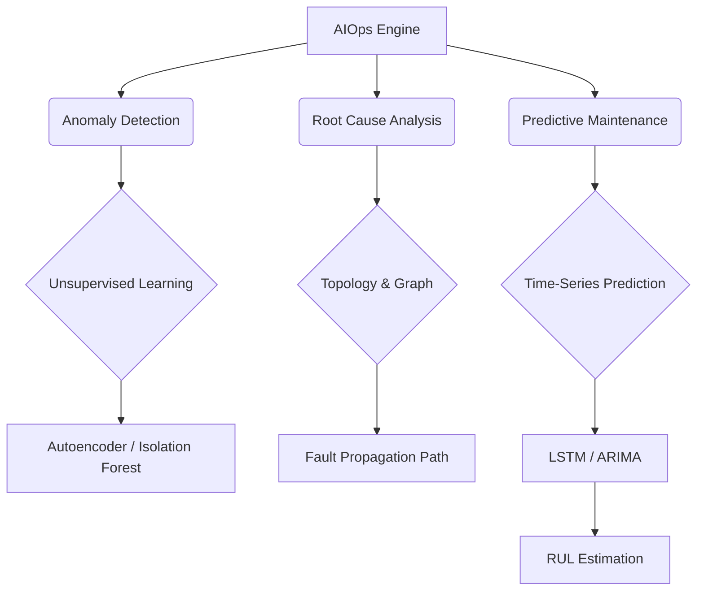

+++
title = "643. AIOps 기반 하드웨어 이상 탐지"
weight = 643
+++

> **3-line Insight**
> *   AIOps(Artificial Intelligence for IT Operations) 기반 하드웨어 이상 탐지는 머신러닝(Machine Learning) 알고리즘을 활용하여 방대한 하드웨어 텔레메트리(Telemetry) 데이터에서 비정상적인 패턴을 식별하는 기술입니다.
> *   기존의 정적 임계값(Static Threshold) 기반 알람 시스템의 한계를 넘어, 시스템 장애가 발생하기 전에 사전 징후(Precursor)를 포착하는 예지 정비(Predictive Maintenance)를 실현합니다.
> *   시계열 분석(Time-Series Analysis), 비지도 학습(Unsupervised Learning), 그리고 인과 관계 분석(Causal Inference)을 결합하여 복잡한 데이터 센터 환경에서 장애의 근본 원인(Root Cause)을 정확히 도출합니다.

# Ⅰ. AIOps와 하드웨어 이상 탐지의 개요

## 1. AIOps(Artificial Intelligence for IT Operations)의 정의
AIOps(Artificial Intelligence for IT Operations)는 IT 인프라 운영 과정에 빅데이터(Big Data) 분석과 인공지능(Artificial Intelligence) 기술을 결합하여 자동화와 효율성을 극대화하는 방법론입니다. IT 시스템에서 발생하는 막대한 양의 로그(Log), 메트릭(Metric), 트레이스(Trace) 데이터를 실시간으로 수집 및 분석하여 운영 프로세스를 지능화합니다. 하드웨어 관점에서 AIOps는 서버, 네트워크 장비, 스토리지 등의 물리적 컴포넌트의 건강 상태를 모니터링하고 관리하는 데 핵심적인 역할을 수행합니다.

## 2. 기존 이상 탐지 방식의 한계와 AIOps의 필요성
전통적인 하드웨어 모니터링은 관리자가 사전에 설정한 고정된 임계값(Static Threshold, 예: "CPU 온도가 85도를 넘으면 알람")에 의존하는 룰 기반(Rule-based) 시스템이었습니다. 그러나 클라우드 환경에서는 워크로드의 변동성이 커서 고정된 임계값은 수많은 오탐(False Positive, 경고 폭주)이나 미탐(False Negative, 실제 장애 누락)을 유발합니다. AIOps는 하드웨어의 과거 동작 패턴을 학습하여 동적 임계값(Dynamic Threshold)을 설정하고, 미세한 성능 저하나 비정상적인 상관관계를 스스로 찾아내어 선제적으로 대응할 수 있게 해줍니다.

📢 섹션 요약 비유: 기존 방식은 체온이 무조건 38도를 넘어야만 '아프다'고 판단하는 융통성 없는 간호사입니다. 반면 AIOps는 환자의 평소 생활 습관, 심박수, 혈압의 미세한 변화 패턴을 종합적으로 분석해 "내일 감기에 걸릴 확률이 높으니 미리 약을 처방하자"고 알려주는 인공지능 주치의와 같습니다.

# Ⅱ. AIOps 하드웨어 이상 탐지 아키텍처

## 1. 이상 탐지 시스템의 파이프라인 (Data Pipeline)
AIOps를 이용한 하드웨어 이상 탐지는 데이터의 수집, 처리, 분석, 조치의 파이프라인으로 구성됩니다.

```text
[ Hardware Infrastructure ]
 (CPU, Memory, SSD, NIC, Switch)
        |
        | 1. Telemetry Data Collection (Metrics, Logs, Events)
        v
[ Data Ingestion & Stream Processing ] <-- Kafka, Flink, Spark
        | - Data Cleansing, Normalization, Feature Extraction
        v
[ AIOps Analytics Engine (Machine Learning Models) ]
  +-----------------------------------------------------------+
  |  [ Anomaly Detection ] -> 식별: 시계열 패턴 분석, 이탈값 탐지 |
  |  [ Root Cause Analysis ] -> 원인: 토폴로지 기반 인과망 분석  |
  |  [ Predictive Maintenance ] -> 예측: 남은 수명(RUL) 예측   |
  +-----------------------------------------------------------+
        | 2. Insights & Actionable Alerts
        v
[ IT Service Management (ITSM) / Orchestration ]
  - 자동 복구 스크립트 실행 (Auto-remediation)
  - 장애 티켓 자동 생성 (Automated Ticketing)
```

## 2. 다차원 텔레메트리 융합 분석 (Multidimensional Telemetry Fusion)
단일 지표의 변화만으로는 정확한 이상을 판단하기 어렵습니다. 예를 들어, CPU 사용률이 급증한 것은 단순한 트래픽 증가 때문일 수도 있고, 하드웨어 스레드(Thread) 교착 상태(Deadlock)의 결과일 수도 있습니다. AIOps 아키텍처는 CPU의 전력 소비량, 온도, 캐시 미스율(Cache Miss Rate) 등 다양한 차원의 센서 데이터를 융합(Sensor Fusion)하여 분석합니다. 여러 메트릭 간의 상호 상관관계(Cross-correlation)를 다차원 벡터 공간에서 계산함으로써, 개별 지표는 정상 범위에 있더라도 조합되었을 때 나타나는 미묘한 비정상 패턴을 포착합니다.

📢 섹션 요약 비유: 공장에서 하나의 기계 소리만 듣고 고장을 판단하는 것이 아니라, 기계의 소리, 진동, 온도, 전기 사용량을 동시에 모니터링하여 "소리는 정상인데 진동과 온도의 조합이 평소와 다르다"는 것을 잡아내는 정밀 진단 시스템의 뼈대입니다.

# Ⅲ. 핵심 머신러닝 알고리즘 및 기법

## 1. 비지도 학습(Unsupervised Learning) 기반 이상 탐지
하드웨어 장애는 종류가 매우 다양하고 사전에 모든 고장 데이터를 수집하기(Labeling) 어렵기 때문에, 주로 비지도 학습 알고리즘을 활용합니다.
*   **오토인코더(Autoencoder):** 정상적인 하드웨어 상태 데이터를 압축(Encoding)했다가 복원(Decoding)하는 신경망을 학습시킵니다. 이상 데이터가 입력되면 복원 오차(Reconstruction Error)가 커지므로 이를 통해 이상을 탐지합니다.
*   **고립 숲(Isolation Forest) & One-Class SVM:** 데이터 포인트 중 무리에서 멀리 떨어져 있는(고립된) 아웃라이어(Outlier)를 빠르고 효율적으로 식별해내는 알고리즘으로, 대규모 텔레메트리 데이터 스트림 분석에 적합합니다.

## 2. 시계열 예측 (Time-Series Forecasting) 알고리즘
하드웨어의 마모도(Wear-and-tear)나 누수 리소스(예: 메모리 릭)를 예측하기 위해 시간에 따른 데이터 변화를 분석합니다.
*   **ARIMA / Prophet:** 전통적 통계 기반 시계열 예측 모델로 주기성(Seasonality)과 추세(Trend)를 파악합니다.
*   **LSTM (Long Short-Term Memory):** 딥러닝(Deep Learning) 기반의 순환 신경망(RNN)으로, 과거의 긴 시퀀스(Sequence) 데이터를 기억하여 향후 하드웨어 센서 값의 궤적을 예측합니다. 예측값과 실제 센서 값 간의 차이가 발생하면 이상 징후로 판단합니다.

📢 섹션 요약 비유: 비지도 학습은 공장에 처음 온 경비원이 '평소 공장이 돌아가는 소리(정상 상태)'를 계속 듣다가, 어느 날 한 번도 들어보지 못한 '끼익' 소리(이상 상태)가 나면 즉각 보고하는 방식입니다. 시계열 예측은 "이 속도로 타이어가 닳으면 3일 뒤에 펑크가 나겠다"고 미리 계산해내는 것입니다.

# Ⅳ. 근본 원인 분석 (Root Cause Analysis, RCA)

## 1. 인과 관계 추론 (Causal Inference)
알람 폭풍(Alert Storm)이 발생했을 때, 여러 하드웨어 컴포넌트에서 동시에 경고가 울리면 어디서부터 문제가 시작되었는지 파악하는 것이 가장 중요합니다. AIOps 엔진은 단순한 상관관계(Correlation)를 넘어 원인과 결과(Causation)를 추론합니다. 예를 들어 '스토리지 I/O 지연'이 원인이 되어 'CPU 대기(Wait) 시간 급증'과 '웹 서버 응답 지연'이라는 결과를 낳았음을 논리적으로 연결합니다.

## 2. 위상(Topology) 매핑과 지식 그래프(Knowledge Graph) 연동
근본 원인을 정확히 추적하기 위해 하드웨어 자원 간의 물리적 및 논리적 연결망(Topology)을 활용합니다. 서버 랙(Rack) 구조, 네트워크 스위치 연결 상태, 가상 머신(VM) 매핑 정보 등을 지식 그래프(Knowledge Graph) 형태로 구성합니다. 노드(서버)나 엣지(네트워크 링크)에서 이상 신호가 감지되면 그래프 신경망(Graph Neural Networks, GNN)을 활용해 장애의 전파 경로(Propagation Path)를 추적하여 최초 진원지를 짚어냅니다.

📢 섹션 요약 비유: 도시 전체에 정전이 발생했을 때 수백 통의 신고 전화(알람 폭풍)가 쏟아집니다. 이때 AIOps는 도시의 전력망 지도(위상 토폴로지)를 펼쳐놓고, 정전이 퍼져나간 순서를 추적하여 "A 구역의 변압기가 터진 것이 최초 원인이다"라고 콕 집어내는 숙련된 수사관입니다.

# Ⅴ. 예지 정비(Predictive Maintenance) 및 자율 복구

## 1. 잔존 유효 수명(RUL, Remaining Useful Life) 예측
AIOps의 궁극적인 목표는 장애 발생 후의 대응이 아니라, 장애 발생 전에 부품을 교체하는 예지 정비(Predictive Maintenance)입니다. 특히 SSD의 웨어 레벨링(Wear Leveling) 지표나 냉각 팬(Cooling Fan)의 모터 진동 데이터 등을 분석하여 해당 컴포넌트가 완전히 고장나기까지 남은 시간인 잔존 유효 수명(RUL)을 확률적으로 계산합니다. 이를 통해 계획되지 않은 다운타임(Unplanned Downtime)을 제로화할 수 있습니다.

## 2. 자율 복구 (Auto-Remediation) 시스템 연계
단순한 경고 발송을 넘어, AIOps는 식별된 하드웨어 이상에 대해 즉각적인 자율 복구 조치를 수행할 수 있습니다. 예를 들어, 특정 서버 노드의 메모리 온도가 위험 수준으로 상승하는 이상 패턴이 탐지되면, AIOps 오케스트레이션 엔진이 즉각적으로 해당 노드의 워크로드를 다른 정상 노드로 마이그레이션(Live Migration)시키고 문제가 된 서버를 유휴 상태(Idle State)로 전환하여 하드웨어 손상을 방지합니다.

📢 섹션 요약 비유: 예지 정비는 자동차 정비사가 엔진 소리를 듣고 "이 타이밍 벨트는 한 달 뒤에 끊어질 테니 지금 교체하시죠"라고 미리 알려주는 것입니다. 자율 복구는 주행 중 타이어 공기압이 빠지는 것을 차가 스스로 감지하고 다른 타이어에 힘을 분산시켜 정비소까지 안전하게 자율 주행으로 이동하는 기능입니다.

---

### 💡 Knowledge Graph 및 초등학생 비유

**Knowledge Graph**


**초등학생 비유**
여러분의 자전거가 고장 나기 전에 미리 고쳐주는 인공지능 로봇 친구를 상상해 보세요. 예전에는 타이어가 펑크 난 뒤에야 "아 고장 났네" 하고 알았어요. 그런데 로봇 친구(AIOps)는 여러분이 자전거를 탈 때 나는 미세한 소리나 떨림(텔레메트리 데이터)을 매일매일 똑똑하게 기억(머신러닝)해둬요. 그래서 "친구야, 소리를 들어보니 내일 브레이크가 고장 날 것 같아! 당장 나사부터 조이자!"라고 고장 나기 전에 미리 알려준답니다.
