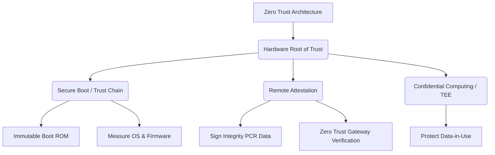

+++
title = "644. 제로 트러스트 (Zero Trust) 아키텍처의 하드웨어 루트 오브 트러스트"
weight = 644
+++

> **3-line Insight**
> *   제로 트러스트(Zero Trust)는 "아무것도 신뢰하지 않고 항상 검증한다(Never Trust, Always Verify)"는 보안 철학으로, 네트워크 경계 기반 보안의 한계를 극복하기 위한 최신 패러다임입니다.
> *   하드웨어 루트 오브 트러스트(Hardware Root of Trust, RoT)는 소프트웨어가 변조될 수 있다는 가정하에, 암호학적 키(Cryptographic Keys)와 보안 부팅(Secure Boot) 과정을 보호하는 가장 신뢰할 수 있는 물리적 기반(Foundation)입니다.
> *   제로 트러스트 아키텍처가 실질적인 보안을 보장하려면, 상위 계층의 ID 및 접근 관리(IAM)가 하드웨어 RoT가 제공하는 불변의 디바이스 무결성(Device Integrity) 검증 증명과 결합되어야 합니다.

# Ⅰ. 제로 트러스트(Zero Trust)와 보안 기반의 한계

## 1. 제로 트러스트(Zero Trust) 아키텍처의 패러다임
과거의 IT 보안은 내부 네트워크와 외부 네트워크를 구분하는 경계 기반 보안(Perimeter-based Security, 일명 성과 해자 모델)에 의존했습니다. 방화벽 내부에 진입한 사용자나 기기는 기본적으로 신뢰받았습니다. 그러나 클라우드 전환과 재택근무의 확산으로 경계가 모호해졌고, 내부자 위협(Insider Threat)이나 탈취된 자격 증명을 통한 공격이 증가했습니다. 이를 방어하기 위해 도입된 제로 트러스트(Zero Trust) 모델은 위치(내/외부)에 상관없이 사용자의 신원, 디바이스 상태, 컨텍스트를 매 접속 요청 시마다 엄격하게 인증하고 최소 권한(Least Privilege)만 부여합니다.

## 2. 소프트웨어 기반 검증의 근본적 취약점
제로 트러스트는 디바이스의 상태(Health)를 지속적으로 검증해야 합니다. 그러나 운영체제(OS)나 백신(Anti-virus) 같은 소프트웨어 수준의 검증 에이전트만으로는 완벽을 기할 수 없습니다. 공격자가 펌웨어(Firmware)를 변조하거나 OS 커널(Kernel) 권한(Rootkit)을 장악하면, 보안 검증 소프트웨어 자체를 속여 기기가 안전한 것처럼 거짓 보고(Spoofing)하게 만들 수 있기 때문입니다. 따라서 신뢰의 시작점이 되는 조작 불가능한 기반(Anchor)이 필수적으로 요구됩니다.

📢 섹션 요약 비유: 제로 트러스트가 건물 출입 시 모든 문마다 신분증과 지문을 검사하는 철저한 경비원이라면, 소프트웨어 검증의 한계는 범죄자가 위조 신분증을 만들거나 경비원을 매수한 상황입니다. 아무리 검사를 깐깐하게 해도, 검사하는 기준 자체(소프트웨어)가 오염되면 소용이 없습니다.

# Ⅱ. 하드웨어 루트 오브 트러스트 (Hardware RoT)의 개념과 구조

## 1. 하드웨어 루트 오브 트러스트(Root of Trust, RoT)의 정의
하드웨어 RoT는 시스템 내에서 무조건적으로 신뢰할 수밖에 없는 암호학적 및 연산의 최소 물리적 구성 요소입니다. 이는 하드웨어 칩(Silicon) 내에 고립된 실행 환경(Isolated Execution Environment)으로 설계되어 있으며, 어떠한 소프트웨어 악성코드나 상위 계층의 관리자 권한으로도 물리적으로 간섭하거나 변조할 수 없습니다. 시스템 부팅, 키 관리, 암호화 연산의 절대적인 기점(Trust Anchor) 역할을 합니다.

## 2. 하드웨어 RoT의 핵심 구성 요소
하드웨어 RoT는 다음과 같은 물리적/논리적 구조를 가집니다.

```text
[ Application Layer ] (OS, Apps - Untrusted by default)
        |
        v
[ Hardware Root of Trust (RoT) Boundary - Silicon Level ]
  +-------------------------------------------------------------+
  |  1. RoT for Measurement (RTM) : 부팅 코드의 해시(Hash) 측정   |
  |  2. RoT for Storage (RTS) : 암호키 및 측정값(PCR)의 안전 저장 |
  |  3. RoT for Reporting (RTR) : 플랫폼 상태에 대한 암호화된 증명 |
  +-------------------------------------------------------------+
  |  [ Immutable Boot ROM ] - 수정 불가, 시스템의 첫 번째 실행 코드 |
  |  [ Cryptographic Engine ] - 하드웨어 가속 AES, RSA, ECC     |
  |  [ Secure Memory / Fuses ] - 키 주입 및 영구 저장 공간      |
  +-------------------------------------------------------------+
```
대표적인 하드웨어 RoT 구현체로는 TPM(Trusted Platform Module), TEE(Trusted Execution Environment, 예: ARM TrustZone, Intel SGX), Apple의 Secure Enclave, Google의 Titan 칩 등이 있습니다.

📢 섹션 요약 비유: 하드웨어 RoT는 은행의 거대한 '초대형 금고(Vault)'와 같습니다. 금고 벽면은 아주 두꺼운 콘크리트와 강철(물리적 칩 분리)로 되어 있어서 밖에서 드릴로 뚫거나 불태우려는 어떤 시도(해킹, 악성코드)도 막아내며, 은행장(OS 최고 권한자)조차도 마음대로 부수고 안을 들여다볼 수 없는 절대적인 신뢰의 공간입니다.

# Ⅲ. 보안 부팅(Secure Boot)과 신뢰 체인(Chain of Trust) 구축

## 1. 정적 신뢰 체인 (Static Root of Trust for Measurement, SRTM)
하드웨어 RoT의 가장 중요한 역할은 시스템 전원을 켜는 순간부터 운영체제가 로드될 때까지 펌웨어와 부트로더(Bootloader)가 악성코드에 감염되지 않았음을 검증하는 것입니다. 변조 불가능한 Boot ROM(하드웨어 RoT)이 가장 먼저 실행되어 다음 단계 코드(예: UEFI 펌웨어)의 암호학적 해시(Hash)를 계산하고, 이를 저장된 무결성 기준값(Golden Value)과 비교합니다. 검증이 통과되어야만 다음 코드를 실행하며, 이 과정이 OS 커널 로딩까지 연쇄적으로 이어져 신뢰 체인(Chain of Trust)을 형성합니다.

## 2. 동적 신뢰 체인 (Dynamic Root of Trust for Measurement, DRTM)
SRTM은 부팅 시점의 무결성을 보장하지만, 부팅 이후 런타임에 발생하는 공격(예: 메모리 내 악성코드 주입)에는 취약합니다. 이를 보완하는 DRTM은 시스템 운영 중 언제라도 CPU의 특정 명령(예: Intel TXT, AMD SKINIT)을 호출하여 시스템을 일시 정지시키고, 안전하고 격리된 상태에서 다시 무결성을 측정하여 신뢰 체인을 동적으로 재설정하는 기술입니다. 제로 트러스트의 "지속적 검증" 철학을 하드웨어 레벨에서 뒷받침합니다.

📢 섹션 요약 비유: 신뢰 체인(Chain of Trust)은 릴레이 달리기 장거리 경기에서 바통을 넘겨주는 것과 같습니다. 첫 번째 주자(Boot ROM)는 절대 도핑(해킹)을 할 수 없는 로봇이며, 이 주자가 다음 주자의 피 검사(해시 검증)를 해서 통과해야만 바통을 넘깁니다. 바통이 마지막 주자(운영체제)까지 도착했다면, 그 과정의 모든 주자가 깨끗하다는 것을 100% 보장할 수 있습니다.

# Ⅳ. 원격 증명 (Remote Attestation)과 제로 트러스트의 결합

## 1. 원격 증명 (Remote Attestation) 메커니즘
제로 트러스트 네트워크 액세스(Zero Trust Network Access, ZTNA) 게이트웨이는 기기의 접속 요청을 허가하기 전에 해당 기기가 정말 안전한지 증명(Attestation)을 요구합니다. 기기 내부의 하드웨어 RoT(예: TPM)는 부팅 과정에서 기록된 무결성 측정값(Platform Configuration Registers, PCRs)을 자신의 비밀 보증 키(Endorsement Key, EK)로 디지털 서명(Digital Signature)하여 게이트웨이에 전송합니다. 이 서명은 하드웨어 자체에서 생성되었으므로 악성코드가 위조할 수 없습니다.

## 2. 하드웨어 기반 컨텍스트 인식 제로 트러스트
검증 서버는 수신한 증명 데이터를 분석하여 기기의 펌웨어나 부트 설정이 변경되지 않았는지 확인합니다. 만약 해커가 OS 커널을 변조했다면 측정값(Hash)이 달라지므로 증명에 실패하고, ZTNA 게이트웨이는 즉각적으로 해당 기기의 네트워크 접속을 차단하거나 격리(Quarantine) 네트워크로 리디렉션합니다. 이를 통해 상위 레벨의 신원 인증(ID/Password, MFA)과 하위 레벨의 디바이스 물리적 무결성이 결합된 진정한 엔드투엔드(End-to-End) 제로 트러스트가 완성됩니다.

📢 섹션 요약 비유: 원격 증명은 입국 심사대(제로 트러스트 게이트웨이)에서 위조 방지 홀로그램이 박힌 전자 여권(디지털 서명된 증명 데이터)을 스캔하는 것입니다. 이 홀로그램은 여권을 만든 국가의 조폐공사(하드웨어 RoT)에서만 찍어낼 수 있기 때문에, 범죄자가 여권의 사진이나 이름을 교묘하게 바꾸려고 시도하더라도 단번에 가짜임을 적발하고 입국을 거부할 수 있습니다.

# Ⅴ. 차세대 하드웨어 보안: 컨피덴셜 컴퓨팅 (Confidential Computing)

## 1. 데이터 사용 중(Data-in-Use) 보안의 완성
전통적인 보안은 데이터가 저장될 때(Data-at-Rest)나 네트워크로 전송될 때(Data-in-Transit) 암호화를 수행합니다. 하지만 데이터가 메모리에 적재되어 CPU에서 연산되는 순간(Data-in-Use)에는 평문(Plaintext)으로 노출되어 메모리 스크래핑(Memory Scraping) 공격에 취약합니다. 제로 트러스트 아키텍처는 이를 해결하기 위해 컨피덴셜 컴퓨팅(Confidential Computing)을 도입하고 있습니다.

## 2. 신뢰 실행 환경(TEE, Trusted Execution Environment)의 역할
하드웨어 RoT를 기반으로 한 신뢰 실행 환경(TEE)은 CPU 내부에 메모리 암호화 기술과 강력한 하드웨어 격리 장벽을 통해 엔클레이브(Enclave)라는 암호화된 블랙박스 영역을 생성합니다. 클라우드 관리자(Hypervisor)나 침해된 호스트 OS조차도 이 엔클레이브 내부의 데이터와 코드에 접근할 수 없습니다. 따라서 퍼블릭 클라우드의 제로 트러스트 환경에서 금융 데이터나 AI 모델과 같은 극비 자산을 처리할 때 절대적인 기밀성을 보장합니다.

📢 섹션 요약 비유: 컨피덴셜 컴퓨팅의 엔클레이브는 투명한 유리로 된 일반 회의실(일반 메모리) 안에, 누구도 안을 들여다볼 수 없고 엿들을 수 없는 완전 방음·불투명 마법 텐트(TEE)를 치는 것과 같습니다. 건물 관리인(클라우드 관리자)이 회의실 안에 마음대로 들어올 수는 있지만, 마법 텐트 안에서 무슨 극비 회의(데이터 연산)가 진행되는지는 절대 알 수 없습니다.

---

### 💡 Knowledge Graph 및 초등학생 비유

**Knowledge Graph**


**초등학생 비유**
제로 트러스트는 "아무도 믿지 마!"라는 보안 규칙이에요. 컴퓨터 안에 나쁜 바이러스가 몰래 들어와서 "나는 착한 프로그램이야"라고 거짓말을 할 수 있거든요. 하드웨어 '루트 오브 트러스트'는 컴퓨터의 심장 깊숙한 곳에 있는 '절대 부서지지 않는 거짓말 탐지기(칩)'예요. 이 칩은 도둑이 절대 조작할 수 없어서, 컴퓨터가 켜질 때마다 모든 프로그램이 진짜 착한지 꼼꼼하게 검사하고, 중앙 관리자에게 "이 컴퓨터는 거짓말을 하지 않아요!"라고 확실한 도장을 찍어 보내는 아주 중요한 역할을 한답니다.
