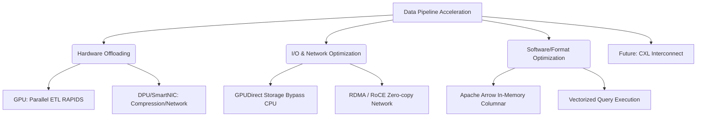

+++
title = "645. 데이터 파이프라인 (Data Pipeline) 가속"
weight = 645
+++

> **3-line Insight**
> *   데이터 파이프라인(Data Pipeline) 가속은 데이터의 수집, 정제, 변환, 적재(ETL) 및 분석 과정에서 발생하는 CPU와 메모리 병목 현상을 타파하여 처리 속도를 극대화하는 기술적 접근입니다.
> *   기존 CPU 중심의 처리 방식에서 벗어나, GPU, FPGA, DPU(Data Processing Unit), SmartNIC과 같은 전용 하드웨어 가속기(Hardware Accelerators)로 연산을 오프로딩(Offloading)하는 것이 핵심입니다.
> *   단순한 하드웨어의 도입을 넘어, GPU 다이렉트 스토리지(GPUDirect Storage), RDMA, 그리고 Apache Arrow 기반의 인메모리 포맷 최적화를 아우르는 풀 스택(Full-stack) 아키텍처 재설계가 요구됩니다.

# Ⅰ. 데이터 파이프라인 가속의 필요성과 병목 분석

## 1. 현대 데이터 파이프라인의 구조와 한계
데이터 파이프라인은 다양한 소스에서 데이터를 수집(Ingest)하고, 분석 가능한 형태로 변환(Transform)하여, 데이터 웨어하우스나 머신러닝 모델로 적재(Load)하는 일련의 데이터 이동 및 처리 경로입니다. 빅데이터 인프라에서는 전통적으로 Apache Spark, Hadoop과 같은 분산 프레임워크를 기반으로 범용 CPU를 사용하여 이 과정을 처리해왔습니다. 그러나 데이터 볼륨이 페타바이트(Petabyte) 급으로 폭증하고, 실시간 스트리밍 처리 요구사항이 강화되면서, 직렬 처리에 최적화된 CPU 코어는 압축 해제(Decompression), 파싱(Parsing), 조인(Join)과 같은 대규모 데이터 변환 작업에서 심각한 병목(Bottleneck)을 겪게 되었습니다.

## 2. 폰 노이만 병목 (Von Neumann Bottleneck) 과 I/O의 한계
데이터 파이프라인 지연의 근본 원인은 연산 능력 부족뿐만 아니라 데이터를 이동시키는 과정에 있습니다. CPU가 스토리지(SSD)에서 데이터를 가져오기 위해서는 PCIe 버스를 거쳐 호스트 메모리(RAM)로 복사하고, 이를 다시 CPU 캐시로 가져와야 하는 여러 단계의 복사 오버헤드(Memory Copy Overhead)가 발생합니다. 연산 속도보다 데이터 이동 속도가 훨씬 느린 '폰 노이만 병목'과 '메모리 장벽(Memory Wall)' 현상이 파이프라인의 전체 성능을 갉아먹는 주범이 됩니다.

📢 섹션 요약 비유: 데이터 파이프라인 병목은 엄청난 양의 밀가루(데이터)를 빵(인사이트)으로 만드는 공장에서 발생합니다. 오븐(CPU)은 크지만, 밀가루를 창고(스토리지)에서 가져와 반죽(변환)하고 오븐에 넣는 과정(I/O 복사)을 사람 몇 명이 일일이 손수레로 나르다 보니 오븐이 비어있는 채로 계속 기다리게 되는 비효율적인 상황과 같습니다.

# Ⅱ. 하드웨어 가속기(Hardware Accelerators)를 통한 연산 오프로딩

## 1. GPU (Graphics Processing Unit) 기반 데이터 처리 가속
그래픽 처리를 위해 탄생한 GPU는 수천 개의 작은 코어로 이루어져 있어, 방대한 데이터 세트에 동일한 연산을 동시에 수행하는 SIMD(Single Instruction, Multiple Data) 처리에 최적화되어 있습니다. 최근 RAPIDS(NVIDIA)와 같은 데이터 사이언스 프레임워크가 등장하여, 머신러닝 훈련뿐만 아니라 데이터프레임(DataFrame) 병합, 필터링, 정렬 등 ETL 작업 전체를 GPU로 오프로딩(Offloading)하여 CPU 대비 수십 배의 가속을 실현하고 있습니다.

## 2. DPU(Data Processing Unit)와 SmartNIC의 네트워킹 및 인프라 가속
데이터 파이프라인의 병목은 노드(Node) 간의 네트워크 이동에서도 발생합니다. DPU나 SmartNIC은 서버의 메인 CPU 대신 네트워크 패킷 처리, 암호화/복호화, 데이터 압축 및 해제 등의 인프라(Infrastructure) 작업을 전담하여 처리합니다. 데이터가 서버 섀시(Chassis)에 도착하자마자 네트워크 카드 단에서 불필요한 데이터를 필터링하거나 압축을 풀어버리므로, 호스트 CPU는 순수하게 애플리케이션 비즈니스 로직(분석)에만 집중할 수 있게 되어 전체 파이프라인 처리량이 대폭 상승합니다.

📢 섹션 요약 비유: 공장의 효율을 높이기 위해, 단순 반복적이고 힘든 반죽 작업과 포장 작업(압축, 네트워크 처리)은 로봇 팔(DPU, SmartNIC)이나 컨베이어 벨트(GPU)에 전부 맡겨버리는 것입니다. 그러면 수석 제빵사(CPU)는 레시피 개발이나 맛 테스트(고차원 분석 및 제어)라는 본연의 중요한 업무에만 100% 집중할 수 있게 됩니다.

# Ⅲ. 스토리지 및 메모리 아키텍처 혁신 (I/O 가속)

## 1. GPUDirect Storage 및 호스트 메모리 바이패스 (Bypass)
앞서 언급한 데이터 이동의 병목을 해결하기 위해 나타난 기술이 GPUDirect Storage와 같은 다이렉트 I/O 기술입니다. 전통적으로 스토리지는 데이터를 GPU 메모리로 보내기 위해 반드시 호스트 CPU의 시스템 메모리(RAM)를 거쳐야(Bounce Buffer) 했습니다. GPUDirect Storage는 PCIe 스위치를 통해 NVMe 스토리지에서 GPU의 VRAM으로 데이터를 직접(Direct Memory Access, DMA) 전송합니다. CPU와 시스템 메모리를 우회(Bypass)하므로 레이턴시가 획기적으로 줄고 I/O 대역폭이 극대화됩니다.

## 2. RDMA (Remote Direct Memory Access) 오버 이더넷(RoCE)
분산 데이터 파이프라인에서 여러 서버 노드 간의 데이터 셔플링(Shuffling) 과정은 대규모 네트워크 오버헤드를 유발합니다. RDMA(Remote Direct Memory Access)는 한 서버의 애플리케이션이 다른 서버의 메모리 영역에 직접 접근하여 데이터를 읽고 쓰는 기술입니다. 운영체제의 커널(Kernel) 개입 및 TCP/IP 스택 처리 과정을 생략(Zero-copy)하기 때문에 네트워크 지연 시간을 마이크로초(Microsecond) 단위로 낮추어 분산 노드 간의 데이터 전송을 가속합니다.

📢 섹션 요약 비유: GPUDirect와 RDMA는 고속도로에 '화물 전용 하이패스 차로'를 뚫는 것과 같습니다. 예전에는 화물을 다른 도시(GPU나 다른 서버)로 보낼 때마다 반드시 중앙 톨게이트(CPU, 커널)에서 멈춰서 서류 검사(메모리 복사)를 받아야 했지만, 이제는 톨게이트를 무시하고 창고와 창고 사이를 전용 직통 도로로 최고 속도로 달리게 된 것입니다.

# Ⅳ. 소프트웨어 포맷과 프레임워크의 최적화

## 1. Apache Arrow: 인메모리 컬럼너(Columnar) 포맷
하드웨어가 아무리 빨라도 데이터를 표현하는 소프트웨어 포맷이 비효율적이면 성능을 낼 수 없습니다. Apache Arrow는 이종 시스템(Python, Java, C++, Spark 등) 간에 메모리 내에서 데이터를 표현하는 언어 독립적인 표준 컬럼 지향(Columnar) 데이터 포맷입니다. 데이터를 직렬화(Serialization)하거나 역직렬화(Deserialization)하는 비용 없이 프로세스 간에 메모리 버퍼를 그대로 복사하여 공유(Zero-copy Data Sharing)할 수 있게 해 주어 변환 파이프라인을 급격히 가속시킵니다.

## 2. 벡터화된 쿼리 실행 엔진 (Vectorized Query Execution)
데이터베이스 쿼리나 ETL 변환 작업을 수행할 때, 전통적인 방식은 한 번에 하나의 행(Row) 데이터를 처리(Tuple-at-a-time)했습니다. 반면 벡터화된 실행(Vectorized Execution) 엔진은 한 번에 수천 개의 데이터 묶음(Batch of Vectors)을 CPU의 SIMD 레지스터에 적재하여 병렬로 처리합니다. Apache Arrow 포맷과 결합된 벡터화 엔진(예: DuckDB, Velox)은 메모리 대역폭을 최대한 활용하여 CPU의 캐시 효율성을 극대화합니다.

📢 섹션 요약 비유: Apache Arrow는 세계 어디서나 통용되는 '표준 컨테이너 박스'입니다. 예전에는 배에서 기차로 짐을 옮길 때 박스를 일일이 풀어서 다시 포장(직렬화/역직렬화)해야 했지만, 이제는 표준 컨테이너 통째로 크레인으로 한 번에 옮기기만 하면(Zero-copy) 되니까 물류(데이터 파이프라인) 속도가 엄청나게 빨라지는 것입니다.

# Ⅴ. 차세대 컴퓨팅 아키텍처: CXL의 도입

## 1. Compute Express Link (CXL) 인터페이스
데이터 파이프라인 가속의 미래는 CXL(Compute Express Link) 기술에 있습니다. CXL은 PCIe 물리 계층 위에서 동작하는 고속 인터커넥트 표준으로, CPU, GPU, 메모리, 스토리지 간의 캐시 일관성(Cache Coherency)을 하드웨어 레벨에서 보장합니다. 이는 가속기(GPU, FPGA)와 CPU가 완전히 동일한 메모리 공간을 지연 없이 공유할 수 있음을 의미합니다.

## 2. 메모리 풀링(Memory Pooling)과 진정한 분리형 아키텍처
CXL을 통해 스토리지 박스처럼 방대한 '메모리 풀(Memory Pool)'을 구성할 수 있습니다. 데이터 파이프라인 워크로드의 특성에 따라 필요한 만큼의 메모리 용량과 대역폭을 동적으로 할당(Composable Architecture)할 수 있게 되어, 데이터 이리저리 이동시킬 필요 없이 한 곳에 데이터를 두고 다양한 연산 장치(CPU, GPU, DPU)가 돌아가며 접근하는 '데이터 중심(Data-Centric)' 컴퓨팅을 완성하여 궁극적인 파이프라인 가속을 달성합니다.

📢 섹션 요약 비유: CXL은 여러 부서의 사람들이 모여 회의할 때, 각자 자기 자리에 앉아 문서를 주고받는 대신 아주 거대한 '공유 원탁 테이블(CXL 메모리 풀)'을 만드는 것입니다. 자료(데이터)는 테이블 한가운데 가만히 두고, 기획자(CPU), 디자이너(GPU), 회계사(DPU)가 동시에 테이블에 붙어서 실시간으로 문서를 수정하고 공유(캐시 일관성)하는 완벽한 협업 시스템입니다.

---

### 💡 Knowledge Graph 및 초등학생 비유

**Knowledge Graph**

**초등학생 비유**
데이터 파이프라인 가속은 피자를 배달하는 과정을 엄청나게 빠르게 만드는 작전이에요! 예전에는 요리사(CPU) 한 명이 주문받기, 재료 썰기, 굽기, 배달까지 다 해서 너무 느렸어요. 이제는 재료를 썰고 굽는 기계(GPU 가속기)를 들여놓고, 배달 전용 쌩쌩이 오토바이(RDMA 네트워크)를 샀어요. 게다가 치즈를 창고에서 도마 위로 거치지 않고 바로 오븐으로 쏘아 보내는 마법의 터널(GPUDirect)까지 만들어서 피자(데이터)가 눈 깜짝할 새에 완성되어 배달되는 거랍니다!
