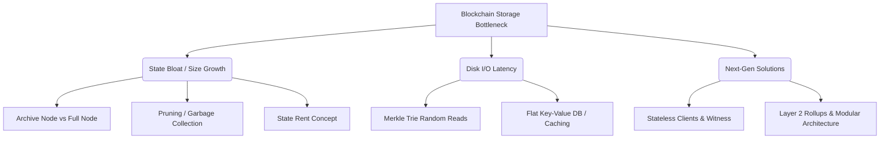

+++
title = "646. 블록체인 노드 스토리지 병목 현상"
weight = 646
+++

> **3-line Insight**
> *   블록체인 노드 스토리지 병목 현상(Blockchain Node Storage Bottleneck)은 시간이 지남에 따라 무한히 증가하는 블록체인 원장(Ledger) 데이터와 상태(State) 데이터의 크기로 인해 발생하는 성능 저하와 자원 고갈 문제입니다.
> *   특히 트랜잭션 처리량(TPS)이 높은 이더리움이나 솔라나 같은 스마트 컨트랙트 플랫폼에서 수십 억 개의 상태 트리(Merkle Patricia Trie)를 디스크(SSD/HDD)에서 읽고 쓰는 과정의 I/O 지연이 핵심 원인입니다.
> *   이를 해결하기 위해 스토리지 프루닝(Pruning), 상태 임대(State Rent), 샤딩(Sharding), 영지식 증명(Zero-Knowledge Proofs)을 활용한 상태 압축 등 다각적인 아키텍처 개선이 진행되고 있습니다.

# Ⅰ. 블록체인 스토리지 병목 현상의 원인

## 1. 블록체인 데이터 구조의 특성과 팽창 (Bloat)
블록체인은 본질적으로 과거의 모든 거래 기록을 삭제하거나 위조할 수 없도록 영구적으로 보존하는 '추가 전용(Append-only)' 분산 데이터베이스입니다. 블록(Block) 단위로 데이터가 계속 추가되기 때문에, 네트워크가 활성화될수록 원장의 전체 크기(Chain Size)는 끝없이 팽창(State Bloat)합니다. 새로운 노드(Full Node)가 네트워크에 참여하여 과거부터 현재까지의 모든 블록을 다운로드하고 검증하는 동기화(Syncing) 과정에 수 주일이 소요될 수 있으며, 이는 일반 사용자의 노드 운영(Decentralization)을 심각하게 저해합니다.

## 2. 상태 트리(State Trie)의 디스크 I/O 레이턴시 병목
가장 치명적인 병목은 단순 블록 데이터의 크기가 아니라 '상태(State) 데이터'의 I/O 처리에서 발생합니다. 비트코인의 UTXO 모델과 달리, 이더리움은 스마트 컨트랙트의 계정 잔액, 코드 변수 등의 현재 상태를 저장하는 거대한 머클 패트리샤 트리(Merkle Patricia Trie) 구조를 사용합니다. 트랜잭션 하나를 실행할 때마다 이 트리를 갱신하기 위해 하부 스토리지(LevelDB, RocksDB)에서 수많은 랜덤 읽기/쓰기(Random Read/Write) 작업이 발생하며, 이는 고성능 NVMe SSD를 사용하더라도 막대한 I/O 병목(I/O Bottleneck)을 유발하여 시스템 전체의 TPS(초당 트랜잭션 수) 상승을 가로막습니다.

📢 섹션 요약 비유: 블록체인 스토리지는 절대로 일기장을 버리지 못하고 죽을 때까지 모든 일기를 다 짊어지고 다녀야 하는 사람과 같습니다. 게다가 '상태 I/O 병목'은 오늘 가계부에 천 원을 쓰기 위해 10년 치 일기장이 꽂혀 있는 거대한 책장(디스크) 구석구석을 뛰어다니며 옛날 장부를 찾아 확인하고 돌아와야 하는 극도로 비효율적인 상황과 같습니다.

# Ⅱ. 노드 유형에 따른 스토리지 부담 (Node Types)

## 1. 풀 노드 (Full Node)와 아카이브 노드 (Archive Node)
블록체인 네트워크의 무결성을 유지하는 풀 노드(Full Node)는 모든 블록의 트랜잭션을 스스로 검증하고 최근의 상태(State)만을 유지합니다. 반면 아카이브 노드(Archive Node)는 블록체인이 시작된 제네시스 블록(Genesis Block)부터 현재까지의 모든 과거 '상태 변화'의 스냅샷을 저장합니다. 블록 탐색기(Block Explorer)나 복잡한 체인 분석을 위해 필요하지만, 이더리움의 경우 아카이브 노드의 크기는 수 테라바이트(TB)를 가볍게 넘어서며 막대한 스토리지 비용을 요구합니다.

## 2. 라이트 클라이언트 (Light Client / Light Node)
스토리지 병목을 피하기 위해 설계된 라이트 클라이언트는 블록의 전체 내용(Body)을 다운로드하지 않고, 블록의 헤더(Header)만을 다운로드하여 트랜잭션의 검증(SPV, Simplified Payment Verification)을 수행합니다. 모바일 기기에서도 실행할 수 있을 만큼 스토리지 요구량이 작지만, 블록체인 네트워크의 완전한 탈중앙화 기여(블록 생성 및 전체 검증) 측면에서는 한계가 있습니다.

📢 섹션 요약 비유: 아카이브 노드는 국립 도서관 지하 수장고에 과거 수백 년 치 신문 원본을 모두 쌓아두는 것이고, 풀 노드는 최근 몇 달 치 신문만 꼼꼼히 읽고 보관하는 구독자입니다. 라이트 노드는 짐이 무거우니 신문의 '헤드라인(블록 헤더)'만 스마트폰으로 훑어보고 내용을 믿는 바쁜 현대인입니다.

# Ⅲ. 스토리지 병목 완화를 위한 구조적 개선 전략

## 1. 프루닝 (Pruning) 및 가비지 컬렉션 (Garbage Collection)
스토리지 팽창을 억제하는 가장 기본적인 방법은 프루닝(가지치기, Pruning)입니다. 노드는 최신 상태(Current State)를 계산하기 위해 굳이 오래된 과거의 상태 트리(Historical State Tries)를 모두 가지고 있을 필요가 없습니다. 오래되고 더 이상 접근되지 않는 쓸모없는 데이터 노드(Dead Nodes)를 주기적으로 디스크에서 삭제(가비지 컬렉션)하여 스토리지 용량을 확보하는 기술입니다.

## 2. 상태 임대료 (State Rent) 도입 논의
경제적 인센티브 관점에서의 해결책은 상태 임대(State Rent) 모델입니다. 스마트 컨트랙트 개발자가 블록체인 공간(상태 데이터)에 데이터를 한 번 기록하면 영원히 노드들의 디스크 공간을 공짜로 점유(Tragedy of the Commons)하는 현상을 막기 위해, 스토리지를 차지하는 시간과 용량에 비례하여 임대료(수수료)를 지속적으로 부과하는 메커니즘입니다. 임대료를 내지 않는 컨트랙트의 상태 데이터는 일시적으로 동결(Hibernate)되거나 체인 밖으로 축출됩니다.

📢 섹션 요약 비유: 프루닝은 스마트폰 용량이 꽉 찼을 때 3년 전 안 보는 사진과 동영상을 지우는(가비지 컬렉션) 것입니다. 상태 임대료는 공용 주차장(블록체인 스토리지)에 고장 난 차를 영원히 공짜로 방치하지 못하게, 주차한 시간만큼 요금을 매겨 스스로 차를 빼게 만드는 제도입니다.

# Ⅳ. 데이터베이스 최적화와 I/O 성능 개선

## 1. 평면적 키-값 스토리지 (Flat Key-Value Storage) 도입
이더리움의 기존 머클 트리는 한 계정의 잔액을 조회하기 위해 트리의 노드를 따라 디스크에서 O(log N) 번의 랜덤 읽기(Random Read)를 수행해야 했습니다. 이를 개선하기 위해 상태 데이터의 계정 주소를 해시하여 직접 값을 매핑하는 평면적(Flat) 데이터베이스 구조를 혼용하는 방법(예: Ethereum의 Verkle Trie 전환 논의, Turbo-Geth의 아키텍처)이 도입되고 있습니다. 이를 통해 상태 조회를 1번의 디스크 접근(O(1))으로 단축하여 스토리지 병목을 획기적으로 개선합니다.

## 2. 메모리 캐싱 (In-Memory Caching)과 비동기 I/O
디스크의 물리적 한계를 극복하기 위해 자주 접근되는 상태 데이터(Hot State)를 RAM에 상주시키는 대규모 인메모리 캐싱(In-Memory Caching)을 사용합니다. 또한 블록을 검증하는 트랜잭션 처리(CPU 연산) 과정과 상태를 디스크에 저장하는 과정(Storage I/O)을 분리하여 비동기적(Asynchronous)으로 실행함으로써 병목을 완화합니다.

📢 섹션 요약 비유: 평면적 스토리지는 도서관에서 책을 찾을 때, 복잡한 십진분류표를 따라 여러 서가를 거치지 않고 "A-15번 칸"이라고 적힌 색인표만 보고 책을 한 번에 뽑아오는 방식입니다. 인메모리 캐싱은 자주 읽는 베스트셀러만 사서의 책상(RAM) 위에 올려두어 창고(디스크)까지 갈 필요를 없애는 것입니다.

# Ⅴ. 차세대 솔루션: 상태 비저장 (Statelessness) 및 오프체인

## 1. 무상태성 (Stateless Clients) 아키텍처
스토리지 병목을 근본적으로 해결하는 차세대 패러다임은 무상태 클라이언트(Stateless Clients)입니다. 노드가 1테라바이트에 달하는 전체 상태 데이터를 하드디스크에 저장할 필요 없이, 블록 생성자(Miner/Validator)가 블록과 함께 이 트랜잭션들이 유효하다는 암호학적 증거(Witness, 머클 증명 등)를 함께 첨부하여 전송합니다. 검증 노드는 디스크에 저장된 상태가 없어도(Stateless) 이 증거(Witness)만을 수학적으로 검증하여 거래를 확정 지을 수 있습니다.

## 2. 롤업(Rollups)과 데이터 가용성(Data Availability) 계층의 분리
연산과 상태 저장의 책임을 메인넷(Layer 1)에서 분리합니다. 영지식 롤업(ZK-Rollups)이나 옵티미스틱 롤업(Optimistic Rollups)은 수천 건의 트랜잭션을 외부 네트워크(Layer 2)에서 연산하고 상태를 압축한 뒤, 메인넷에는 매우 작은 크기의 결과 요약본(콜데이터, 증명)만 기록합니다. 향후 블록체인은 복잡한 상태를 저장하는 곳이 아니라, 데이터가 존재한다는 사실만 보장(Data Availability Layer)하는 거대한 분산 스토리지 게시판으로 역할을 쪼개어 병목을 해소하는 아키텍처(Modular Blockchain)로 진화하고 있습니다.

📢 섹션 요약 비유: 무상태 클라이언트는 시험 채점을 할 때 학생이 '정답지'와 함께 '풀이 과정 증명서'를 내는 것입니다. 선생님(노드)은 두꺼운 교과서(상태 데이터)를 일일이 뒤져보지 않고 그 증명서만 보고 바로 채점할 수 있습니다. 롤업은 수천 명의 주민 투표 결과를 동네 반장이 다 집계해서 최종 결과 딱 한 장의 요약본만 시청(메인넷)에 제출하여 시청 서류고(스토리지)의 부담을 덜어주는 것입니다.

---

### 💡 Knowledge Graph 및 초등학생 비유

**Knowledge Graph**

**초등학생 비유**
블록체인은 절대 지울 수 없는 마법의 '전교생 용돈 기입장'이에요. 그런데 학교가 오래되다 보니 기입장이 산더미(스토리지 팽창)처럼 쌓여서, 누가 떡볶이를 사 먹을 때마다 옛날 장부를 다 뒤져서 잔돈이 맞는지 확인(I/O 병목)하느라 시간이 너무 오래 걸려요. 그래서 최근에는 안 보는 옛날 장부는 창고에 치워버리고(프루닝), 학생이 물건을 살 때 "나 돈 이만큼 있어!"라는 영수증(암호학적 증명, 무상태성)을 같이 내게 해서 선생님이 장부를 덜 뒤지게 만드는 똑똑한 방법을 쓰고 있어요.
