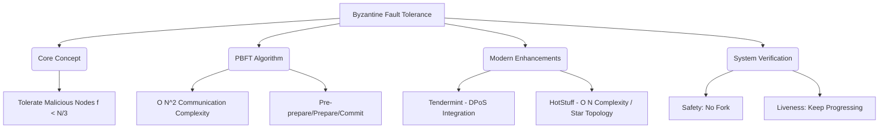

+++
title = "647. 비잔틴 장애 허용 (BFT) 분산 시스템 검증"
weight = 647
+++

> **3-line Insight**
> *   비잔틴 장애 허용(Byzantine Fault Tolerance, BFT)은 분산 시스템 내의 일부 노드가 단순히 고장(Crash) 나는 것을 넘어, 악의적으로 잘못된 정보(거짓말)를 전송하거나 임의의 방식으로 실패하더라도 시스템 전체의 신뢰성과 일관성(Consistency)을 유지하는 알고리즘적 특성입니다.
> *   과거 항공우주 산업의 컴퓨터 시스템이나 폐쇄적인 네트워크에서 사용되던 BFT는, 퍼블릭 블록체인(Public Blockchain) 시대의 등장과 함께 서로 신뢰하지 않는 참여자 간의 탈중앙화된 합의(Decentralized Consensus)를 도출하는 핵심 기반 기술로 부상했습니다.
> *   성능 향상과 네트워크 오버헤드(O(N²))를 극복하기 위해 실용적 비잔틴 장애 허용(PBFT)에서 시작하여, 위임 지분 증명(DPoS)과 결합되거나 통신 복잡도를 O(N)으로 낮춘 최신 BFT 알고리즘(예: HotStuff, Tendermint)으로 지속 발전하고 있습니다.

# Ⅰ. 비잔틴 장군의 딜레마와 BFT의 개념

## 1. 비잔틴 장군 문제 (Byzantine Generals Problem)의 기원
1982년 레슬리 램포트(Leslie Lamport) 등이 제안한 사고 실험입니다. 비잔틴 제국의 장군들이 각자의 부대를 이끌고 적군 성벽을 둘러싸고 있습니다. 성을 함락시키려면 모든 장군이 동시에 '공격'하거나 동시에 '후퇴'해야(합의 도출) 합니다. 그러나 장군들은 서로 멀리 떨어져 있어 전령(네트워크 통신)을 통해서만 메시지를 주고받을 수 있으며, 장군들 중 일부는 적의 스파이(배신자)일 수 있습니다. 배신자는 일부 장군에게는 '공격'하라고 전하고 다른 장군에게는 '후퇴'하라고 전하여 전체 계획을 무산시키려 합니다. 이러한 상황에서 충성스러운 장군들이 어떻게 동일한 결론에 도달할 수 있는지가 핵심 딜레마입니다.

## 2. 비잔틴 장애 (Byzantine Fault)의 정의
컴퓨터 분산 시스템에서 장애는 크게 두 가지로 나뉩니다. 첫째는 노드가 단순히 응답을 멈추는 고장 장애(Crash-stop Fault)입니다(예: 전원 꺼짐, 네트워크 단절). 둘째는 노드가 멈추지 않고 계속 동작하지만, 버그나 해커의 조작으로 인해 무작위적이고 악의적인 데이터를 네트워크에 흩뿌리는 '비잔틴 장애'입니다. 비잔틴 장애 허용(BFT)은 전체 노드 수 N에 대해 배신자(악의적 노드) 수 f가 특정 비율(일반적으로 N ≥ 3f + 1) 이하일 때, 정상 노드들이 일관된 합의에 도달함을 보장하는 시스템의 속성입니다.

📢 섹션 요약 비유: 비잔틴 문제는 친구 10명이 모바일 메신저로 "내일 소풍 갈까 말까?"를 정하는 상황입니다. 그런데 그 중 3명이 장난꾸러기여서, 어떤 친구에겐 "간다"고 하고 어떤 친구에겐 "안 간다"고 거짓말을 치며 혼란을 줍니다. BFT 알고리즘은 이렇게 거짓말쟁이가 섞여 있어도 다수결의 투표 규칙을 아주 정교하게 짜서 결국 모두가 같은 장소에 모이게 만드는 마법의 규칙입니다.

# Ⅱ. PBFT (Practical Byzantine Fault Tolerance) 아키텍처

## 1. PBFT의 등장과 의의
초기의 BFT 이론은 수학적으로 완벽했지만 네트워크 통신 비용이 너무 커서 실제 시스템(Practical)에 적용하기 어려웠습니다. 1999년 미구엘 카스트로(Miguel Castro)와 바바라 리스코프(Barbara Liskov)가 제안한 PBFT는 클라이언트-서버 구조에서 실제 시스템에 적용할 수 있는 성능을 확보한 기념비적인 알고리즘입니다. 리더(Primary) 노드가 합의를 주도하며, 전체 노드의 1/3 미만이 악의적이더라도 합의가 이루어짐(N ≥ 3f + 1)을 증명했습니다. 하이퍼레저 패브릭(Hyperledger Fabric) 등 많은 허가형(Permissioned) 블록체인이 PBFT 계열을 기반으로 합니다.

## 2. PBFT의 3단계 합의 검증 프로세스 (Consensus Phases)
PBFT는 모든 노드가 서로 메시지를 교환(All-to-All 통신)하여 리더의 제안을 검증합니다.
*   **Pre-prepare 단계:** 리더(Primary) 노드가 클라이언트의 요청(트랜잭션)을 받아 순서를 부여하고 다른 모든 복제본(Replica) 노드들에게 제안(Proposal) 메시지를 브로드캐스트합니다.
*   **Prepare 단계:** 제안을 받은 복제본 노드들은 해당 제안이 타당한지 검증한 후, 다른 모든 노드들에게 자신이 이 제안에 동의한다는 'Prepare' 메시지를 다시 브로드캐스트합니다. 각 노드가 2f(전체의 2/3) 이상의 Prepare 메시지를 모으면 검증의 1차 관문을 통과(Prepared 상태)합니다.
*   **Commit 단계:** Prepared 상태가 된 노드는 최종 승인을 알리는 'Commit' 메시지를 또다시 모든 노드에게 브로드캐스트합니다. 마찬가지로 2f 이상의 Commit 메시지를 수집하면 블록(데이터)을 최종 저장(Committed 상태)하고 클라이언트에 응답을 보냅니다.

📢 섹션 요약 비유: PBFT의 합의는 반장(리더)이 반 학생들에게 "내일 점심은 피자야!"라고 알리는 과정(Pre-prepare)입니다. 그러면 학생들은 옆 친구들에게 "반장이 피자 먹자는데 너도 들었지?"라고 서로 확인(Prepare)합니다. 과반수가 넘는 친구들이 똑같이 들었다는 것을 확인한 후, 마지막으로 다 같이 일어서서 "좋아, 피자로 확정!"이라고 외치는(Commit) 복잡하지만 확실한 3단계 투표 과정입니다.

# Ⅲ. BFT 알고리즘의 한계와 병목 분석

## 1. 네트워크 통신 복잡도 (Network Complexity)의 문제
PBFT의 가장 큰 단점은 노드 간 메시지 교환량입니다. N개의 노드가 합의를 이룰 때, Prepare와 Commit 단계에서 모든 노드가 다른 모든 노드에게 메시지를 보내야 하므로 통신 복잡도가 O(N²)으로 증가합니다. 이는 노드 수가 수십 개 수준일 때는 빠르게 동작(수천 TPS 보장)하지만, 퍼블릭 블록체인처럼 참여 노드가 수백, 수천 개로 늘어나면 네트워크 대역폭이 기하급수적으로 포화되어 합의가 불가능해지는 치명적인 병목 현상을 유발합니다.

## 2. 리더 교체 (View Change)의 오버헤드
BFT 알고리즘에서 합의를 주도하는 리더 노드 자체가 악의적인 해커이거나 고장으로 다운될 수 있습니다. 이때 시스템은 새로운 리더를 선출하기 위한 뷰 체인지(View Change) 프로토콜을 가동합니다. 뷰 체인지 과정은 매우 복잡하며, 정상 노드들 간에 상태 동기화가 이루어지는 동안 전체 시스템의 트랜잭션 처리가 일시적으로 중단(Liveness 저하)되는 성능 저하 이슈가 발생합니다.

📢 섹션 요약 비유: 통신 복잡도(O(N²)) 문제는 교실에 학생이 10명일 때는 서로 귓속말을 주고받으며 결정하기 쉽지만, 전교생 3,000명이 운동장에 모여서 각자 다른 2,999명과 일일이 대화를 나누며 동의를 구해야 한다면 너무 시끄러워져서 밤을 새워도 아무 결정을 내리지 못하는 상황과 같습니다.

# Ⅳ. 최신 BFT 알고리즘의 진화 및 최적화

## 1. 텐더민트 (Tendermint)와 DPoS의 결합
코스모스(Cosmos) 네트워크 등에서 사용하는 텐더민트(Tendermint) 합의 알고리즘은 PBFT를 개량하여 블록체인 환경에 최적화했습니다. 통신 복잡도 문제는 여전하지만, 이를 극복하기 위해 위임 지분 증명(Delegated Proof of Stake, DPoS)을 결합했습니다. 수만 명의 사용자(토큰 홀더)가 합의에 직접 참여하는 대신 소수의 검증인(Validator, 예: 21개 또는 100개 노드)을 선출하여, 검증인들끼리만 BFT 합의를 진행하게 함으로써 성능과 보안의 타협점을 찾았습니다.

## 2. HotStuff와 통신 복잡도 개선 (O(N))
페이스북(Meta)의 리브라(Diem) 프로젝트에서 채택하고 앱토스(Aptos) 등에 적용된 HotStuff 알고리즘은 BFT의 구조적 혁신을 이뤄냈습니다. 모든 노드가 서로 통신하는 O(N²) 방식 대신, 임시 서명(Threshold Signatures) 기술을 활용하여 모든 노드가 리더 노드 한 명에게만 응답을 보내고, 리더가 이를 취합(Aggregation)하여 다시 전파하는 스타형(Star-topology) 통신 구조를 채택했습니다. 이를 통해 통신 복잡도를 선형적인 O(N)으로 대폭 낮추어 노드 수가 늘어나도 높은 확장성(Scalability)을 유지할 수 있게 되었습니다.

📢 섹션 요약 비유: 최신 BFT인 HotStuff의 방식은 전교생이 서로 대화하는 대신, 각 반의 대표 학생들(검증인)이 교장 선생님(리더 노드) 한 명에게 투표용지를 제출하는 방식입니다. 교장 선생님이 투표 결과를 모아서 다시 방송으로 모두에게 알려주기 때문에 통신(대화) 횟수가 극적으로 줄어들어 합의 속도가 엄청나게 빨라집니다.

# Ⅴ. BFT 시스템 검증 및 수학적 증명 (Formal Verification)

## 1. 일관성 (Safety)과 진행성 (Liveness)
분산 시스템 검증에서 BFT 알고리즘은 두 가지 핵심 속성을 증명해야 합니다.
*   **Safety (안전성 / 일관성):** "결코 나쁜 일이 일어나지 않는다." 즉, 악의적 노드(비잔틴 결함)가 존재하더라도 정상적인 노드들은 절대로 서로 다른 결과에 합의하지 않음을 보장해야 합니다(포크 방지).
*   **Liveness (진행성):** "결국에는 좋은 일이 일어난다." 즉, 네트워크 지연이나 악의적 노드의 방해가 있더라도 시스템이 멈추지 않고 궁극적으로 합의를 도출하여 다음 트랜잭션을 처리할 수 있음을 의미합니다. (이론적으로 CAP 정리 및 FLP Impossibility에 의해 이 둘과 비동기성을 동시에 완벽히 만족할 수는 없어 부분 동기화(Partial Synchrony) 가정을 도입합니다.)

## 2. 정형 검증 (Formal Verification) 모델 검사기 활용
BFT 알고리즘은 매우 복잡하여 설계상 미세한 결함이나 엣지 케이스(Edge Case) 버그가 존재할 경우 블록체인 네트워크 전체의 자금이 탈취되는 치명적인 결과로 이어집니다. 이를 방지하기 위해 TLA+ 나 Coq와 같은 수학적 정형 명세(Formal Specification) 언어와 모델 체커(Model Checker) 도구를 사용하여 알고리즘 논리를 검증합니다. 모든 가능한 노드의 상태 전환, 패킷 손실, 비잔틴 공격 시나리오 공간을 수학적으로 탐색하여 알고리즘의 Safety와 Liveness가 수학적으로 완벽함(Formal Verification)을 증명합니다.

📢 섹션 요약 비유: BFT 시스템을 검증하는 과정은 우주선을 발사하기 전에 컴퓨터 시뮬레이션을 돌려보는 것과 같습니다. 수백만 가지의 비상 상황(엔진 고장, 운석 충돌 등 모든 비잔틴 장애 시나리오)을 수학 공식으로 만들어서, 어떤 최악의 상황에서도 우주선이 폭발하지 않고(Safety) 멈추지 않고 앞으로 전진(Liveness)할 수 있음을 완벽하게 증명해내는 것입니다.

---

### 💡 Knowledge Graph 및 초등학생 비유

**Knowledge Graph**

**초등학생 비유**
비잔틴 장애 허용(BFT)은 친구들과 숨바꼭질 술래를 정할 때 쓰는 완벽한 규칙이에요. 10명 중에 3명이 거짓말쟁이 장난꾸러기여서 "영수가 술래야!", "아니, 철수가 술래야!" 하고 일부러 거짓말을 막 던지며 헷갈리게 만들어요. 하지만 BFT 규칙을 쓰면, 친구들이 3단계에 걸쳐서 아주 꼼꼼하게 다수결로 물어보고 확인하기 때문에, 거짓말쟁이들의 방해를 뚫고 정상적인 친구들은 무조건 "오늘 술래는 영수!"라고 만장일치로 똑같이 알아듣게 되는 똑똑한 회의 방법이랍니다.
