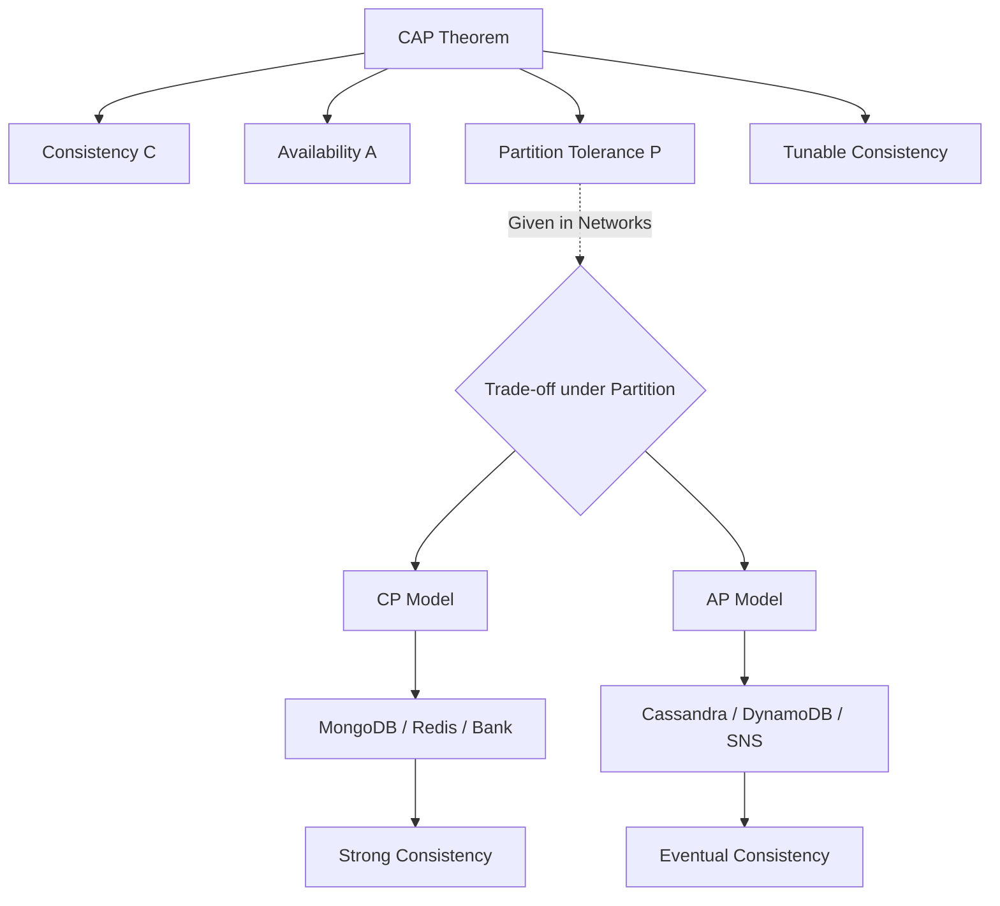

+++
title = "648. 캡 정리 (CAP Theorem)와 분산 스토리지"
weight = 648
+++

> **3-line Insight**
> *   캡 정리(CAP Theorem)는 네트워크로 연결된 분산 데이터 스토리지 시스템이 일관성(Consistency), 가용성(Availability), 파티션 허용성(Partition Tolerance)의 세 가지 속성 중 최대 두 가지만을 동시에 충족할 수 있다는 분산 컴퓨팅의 근본적인 원리입니다.
> *   현실의 네트워크에서는 물리적 단절이나 지연(네트워크 파티션, P)이 불가피하므로, 분산 시스템 아키텍트는 장애 발생 시 완벽한 데이터 일관성(CP 모델)을 유지할 것인지, 아니면 중단 없는 서비스 가용성(AP 모델)을 우선할 것인지 트레이드오프(Trade-off)를 선택해야 합니다.
> *   현대의 클라우드 네이티브 데이터베이스는 이러한 한계를 극복하기 위해 다중 데이터센터 배포와 튜닝 가능한 일관성(Tunable Consistency)을 제공하여 CAP 정리의 경계를 유연하게 탐색하고 있습니다.

# Ⅰ. 분산 스토리지 아키텍처와 CAP 정리의 탄생 배경

## 1. 단일 노드의 한계와 분산 스토리지의 등장
과거의 데이터베이스 시스템은 강력하고 거대한 단일 서버(Scale-up, RDBMS) 중심이었습니다. 단일 노드에서는 트랜잭션의 완벽한 ACID(원자성, 일관성, 고립성, 지속성) 보장이 용이했습니다. 그러나 웹 스케일 트래픽의 증가와 빅데이터의 등장으로 인해, 여러 대의 저렴한 범용 서버를 연결하여 데이터를 분산 저장(Scale-out)하고 복제(Replication)하는 NoSQL 기반의 분산 데이터 스토리지 시대가 도래했습니다. 데이터를 여러 노드에 복제함으로써 성능과 내결함성은 높아졌지만, 이로 인해 여러 노드 간의 데이터 동기화라는 새로운 난제에 직면하게 되었습니다.

## 2. 에릭 브루어의 CAP 정리 (Brewer's Theorem)
2000년, 에릭 브루어(Eric Brewer) 교수는 분산 시스템이 직면한 한계를 설명하며 CAP 정리를 제안했고, 이후 2002년 세스 길버트와 낸시 린치가 이를 수학적으로 증명했습니다. 이 정리는 분산 컴퓨팅 시스템 설계자가 극복할 수 없는 '철의 삼각지대'를 제시합니다. 시스템이 네트워크로 분할(Partitioned)되어 여러 대의 서버로 구성되어 있을 때, C(일관성), A(가용성), P(파티션 허용성) 세 가지 이상적인 목표를 동시에 100% 달성하는 설계는 수학적으로 불가능하다는 것이 핵심 골자입니다.

📢 섹션 요약 비유: 단일 서버는 요리사 한 명이 혼자서 모든 주문을 처리하는 작은 식당입니다. 음식이 헷갈릴 일이 없습니다. 하지만 분산 스토리지는 요리사 10명이 거대한 주방 곳곳에 떨어져서 주문을 나눠 받는 프랜차이즈 식당입니다. 요리사들이 서로 소리쳐서(네트워크 통신) 주문 내역을 맞춰봐야 하는데, 이 과정에서 완벽함(CAP)을 모두 챙길 수 없는 딜레마가 발생합니다.

# Ⅱ. CAP 정리의 3대 핵심 속성 정의

## 1. 일관성 (Consistency)
분산 시스템의 여러 노드에 데이터가 복제되어 있을 때, 클라이언트가 어떤 노드에 읽기(Read) 요청을 보내더라도 항상 가장 최근에 쓰인(Write) 최신 데이터(동일한 데이터)를 반환받아야 한다는 속성입니다. 만약 동기화가 완료되지 않아 노드 간 데이터 불일치가 발생한다면, 시스템은 오래된 데이터를 반환하는 대신 에러(오류 응답)를 반환해야 일관성이 보장되는 것입니다. (주의: DB의 ACID에서 말하는 트랜잭션 무결성으로서의 C와는 의미가 다르며, CAP의 C는 '분산된 복제본 간의 동기화 상태'를 의미합니다.)

## 2. 가용성 (Availability)
가용성은 시스템 내의 일부 노드에 장애가 발생하더라도, 살아있는 정상 노드에 요청을 보낸 모든 클라이언트는 시스템으로부터 반드시 지연 없는 응답(성공 데이터)을 받아야 한다는 속성입니다. 즉, 장애 상황에서도 서비스 중단(Downtime)이나 타임아웃 오류 없이 시스템이 항상 동작 상태를 유지하여 사용자 경험을 보장하는 특성입니다.

## 3. 파티션 허용성 (Partition Tolerance)
네트워크 파티션(Partition)이란 분산된 노드들을 연결하는 네트워크 회선이 끊어지거나 패킷 손실로 인해 통신 두절(단절) 상태가 발생하는 것을 의미합니다. 파티션 허용성은 두 노드 간의 통신이 끊겨 메시지가 전달되지 못하는 상황이 발생하더라도, 시스템 전체는 멈추지 않고 설계된 대로(일관성을 지키든 가용성을 지키든) 정상적으로 계속 동작해야 한다는 속성입니다. 현실의 물리적 네트워크에서는 단절과 지연 장애를 100% 막을 수 없으므로, **분산 시스템에서 'P(Partition Tolerance)'는 선택이 아니라 필수 전제 조건**이 됩니다.

📢 섹션 요약 비유: 은행 시스템(C)은 내가 서울 지점에서 입금하자마자 부산 지점에서 확인해도 똑같은 잔액이 나와야(일관성) 합니다. 인터넷 쇼핑몰(A)은 연휴에 접속자가 몰리거나 서버 몇 대가 죽어도 상품 페이지가 에러 없이 잘 떠야(가용성) 합니다. 그리고 이 두 시스템 모두 중간에 통신망이 끊어져도(P) 서비스 전체가 완전히 멈춰버려서는 안 됩니다.

# Ⅲ. 트레이드오프 (Trade-off): CP 모델 vs AP 모델

앞서 언급했듯 P(네트워크 파티션)는 분산 시스템의 필수 조건이므로, 장애 상황에서 설계자는 C와 A 중 하나를 포기해야 하는 기로에 놓입니다.

## 1. CP (Consistency + Partition Tolerance) 시스템
네트워크 단절(Partition) 시 '가용성(Availability)'을 포기하고 '일관성(Consistency)'을 선택하는 설계입니다. 두 데이터센터 간 연결이 끊긴 상황에서 새로운 쓰기 요청이 들어오면, 노드 간 데이터 동기화(복제)를 할 수 없게 됩니다. 이때 CP 시스템은 두 노드 간 데이터 불일치를 막기 위해, 클라이언트의 요청 처리를 거부(Timeout/Error)하여 전체 시스템의 가용성을 낮춥니다.
*   **대표 시스템:** 은행 결제 시스템, 블록체인 노드 합의, MongoDB, HBase, Redis(기본 설정), Zookeeper
*   **핵심 목적:** 데이터가 틀리는 것(오작동)보다 차라리 서비스가 잠시 멈추는 것이 더 안전한 도메인.

## 2. AP (Availability + Partition Tolerance) 시스템
네트워크 단절 시 '일관성(Consistency)'을 포기하고 '가용성(Availability)'을 선택하는 설계입니다. 노드 간 통신이 불가능해 동기화를 할 수 없는 상태라도, 살아있는 노드는 자신이 가진 (어쩌면 최신이 아닌) 과거 데이터를 일단 반환하여 클라이언트 요청을 무조건 처리합니다. 네트워크가 복구된 후에 백그라운드에서 데이터를 맞추어 궁극적으로 동일하게 만듭니다.
*   **대표 시스템:** SNS 피드 서비스, 아마존 다이나모DB(DynamoDB 기본 세팅), 카산드라(Apache Cassandra), CouchDB
*   **핵심 목적:** 사용자가 최신 좋아요 개수나 댓글을 조금 늦게 보더라도(일관성 희생), 서비스 자체가 에러 화면을 띄워(가용성 실패) 사용자가 이탈하는 것을 막아야 하는 도메인.

📢 섹션 요약 비유: 은행 전산망(CP)은 서울과 부산 지점 사이에 전화선이 끊어지면, 통장 잔고가 안 맞을 위험이 있으므로 "통신 장애로 인해 이체 서비스가 일시 중단됩니다"라고 창구 셔터를 내려버립니다(가용성 포기). 반면 페이스북(AP)은 통신이 끊겨도 친구의 최신 글이 안 보일지언정 "현재 서버 접속이 불가능합니다"라는 에러 대신 내 스마트폰에 저장된 예전 글이라도 보여줍니다(일관성 일시 포기).

# Ⅳ. CAP 정리의 현실적 오해와 튜닝 가능한 일관성

## 1. CAP 정리의 일반적인 오해
흔히 "CA 시스템(네트워크 파티션을 포기하고 일관성과 가용성만 챙기는 분산 시스템)"을 만들 수 있다고 오해합니다. 하지만 물리적 네트워크(랜선)가 끊어지는 장애는 소프트웨어적으로 방어할 수 없는 현상이므로, 진정한 분산 시스템에서 완벽한 CA 모델은 존재하지 않습니다(단일 노드 RDBMS만이 CA 모델에 가깝습니다). 또한 평상시(네트워크 장애가 없을 때) 시스템은 C와 A를 모두 만족하며 매우 잘 동작합니다. CAP 딜레마는 '네트워크 장애가 발생했을 때 어떻게 행동(Failover)할 것인가'에 대한 비상 대책입니다.

## 2. 튜닝 가능한 일관성 (Tunable Consistency)
최신 클라우드 기반 NoSQL 데이터베이스(예: Cassandra, CosmosDB)는 개발자가 API 호출 레벨에서 C와 A의 비중을 직접 조절(Tuning)할 수 있게 해줍니다. 쿼리를 던질 때 읽기/쓰기 일관성 수준(Consistency Level)을 'Quorum(과반수 노드 응답 필요 - C 강화)'으로 설정하거나, 'One(응답 속도와 가용성 중시 - A 강화)'으로 설정할 수 있습니다. 이를 통해 단일 데이터베이스 클러스터 내에서도 결제 데이터는 CP로, 상품 로그 데이터는 AP로 워크로드에 맞게 유연하게 구성할 수 있습니다.

📢 섹션 요약 비유: 현대의 데이터베이스는 마치 스피커의 볼륨 다이얼(튜닝 가능)과 같습니다. 돈이 오가는 민감한 거래 화면에서는 다이얼을 'CP 모드'로 돌려 깐깐하게 관리하고, 단순히 클릭 수를 세는 로그 시스템 화면에서는 다이얼을 'AP 모드'로 돌려 속도와 멈추지 않는 동작성을 최우선으로 맞출 수 있습니다.

# Ⅴ. 마이크로서비스 아키텍처(MSA) 관점에서의 CAP

## 1. 분산 트랜잭션과 사가(Saga) 패턴
MSA 환경에서는 거대한 애플리케이션이 수십 개의 독립된 서비스(노드)로 나뉘어 각각 자신만의 데이터베이스를 가집니다. 이는 시스템 전체가 거대한 분산 스토리지 환경이 됨을 의미하며 자연스레 CAP의 제약을 받습니다. MSA에서 하나의 비즈니스 프로세스(예: 주문 -> 결제 -> 재고 차감)가 여러 서비스에 걸쳐 일어날 때, 기존의 2단계 커밋(2PC)과 같은 강력한 동기식 트랜잭션(CP 선호)은 시스템 타임아웃과 가용성 저하를 유발합니다. 이를 극복하기 위해 비동기 이벤트 기반으로 트랜잭션을 처리하고 보상 트랜잭션(Rollback)을 활용하는 사가 패턴(Saga Pattern)이 도입되었습니다.

## 2. 장애 격리와 멱등성 (Idempotency)의 중요성
MSA에서 CAP 딜레마 중 AP를 선택하여 높은 사용자 가용성을 보장하려면, 메시지 지연이나 중복 전달로 인한 일시적 데이터 불일치 상황을 소프트웨어 비즈니스 로직 단에서 해결해야 합니다. 따라서 네트워크 단절 후 복구 과정에서 재시도(Retry) 요청이 여러 번 들어와도 시스템 상태가 변하지 않도록 설계하는 '멱등성(Idempotency)' 보장이 마이크로서비스 간 통신에 있어 가장 중요한 설계 원칙이 됩니다.

📢 섹션 요약 비유: 쇼핑몰을 MSA로 쪼개면 주문, 결제, 배송 창구가 다 떨어져 있는 것(분산 시스템)과 같습니다. 중간에 전화가 끊겨 결제팀이 배송팀에 연락을 못 하면 배송이 잠시 꼬일 수 있습니다. 이때 '사가 패턴'은 연락이 복구되면 즉시 "아까 주문 취소됐으니 배송 나간 거 다시 돌려보내!"라고 수습하는 전략이고, '멱등성'은 배송팀이 확인 전화를 여러 번 받아도 택배를 중복해서 두 개 보내지 않게 막아주는 영리한 업무 매뉴얼입니다.

---

### 💡 Knowledge Graph 및 초등학생 비유

**Knowledge Graph**

**초등학생 비유**
선생님이 반장, 부반장, 서기 3명에게 각기 다른 교실에서 퀴즈 정답(데이터)을 적으라고 시켰어요. 이 세 명(분산 시스템)은 무전기(네트워크)로 정답을 맞춰봐야 해요.
그런데 무전기가 고장(파티션, P) 났어요! 이때 반장은 고민합니다.
"다른 친구들의 답을 정확히 모를 땐, 틀린 답을 말할 바엔 차라리 입을 다물고 있자!" (일관성 지키기, CP 시스템)
"아니야, 침묵하면 선생님이 화내시니까 내가 기억하는 예전 답이라도 당당하게 크게 외치자!" (응답성 지키기, AP 시스템)
캡 정리(CAP)는 이처럼 통신이 끊겼을 때 '완벽함(C)'과 '빠른 대답(A)' 둘 다 가질 수 없고 하나만 골라야 한다는 법칙이랍니다.
