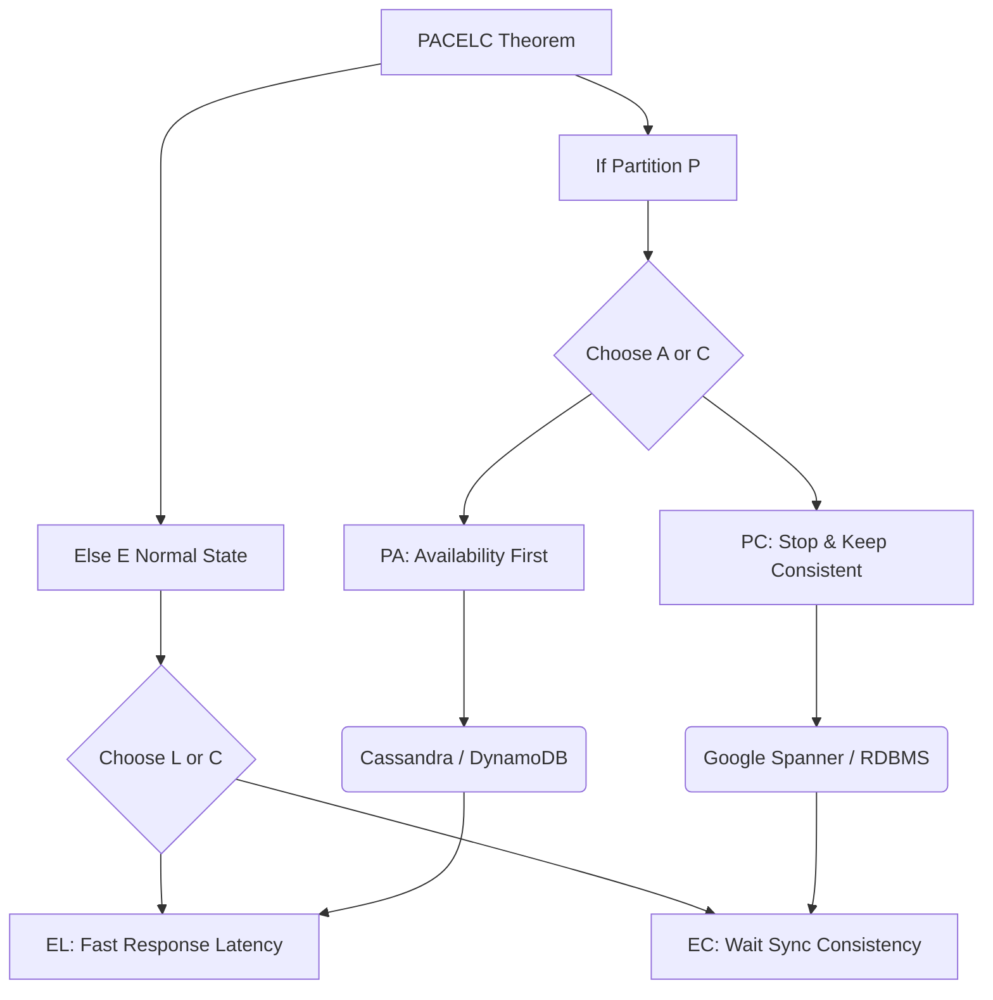

+++
title = "649. PACELC 정리"
weight = 649
+++

> **3-line Insight**
> *   PACELC 정리는 CAP 정리의 한계를 보완하기 위해 제안된 확장된 분산 시스템 모델로, 네트워크 장애 상황뿐만 아니라 "네트워크가 정상적인 평상시(Else)" 시스템이 직면하는 트레이드오프까지 포괄적으로 설명합니다.
> *   "만약 파티션(P)이 발생하면 가용성(A)과 일관성(C) 중 하나를 선택하고, 그렇지 않고 정상 작동할 때(Else, E)는 지연 시간(L)과 일관성(C) 중 하나를 선택해야 한다"는 명제를 담고 있습니다.
> *   현대의 분산 데이터베이스 아키텍트들은 단순히 장애 대비를 넘어, 글로벌 클라우드 환경에서 사용자의 서비스 체감 속도(Latency)와 데이터 정합성(Consistency) 간의 미세한 균형을 맞추기 위해 PACELC 프레임워크를 기반으로 시스템을 설계합니다.

# Ⅰ. CAP 정리의 한계와 PACELC의 등장

## 1. CAP 정리의 사각지대 (Blind Spot)
CAP 정리는 분산 시스템 설계의 기본 원칙을 제시했지만, 치명적인 오해를 낳는 사각지대가 있었습니다. CAP는 오직 "네트워크 파티션(통신 단절, P) 장애가 발생했을 때" C와 A 중 무엇을 선택할 것인가라는 극한의 재난 상황만을 다룹니다. 그러나 실제로 클라우드 데이터베이스를 운영해 보면 네트워크 파티션과 같은 심각한 장애는 1년 중 극히 드문 시간(예: 99.999% 정상, 0.001% 장애)에만 발생합니다. 즉, 개발자들은 "네트워크 장애가 없는 나머지 평온한 99.999%의 시간 동안 분산 시스템은 어떤 트레이드오프를 겪는가?"에 대한 해답을 CAP 정리로부터 얻을 수 없었습니다.

## 2. 다니엘 아바디(Daniel Abadi)의 PACELC 제안
2010년, 예일 대학교(현 메릴랜드 대학교)의 다니엘 아바디(Daniel Abadi) 교수는 CAP 정리의 이러한 부족함을 채우기 위해 **PACELC 정리**를 발표했습니다. PACELC는 CAP의 상황에 **Else(E)**라는 조건을 덧붙여 평상시의 성능 모델을 추가했습니다. 이는 분산 시스템이 장애 대응뿐만 아니라 일상적인 성능(성능 최적화 지연 시간 vs 완벽한 데이터 동기화) 사이에서도 본질적인 타협점을 가지고 있음을 완벽하게 정의한 현대 분산 아키텍처의 기준점이 되었습니다.

📢 섹션 요약 비유: CAP 정리가 "건물에 불이 났을 때(장애 발생), 귀중품(일관성)을 챙길 것인가 아니면 사람 먼저 대피(가용성)시킬 것인가?"를 묻는 비상 대피 매뉴얼이라면, PACELC 정리는 "평소 불이 안 났을 때(정상 상태), 출입문 보안을 철저히 해서 늦게 들어가게 할 것인가(지연 시간 증가, 일관성 유지) 아니면 보안을 풀어 누구나 빨리 들어가게 할 것인가(지연 시간 단축, 일관성 하락)?"라는 평상시 운영 매뉴얼까지 덧붙인 완벽한 보안 가이드북입니다.

# Ⅱ. PACELC 공식의 상세 분해

PACELC는 두 부분으로 나뉘며, **PAC**와 **ELC**의 결합입니다.
`If Partition (P) -> Availability (A) or Consistency (C) / Else (E) -> Latency (L) or Consistency (C)`

## 1. PAC 파트: 네트워크 단절 시 (장애 상황)
이 부분은 기존의 CAP 정리와 완전히 동일합니다. 분산된 노드 간에 네트워크 통신망이 끊어지는 파티션(Partition, P) 상황이 발생했을 때 시스템의 행동 강령입니다.
*   **PA (Partition - Availability):** 노드 간 통신이 안 되더라도 살려있는 노드가 무조건 클라이언트의 요청에 응답(Availability)합니다. 데이터 불일치 위험이 있습니다.
*   **PC (Partition - Consistency):** 통신이 안 되어 복제를 할 수 없으면 응답을 거부(에러 반환)하여 일관성(Consistency)을 지킵니다. 시스템 가용성은 떨어집니다.

## 2. ELC 파트: 네트워크 정상 시 (평상시)
이 부분이 PACELC의 핵심 혁신입니다. 네트워크 파티션이 발생하지 않은 정상 상태(Else, E)일 때도, 데이터를 여러 노드에 복제(Replication)하는 과정에서 시간이 소요되므로 다음과 같은 딜레마에 빠집니다.
*   **EL (Else - Latency):** 일관성보다 지연 시간 최소화(응답 속도 향상, Latency 감소)를 선택합니다. 리더 노드에 데이터를 쓰자마자 다른 복제본으로 동기화가 완료되기를 기다리지 않고(비동기 복제) 클라이언트에게 즉시 "성공" 응답을 보냅니다. 속도는 매우 빠르지만, 복제 도중 찰나의 순간에 클라이언트가 다른 노드를 조회하면 아주 잠깐 예전 데이터를 볼 수 있습니다.
*   **EC (Else - Consistency):** 지연 시간이 길어지더라도 일관성(Consistency)을 선택합니다. 리더 노드에 데이터를 쓴 후, 네트워크를 통해 다른 모든 복제 노드에 데이터가 완벽하게 복사되었다는 확인(동기 복제)을 받을 때까지 클라이언트에게 기다리라고(대기) 합니다. 데이터는 완벽하지만 응답 속도가 느려집니다.

📢 섹션 요약 비유: ELC 파트의 EL 선택은 치킨집 사장님이 배달원에게 치킨을 주자마자(메인 노드 쓰기) 손님에게 "배달 출발했습니다!"라고 바로 문자(빠른 응답, L)를 보내는 것입니다. 빠르긴 하지만 아직 도착 안 한 찰나의 시간이 있습니다. EC 선택은 배달원이 손님 집에 도착해 치킨을 넘겨준 것을 확인한 후에야(모든 노드 동기화 완료) 비로소 손님에게 "배달 완료!" 문자를 보내는 것입니다. 아주 정확하지만 과정이 오래 걸립니다(느린 응답, C).

# Ⅲ. 주요 데이터베이스의 PACELC 분류 및 사례

데이터베이스들은 아키텍처 철학에 따라 PACELC 매트릭스 상의 고유한 위치를 가집니다.

## 1. PA / EL 시스템 (가용성 및 응답 속도 최우선)
장애가 나면 일단 멈추지 않고 응답(PA)하며, 평소에도 완벽한 동기화보다는 클라이언트에게 가장 빠르게 결과를 반환(EL)하는 데 집착하는 시스템입니다. SNS 시스템이나 대규모 센서 데이터 스트리밍 처리 등에 적합합니다.
*   **Apache Cassandra, Amazon DynamoDB (Default 설정), CouchDB, Riak:** 이들은 전 세계 수십 개의 데이터센터에 분산된 노드 간의 느린 통신 속도를 기다려주지 않습니다. 일단 데이터를 로컬에 빠르게 기록하고(응답), 백그라운드에서 여유롭게 가십 프로토콜(Gossip Protocol)을 통해 동기화를 맞추는 결과적 일관성(Eventual Consistency) 모델을 취합니다.

## 2. PC / EC 시스템 (완벽한 무결성과 일관성 최우선)
장애가 나면 차라리 시스템 셔터를 내리고(PC), 평소에도 모든 노드가 완벽히 똑같은 데이터를 가지기 위해 느린 동기 복제(Synchronous Replication)를 감수(EC)하는 보수적인 시스템입니다. 금융권 원장(Ledger) 처리, 재고 관리 등 트랜잭션 무결성이 생명인 도메인에 쓰입니다.
*   **관계형 DB 클러스터(MySQL Cluster, PostgreSQL Sync Replication), Google Spanner, Apache ZooKeeper:** 구글 스패너(Spanner)는 트루타임(TrueTime) API라는 원자 시계를 활용해 전 세계 대륙에 떨어진 노드 간의 엄격한 동기화를 수행하며, 지연(Latency)이 다소 증가하더라도 완벽한 글로벌 일관성(EC)을 유지합니다.

📢 섹션 요약 비유: PA/EL 시스템은 스포츠 생중계 시스템입니다. 시청자 화면에 영상이 0.1초 늦게 동기화되는 것(일관성 깨짐)은 크게 문제없지만, 버퍼링이 걸려 화면이 멈추거나 튕기는 것(가용성 실패, 지연 시간 발생)은 최악의 사고입니다. PC/EC 시스템은 은행 송금 시스템입니다. 송금이 10초 늦게 되거나(지연, EC) 서버 점검으로 로그인이 안 되는 것(PC)은 고객이 참을 수 있지만, 내 통장 잔고가 남의 스마트폰에서는 10만 원 많게 보이는 것(일관성 깨짐)은 은행 파산 수준의 재앙입니다.

# Ⅳ. PA / EC 와 PC / EL 크로스오버 아키텍처

PACELC 프레임워크는 단순히 두 극단만 있는 것이 아니라, 비즈니스 성격에 따라 섞어서 구성할 수도 있음을 보여줍니다.

## 1. PA / EC 시스템 (장애 땐 가용성, 평소엔 철저한 동기화)
네트워크가 단절된 재난 상황에서는 서비스를 멈추지 않고 과거 데이터를 제공하지만(PA), 평상시 네트워크가 정상일 때는 시간이 걸리더라도 완벽하게 동기 복제를 수행하여 항상 최신 데이터를 유지(EC)하려는 하이브리드 접근법입니다. 대표적으로 **MongoDB (특정 설정 시)**가 꼽힙니다. 평소 리더 노드를 통해 강한 일관성을 지키지만, 리더가 죽어 파티션이 발생하면 세컨더리 노드에서 (조금 낡은) 읽기를 허용하는 구성이 가능합니다.

## 2. PC / EL 시스템 (장애 땐 엄격함, 평소엔 속도 중시)
네트워크가 끊어지면 데이터 불일치를 막기 위해 단호하게 서비스 응답을 거부(PC)하지만, 통신이 쌩쌩하게 잘 되는 평소에는 모든 노드 동기화를 기다리지 않고 클라이언트에게 초고속으로 응답(EL)하는 아키텍처입니다. 메모리 기반의 캐시 시스템이나 특정 설정의 분산 캐시 시스템(예: **Hazelcast, Yahoo! PNUTS**)이 이 모델을 채택하여 속도와 장애 시 보호를 동시에 노립니다.

📢 섹션 요약 비유: 자동차의 주행 모드와 비슷합니다. 평소에는 스포츠 모드로 기름을 아끼지 않고 속도를 즐기지만(EL), 비가 오거나 눈길(파티션 장애)에서는 차가 아예 멈추더라도 미끄러짐 방지 시스템을 가동해 생명을 지키는(PC) 똑똑한 하이브리드 자동차입니다.

# Ⅴ. 마이크로서비스 및 글로벌 클라우드 아키텍처에서의 적용

## 1. 멀티 리전 (Multi-Region) 액티브-액티브 배포
기업들이 글로벌 사용자를 위해 AWS나 Azure의 여러 대륙 리전(Region, 예: 서울, 미국, 유럽)에 동시에 액티브(Active) 데이터베이스를 두는 아키텍처에서 PACELC의 딜레마는 극대화됩니다. 서울과 미국 간의 물리적 해저 케이블 통신 시간(빛의 속도 제약) 때문에 핑(Ping)이 최소 150ms가 걸리는데, 동기화(EC)를 하려면 한 번 글을 쓸 때마다 무조건 150ms 이상 응답이 지연(Latency)됩니다. 속도를 위해 비동기(EL)를 택하면, 서울에서 글을 쓰자마자 미국 사용자가 접속할 경우 그 글이 보이지 않는 일관성 문제가 반드시 발생합니다.

## 2. 지연 시간 뒤에 숨은 일관성 해법 (Quorum & Vector Clocks)
현대의 클라우드 네이티브 아키텍처는 이를 극복하기 위해 절대적인 EC와 EL 사이에서 줄타기를 합니다. 쿼럼(Quorum, 정족수) 기반 접근 방식을 사용하여, 5개의 글로벌 노드 중 3개(과반수)에만 데이터가 쓰이면 성공으로 간주하여 지연 시간을 줄이면서도 최소한의 일관성을 확보합니다. 또한, 일시적으로 동기화가 틀어진 EL 상황을 수습하기 위해, 벡터 시계(Vector Clocks)와 충돌 해소(Conflict Resolution) 알고리즘(예: CRDTs)을 도입하여, 뒤늦게 데이터가 섞여도 개발자 개입 없이 시스템이 자동으로 최종 버전을 매끄럽게 병합(Merge)하도록 진화했습니다.

📢 섹션 요약 비유: 멀티 리전 배포는 한국 본사와 미국 지사가 실시간으로 문서를 같이 쓰는 것과 같습니다. 인터넷이 느려서 한국에서 문서를 고치면 미국에는 1초 뒤에 반영됩니다(EL 딜레마). 이를 해결하기 위해 두 명이 동시에 같은 문장을 수정하면, 컴퓨터(CRDT 알고리즘)가 각자의 시계(벡터 시계)를 보고 더 늦게 고친 사람의 글을 자동으로 자연스럽게 덮어써 주어 싸움(충돌)을 막아주는 첨단 문서 편집기(구글 닥스)의 기술 원리입니다.

---

### 💡 Knowledge Graph 및 초등학생 비유

**Knowledge Graph**

**초등학생 비유**
선생님이 반장, 부반장에게 각기 다른 반에서 똑같은 시간표를 알려주라고 하셨어요.
PACELC 정리는 두 가지 상황을 모두 설명해 주는 마법의 규칙이에요!
상황 1 (파티션 발생, P): 반장과 부반장이 서로 연락할 수 없을 때! "틀려도 그냥 대답할까?(A)" 아니면 "확실하지 않으니 모른다고 할까?(C)"
상황 2 (평상시 연락 잘 됨, E): 선생님이 반장에게 새 시간표를 주셨을 때! 부반장에게도 시간표가 도착할 때까지 한참 "기다렸다가 똑같이 발표할까?(C)" 아니면 부반장보다 내가 "먼저 초스피드로 발표해버릴까?(L)"
이렇게 고장 났을 때와 평상시, 두 가지 상황에서 똑똑하게 선택하는 방법을 알려주는 것이 PACELC랍니다.
