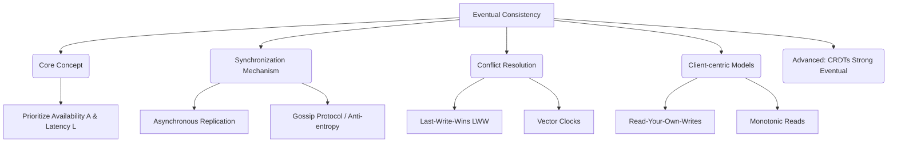

+++
title = "650. 결과적 일관성 (Eventual Consistency)"
weight = 650
+++

> **3-line Insight**
> *   결과적 일관성(Eventual Consistency)은 분산 컴퓨팅 환경에서 고가용성(High Availability)과 초저지연(Low Latency)을 달성하기 위해 데이터 복제 과정에서의 엄격한 동기화를 일시적으로 포기하고, 시간이 지나면 "결국에는(Eventually)" 모든 노드의 데이터가 동일해진다는 것을 보장하는 동시성 모델입니다.
> *   새로운 업데이트가 발생한 직후 클라이언트가 시스템을 조회하면 잠시 동안 과거 데이터(Stale Data)를 읽을 수 있지만, 백그라운드의 안티 엔트로피(Anti-entropy) 및 가십 프로토콜(Gossip Protocol)을 통해 비동기적으로 데이터 정합성이 복구됩니다.
> *   대규모 트래픽을 처리하는 글로벌 SNS, 장바구니 시스템, DNS(Domain Name System) 등 즉각적인 일관성보다 서비스 무중단이 더 치명적으로 중요한 클라우드 네이티브 아키텍처의 핵심 기반입니다.

# Ⅰ. 강한 일관성(Strong Consistency)의 굴레와 한계

## 1. 엄격한 동기화와 지연 시간(Latency)의 딜레마
전통적인 단일 데이터베이스 환경에서는 데이터가 변경(Write)되자마자 어떠한 클라이언트가 조회(Read)하더라도 즉시 최신의 변경된 데이터를 응답받는 '강한 일관성(Strong Consistency)'이 기본 원칙이었습니다. 그러나 분산 시스템에서 강한 일관성을 달성하려면, 리더 노드에 쓰기 작업이 발생했을 때 네트워크로 연결된 다른 모든 복제본(Replica) 노드에 데이터가 완벽하게 복사되고 확인(Ack)을 받을 때까지, 클라이언트의 읽기/쓰기 요청을 잠금(Lock) 처리해야 합니다. 이는 노드 간 거리가 먼 멀티 리전(글로벌) 환경에서 치명적인 응답 지연(Latency)과 타임아웃을 유발합니다.

## 2. CAP 정리와 결과적 일관성의 등장 배경
앞서 다룬 CAP 정리와 PACELC 정리에 따르면, 분산 시스템은 네트워크 파티션 장애(P)나 일상적인 통신 지연(E) 상황에서 '완벽한 일관성(C)'을 고집하면 필연적으로 '가용성(A)'이나 '응답 속도(L)'를 희생해야 합니다. 인터넷 서비스 규모가 폭발적으로 커지면서 0.1초의 지연 시간이 수십억 원의 매출 손실로 직결되는 시대가 되었습니다. 아키텍트들은 "사용자가 방금 누른 '좋아요' 개수가 다른 사용자에게 1~2초 늦게 보이더라도 큰 문제가 없다"는 비즈니스 도메인의 특성을 깨닫고, 강한 일관성의 사슬을 끊어버리는 '결과적 일관성(Eventual Consistency)' 패러다임을 전면적으로 수용하게 되었습니다.

📢 섹션 요약 비유: 강한 일관성은 학교에서 방송조회를 할 때 교장 선생님의 훈화가 모든 교실 스피커에서 1초의 오차도 없이 완벽하게 동시에 들려야만 한다고 고집하는 것입니다. 스피커 하나라도 고장 나면 고칠 때까지 전체 조회를 멈춰 세웁니다. 반면 결과적 일관성은 종이 가정통신문을 나눠주는 것입니다. 앞 반 학생이 뒷 반 학생보다 소식을 5분 일찍 알게 되지만(일시적 불일치), 집에 갈 때쯤이면 결국 전교생 모두가 똑같은 내용을 알게 됩니다(결과적 일치). 조회 시간을 낭비하지 않는 실용적인 방식입니다.

# Ⅱ. 결과적 일관성 시스템의 메커니즘과 동작 원리

## 1. 비동기 복제 (Asynchronous Replication) 프로세스
결과적 일관성 아키텍처에서 노드 간의 데이터 동기화는 철저히 백그라운드에서 비동기적(Asynchronous)으로 이루어집니다.
*   클라이언트가 노드 A에 데이터를 업데이트(Write)합니다.
*   노드 A는 즉각 로컬 디스크에만 데이터를 저장한 후, 클라이언트에게 "성공적으로 저장되었습니다"라는 초고속 응답(Low Latency)을 반환합니다.
*   클라이언트는 기분 좋게 자신의 할 일을 계속합니다.
*   노드 A는 이후 10밀리초 ~ 수 초 사이에 여유가 생길 때, 네트워크를 통해 다른 노드 B와 C에게 "내 데이터가 업데이트되었으니 너희도 바꿔"라는 메시지를 전송합니다(비동기 전파).

## 2. 가십 프로토콜(Gossip Protocol)과 안티 엔트로피(Anti-entropy)
중앙 통제자(Master)가 없는 분산 NoSQL 시스템(예: Apache Cassandra, Amazon Dynamo)은 '가십 프로토콜'이라는 전파 알고리즘을 사용합니다. 각 노드는 주기적으로 무작위의 다른 노드를 선택해 자신의 최신 데이터 버전 상태를 속닥거립니다(Gossip). 만약 서로 데이터 버전이 다르다면 최신 버전으로 덮어쓰는 동기화를 수행합니다. 이 과정을 바이러스가 퍼지듯 연쇄적으로 반복하여, 네트워크의 무질서도(엔트로피)를 줄여나가고(Anti-entropy), 이론상 아주 짧은 시간 내에 수백 개의 노드가 기하급수적으로 동일한 데이터를 보유하게 됩니다.

📢 섹션 요약 비유: 가십 프로토콜은 말 그대로 '소문 퍼뜨리기'와 같습니다. 동네에 새로운 빵집이 생겼다는 소식을 1명이 알게 되면, 지나가는 사람 아무나 3명 붙잡고 말합니다. 그 3명은 또 다른 3명에게 말합니다. 방송국(중앙 마스터 노드)이 없어도, 몇 시간 뒤면 온 동네 사람(수백 대의 서버 노드)이 새로운 빵집 오픈 소식(최신 데이터)을 전부 알게 되는 매우 빠르고 강력한 전파 방식입니다.

# Ⅲ. 버전 불일치와 충돌 해결 (Conflict Resolution) 전략

결과적 일관성의 맹점은 여러 클라이언트가 동시에 다른 노드에서 동일한 데이터를 수정할 때 '버전 충돌(Conflict)'이 발생한다는 점입니다. 시스템은 이를 자동으로 해결할 논리가 필요합니다.

## 1. LWW (Last-Write-Wins): 타임스탬프 기반 병합
가장 단순하고 널리 쓰이는 방식은 '최종 쓰기 승리(Last-Write-Wins)' 규칙입니다. 클라이언트가 데이터를 기록할 때 각자의 시스템 시계(타임스탬프) 값을 함께 저장합니다. 노드 간에 동기화를 위해 만났을 때 같은 데이터에 대해 서로 다른 값을 가지고 있다면, 무조건 타임스탬프 상 1 밀리초라도 더 늦게(최근에) 기록된 데이터를 정답으로 간주하고 과거 데이터를 조용히 폐기(Overwrite)합니다. 구현이 쉽지만, 시계 동기화 오차나 네트워크 지연 시 의도치 않은 데이터 유실이 발생할 수 있는 단점이 있습니다.

## 2. 벡터 시계 (Vector Clocks)와 다중 버전 반환
보다 정교한 충돌 해결 방식은 벡터 시계를 활용하는 것입니다. 데이터가 변경될 때마다 "노드 A에서 1번, 노드 B에서 2번 변경됨 [A:1, B:2]"과 같이 인과 관계 꼬리표를 달아둡니다. 두 노드의 데이터가 충돌했을 때, 시스템이 기계적으로 하나를 삭제하지 않습니다. 대신 두 가지 버전을 모두 보존해 두었다가, 클라이언트가 조회 요청을 할 때 두 개의 충돌된 데이터를 동시에 반환합니다. 그러면 장바구니 애플리케이션 등 비즈니스 로직(Application Layer) 단에서 "두 장바구니 항목을 하나로 합쳐서(Merge)" 다시 저장하도록 사용자에게 책임을 넘깁니다. 이는 Dynamo의 핵심 철학입니다.

📢 섹션 요약 비유: 충돌 해결 전략은 쌍둥이 형제가 하나의 공유 일기장을 쓰다가 동시에 다른 페이지에 다른 글을 적었을 때 일어나는 다툼을 말리는 법입니다. LWW 방식은 엄마가 시계를 보고 "동생이 1초 늦게 썼네, 형이 쓴 건 지워버려!"라고 무조건 늦은 사람 편을 드는 무자비한 방법입니다. 벡터 시계 방식은 엄마가 두 페이지를 모두 꺼내서 "자, 둘 다 읽어보고 너희들이 알아서 하나의 멋진 문장으로 다시 써봐!"라고 기회를 주는 현명한 방식입니다.

# Ⅳ. 결과적 일관성의 세부 변형 (Consistency Variations)

도메인에 따라 결과적 일관성 안에서도 세밀한 조정이 필요합니다. 개발자는 튜닝을 통해 다음과 같은 사용자 체감 일관성(Client-centric Consistency) 모델을 구현할 수 있습니다.

## 1. 자신이 쓴 데이터 읽기 (Read-Your-Own-Writes)
자신이 방금 작성한 댓글을 등록하고 바로 새로고침을 했는데 댓글이 보이지 않는다면 사용자는 버그라고 생각할 것입니다. '자신이 쓴 데이터 읽기' 모델은 전체 시스템은 결과적 일관성을 따르더라도, 특정 클라이언트가 자기가 방금 업데이트한 데이터만큼은 무조건 즉시 최신 상태로 읽을 수 있도록 세션을 유지(Session Consistency)해주는 보완 기법입니다. 다른 사람은 그 댓글을 1초 뒤에 볼지언정, 작성자 본인에게는 강한 일관성처럼 보이게 하는 착시 효과를 줍니다.

## 2. 단조 읽기 (Monotonic Reads)
시간을 거스르지 않는다는 규칙입니다. 사용자가 오전 10시 버전에 해당하는 최신 뉴스 피드(Node A에서 응답)를 한 번 읽었다면, 1초 뒤에 다시 새로고침을 했을 때 동기화가 아직 안 된 느린 Node B로 요청이 가더라도 과거 오전 9시 버전의 뉴스를 보여주어서는 안 됩니다. 즉, 한 번 새로운 데이터를 본 클라이언트는 이후에 다시 조회할 때 결코 이전의 낡은 데이터 상태로 회귀(Time-travel back)하는 것을 겪지 않음을 보장하는 모델입니다.

📢 섹션 요약 비유: '자신이 쓴 데이터 읽기'는 게시판에 글을 올렸을 때 다른 사람 휴대폰에는 아직 안 보이지만 내 휴대폰 화면에는 즉각 "글이 올라갔다!"고 띄워주어 나를 안심시키는 사용자 배려(UX) 기능입니다. '단조 읽기'는 영화 후반부(최신 데이터)를 이미 본 사람에게, 채널을 돌렸다고 해서 갑자기 영화 초반부(과거 데이터) 장면을 다시 틀어주어 시청자를 어리둥절하게 만드는 어처구니없는 상황을 막아주는 안전장치입니다.

# Ⅴ. 차세대 아키텍처: 강한 결과적 일관성과 CRDTs

## 1. 애플리케이션 개발의 복잡성 전가
결과적 일관성은 인프라의 확장성(Scalability)은 해결했지만, "내가 읽은 이 데이터가 정말 최신인가?"라는 고민과 "충돌이 나면 어떻게 병합할 것인가?"라는 무거운 짐을 인프라(DB) 단에서 애플리케이션 개발자(Code Layer)에게 떠넘기는 결과를 낳았습니다. 이로 인해 분산 시스템 애플리케이션 로직이 비대해지고 버그가 양산되었습니다.

## 2. 충돌 없는 복제 데이터 타입 (CRDTs)의 부상
이러한 부담을 원천적으로 제거하기 위해 등장한 획기적인 수학적 데이터 구조가 CRDT(Conflict-free Replicated Data Types)입니다. CRDT로 설계된 데이터(예: 카운터 증가, 텍스트 편집 기록, 장바구니 세트)는 어떠한 순서로 복제되고, 네트워크 지연으로 몇 번이나 꼬여서 수신되더라도, 백그라운드 병합 알고리즘에 의해 오직 하나의 올바른 정답으로 무조건 수렴(Strong Eventual Consistency)하게 됩니다. 개발자는 더 이상 벡터 시계나 충돌 처리에 신경 쓸 필요 없이, 마치 단일 데이터베이스를 쓰듯이 코딩하면서도 결과적 일관성의 초고속 성능 혜택을 온전히 누릴 수 있게 되며, 이는 Figma, 구글 닥스, Redis Enterprise 등 현대 실시간 협업 아키텍처의 심장으로 작동하고 있습니다.

📢 섹션 요약 비유: 과거의 결과적 일관성은 조립식 가구 부품 100개를 순서 없이 마구잡이로 배달해 놓고, 고객(개발자)에게 "알아서 순서 맞춰서 예쁘게 완성해(충돌 해결)!"라고 던져주는 불친절한 방식이었습니다. CRDTs는 '자석이 달린 스마트 레고 블록'입니다. 블록들을 상자 안에 대충 던져 넣고 아무렇게나 마구 흔들기만 하면(네트워크 지연/순서 바뀜), 자기들끼리 척척 알아서 완벽한 성(Strong Eventual Consistency) 모양으로 조립되어 완성되는 기적의 블록 기술입니다.

---

### 💡 Knowledge Graph 및 초등학생 비유

**Knowledge Graph**

**초등학생 비유**
결과적 일관성(Eventual Consistency)은 넓은 운동장에서 친구들에게 '얼음땡' 놀이 규칙이 바뀌었다고 소문내는 방식이에요. 옛날 방식(강한 일관성)은 전교생을 운동장 한가운데 모두 모아놓고 교장 선생님이 한 번에 말할 때까지 게임을 멈추고 10분 동안 기다려야 했어요. 하지만 결과적 일관성은 게임을 멈추지 않고 계속하면서 옆에 있는 친구에게 귓속말로 "야, 규칙 바뀌었대!"라고 전해주는 거예요. 운동장 끝에 있는 친구는 5분 뒤에야 규칙이 바뀐 걸 알게 되겠지만(과거 상태), 결국에는 놀이가 끝날 때쯤 전교생 모두가 똑같은 새 규칙(결과적 일치)을 알게 되니까 멈추지 않고 신나게 놀 수 있는 아주 좋은 방법이랍니다.
