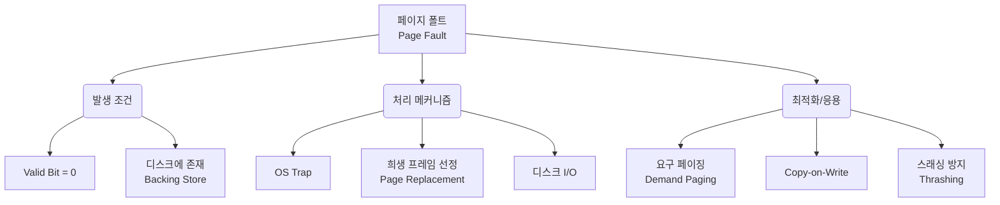

+++
title = "페이지 폴트 처리 과정"
weight = 299
+++

> **3-line Insight**
> - 페이지 폴트(Page Fault)는 가상 메모리 주소가 물리 메모리에 매핑되지 않았을 때 발생하는 필수적인 인터럽트 메커니즘이다.
> - OS(Operating System)의 개입을 통해 백킹 스토어(Backing Store)에서 누락된 페이지를 적재함으로써, 프로그램이 한정된 물리 메모리보다 큰 주소 공간을 사용할 수 있게 한다.
> - 페이지 폴트 처리 지연 시간(Latency)은 시스템 성능의 핵심 병목이 되므로, 효율적인 페이지 교체 알고리즘(Page Replacement Algorithm)과 하드웨어 캐시(TLB)의 지원이 필수적이다.

## Ⅰ. 페이지 폴트의 정의 및 발생 원인

페이지 폴트(Page Fault)는 CPU(Central Processing Unit)가 접근하려는 가상 메모리(Virtual Memory) 페이지가 현재 주 메모리(Main Memory, RAM)에 적재되어 있지 않고 디스크 등의 보조 기억 장치(Backing Store)에 존재할 때, MMU(Memory Management Unit)가 발생시키는 하드웨어 인터럽트(Hardware Interrupt)이다. 
이는 가상 메모리 시스템(Virtual Memory System)에서 요구 페이징(Demand Paging) 기법을 구현하기 위한 핵심 메커니즘이다. 프로세스는 자신이 필요로 하는 모든 코드가 메모리에 있다고 착각하지만, 실제로는 필요한 순간(On-demand)에만 메모리로 가져오는 지연 할당(Lazy Allocation) 방식이 동작하고 있으며, 이 과정에서 발생하는 예외 상황(Exception)이 페이지 폴트이다.
주요 발생 원인으로는 ① 필요한 페이지가 처음 참조되는 경우(Compulsory Miss), ② 페이지가 메모리 부족으로 인해 디스크로 스왑 아웃(Swap-out)된 상태에서 다시 참조되는 경우(Capacity Miss) 등이 있다.

> 📢 **섹션 요약 비유**
> 도서관(CPU)에서 원하는 책(페이지)을 찾으려 했지만, 서가(주 메모리)에 없고 지하 창고(디스크)에 보관되어 있어서 사서(OS)에게 가져다 달라고 요청하는 상황과 같습니다.

## Ⅱ. 페이지 폴트 처리의 핵심 메커니즘 (아키텍처)

페이지 폴트가 발생하면 하드웨어와 운영체제(OS, Operating System)가 긴밀하게 협력하여 누락된 페이지를 메모리에 적재한다. 이 과정은 여러 단계의 컨텍스트 스위칭(Context Switching)과 I/O 대기(I/O Wait)를 수반한다.

```text
[CPU] --(1) Virtual Address--> [MMU / TLB]
                                  |
                                 (2) TLB Miss & Page Table Entry (Valid Bit = 0)
                                  v
[OS (Page Fault Handler)] <--(3) Page Fault Interrupt / Trap--
  |
  +--(4) Find Free Frame in Physical Memory (or run Replacement Algorithm)
  |
  +--(5) Read Page from Backing Store (Disk I/O)
  |       |
  |       v
  |     [Disk (Swap Space)]
  |
  +--(6) Update Page Table (Set Valid Bit = 1, Physical Frame #)
  |
  +--(7) Restart Instruction
  v
[CPU (Resumes Execution)]
```

**상세 처리 단계:**
1. **주소 변환 시도:** CPU가 특정 논리 주소(Logical Address)를 참조한다.
2. **페이지 폴트 트랩(Trap):** MMU의 페이지 테이블(Page Table) 조회 결과, 유효-무효 비트(Valid-Invalid Bit)가 '무효(0)'로 설정되어 있음을 확인하고 OS에 트랩(Trap)을 발생시킨다.
3. **OS 핸들러 개입:** OS의 페이지 폴트 핸들러(Page Fault Handler)가 실행되어, 해당 메모리 접근이 유효한지(접근 권한 등) 검증한다.
4. **빈 프레임 확보:** 물리 메모리에서 빈 프레임(Free Frame)을 찾는다. 빈 프레임이 없다면 페이지 교체 알고리즘(Page Replacement Algorithm)을 통해 희생 페이지(Victim Page)를 선정하고 디스크로 스왑 아웃(Swap-out)한다.
5. **디스크 I/O:** 선택된 빈 프레임으로 디스크에서 필요한 페이지를 스왑 인(Swap-in)한다. 이 동안 해당 프로세스는 대기(Blocked) 상태가 된다.
6. **테이블 업데이트:** I/O가 완료되면 페이지 테이블을 업데이트하여 유효 비트를 '1'로 변경하고 프레임 번호를 기록한다.
7. **명령어 재시작:** 대기 상태였던 프로세스를 준비(Ready) 상태로 변경하고, 중단되었던 명령어를 다시 실행(Restart)한다.

> 📢 **섹션 요약 비유**
> 책이 없다는 걸 안 사서(MMU)가 관리자(OS)를 부르면, 관리자는 서가에 빈자리를 만들고(빈 프레임 확보), 지하 창고에 가서 책을 가져와 꽂아둔 뒤(디스크 I/O), 도서 목록표를 수정하고(테이블 업데이트), 독자에게 다시 읽기를 시작하라고 안내(명령어 재시작)하는 과정입니다.

## Ⅲ. 성능 최적화와 메이저/마이너 폴트

페이지 폴트 처리 시간은 디스크 I/O 시간(Disk I/O Time)이 지배적이기 때문에, 이를 최소화하는 것이 시스템 성능에 직결된다. 이 접근 시간은 유효 접근 시간(EAT, Effective Access Time)이라는 지표로 평가된다.

- **EAT 계산식:** `EAT = (1 - p) * (Memory Access Time) + p * (Page Fault Time)` (단, p는 페이지 폴트 확률)
- **메이저 페이지 폴트 (Major Page Fault):** 디스크 I/O가 실제로 발생하는 폴트. 하드 폴트(Hard Fault)라고도 하며, 성능 저하의 주원인이다. 디스크 접근 지연 시간은 메모리 접근 시간보다 수만 배 이상 느리기 때문에 시스템 스래싱(Thrashing)을 유발할 수 있다.
- **마이너 페이지 폴트 (Minor Page Fault):** 디스크 I/O 없이 해결 가능한 폴트. 소프트 폴트(Soft Fault)라고도 한다. 예를 들어, 공유 라이브러리(Shared Library)가 이미 물리 메모리에는 올라와 있으나 현재 프로세스의 페이지 테이블에만 매핑되지 않은 경우, 테이블 매핑만 업데이트하여 신속하게 처리한다.

성능을 최적화하기 위해서는 요구 페이징(Demand Paging) 시 프리페칭(Prefetching)을 활용하거나, 메모리 압축(Memory Compression) 기술을 도입하여 디스크 접근 빈도 자체를 줄이는 전략이 사용된다.

> 📢 **섹션 요약 비유**
> 지하 창고에서 무거운 책을 직접 가져와야 하는 '메이저 폴트'는 시간이 오래 걸리지만, 옆 사람이 이미 꺼내놓은 책을 같이 보도록 명단에 이름만 추가하는 '마이너 폴트'는 순식간에 끝나는 것과 같습니다.

## Ⅳ. 요구 페이징(Demand Paging)과 페이지 폴트의 관계

요구 페이징(Demand Paging)은 프로세스가 실행되는 동안 당장 필요한 페이지만 메모리에 적재하는 기법이다. 이는 페이지 폴트를 필연적으로 발생시키는 설계 철학이다. 

- **순수 요구 페이징 (Pure Demand Paging):** 프로세스가 시작될 때 메모리에 어떤 페이지도 적재하지 않고 시작하여, 첫 번째 명령어부터 계속해서 페이지 폴트를 유발하며 실행을 진행하는 방식이다. 초기 응답 속도는 느릴 수 있으나 메모리 낭비가 전혀 없다.
- **예측 페이징 (Anticipatory Paging / Prepaging):** 페이지 폴트 발생 시, 필요할 것으로 예상되는 인접 페이지들까지 한 번에 디스크에서 읽어오는 방식이다. 공간 지역성(Spatial Locality)을 활용하여 전체적인 I/O 횟수와 페이지 폴트 빈도를 줄일 수 있다.

페이지 폴트율(Page Fault Rate)을 적정 수준으로 관리하기 위해서는 프로세스의 워킹 셋(Working Set)을 파악하고, 각 프로세스에 적절한 수의 물리 프레임을 할당(Frame Allocation)하는 것이 중요하다.

> 📢 **섹션 요약 비유**
> 요구 페이징은 식당에서 손님이 주문할 때마다 요리를 만들기 시작하는 '주문형 조리' 방식이며, 페이지 폴트는 주방에 재료가 떨어져 창고에 다녀오는 '재료 보충 요청' 이벤트와 같습니다.

## Ⅴ. 현대 시스템에서의 페이지 폴트 및 보안 이슈

현대의 복잡한 운영체제 환경에서 페이지 폴트 메커니즘은 단순히 메모리 공간을 확장하는 것을 넘어, 메모리 보호(Memory Protection) 및 프로세스 격리(Process Isolation)와 같은 보안 기능으로 확장되어 사용된다.

- **Copy-on-Write (CoW):** 자식 프로세스를 생성(Fork)할 때 부모 프로세스의 메모리를 복사하지 않고, 같은 페이지를 읽기 전용으로 공유한다. 둘 중 하나가 쓰기 작업을 시도할 때 보호 예외(Protection Exception)로서 페이지 폴트가 발생하며, OS가 이 시점에 페이지를 복사하여 각자의 독립된 공간을 만들어 준다.
- **보안 측면 악용 (Side-Channel Attack):** 페이지 폴트 발생 여부나 처리 지연 시간(Timing)을 측정하여 메모리 내의 기밀 정보(예: 암호화 키)를 추론하는 부채널 공격(Side-Channel Attack)의 벡터로 페이지 폴트가 활용되기도 한다. 이에 대응하기 위해 하드웨어 기반의 보안 영역 격리 기술 등이 연구되고 있다.

> 📢 **섹션 요약 비유**
> 페이지 폴트 시스템은 단순히 창고 지기를 넘어서, 복사기를 효율적으로 쓰게 통제하거나(CoW), 누군가 서가에 언제 접근하는지 감시하는 정교한 도서관 보안 시스템으로 진화하고 있습니다.

---

### 💡 Knowledge Graph 및 Child Analogy



**👧 Child Analogy:**
네가 레고 블록으로 큰 성을 만들고 있는데, 책상(메모리) 위가 좁아서 모든 레고를 다 꺼내놓지 못해 장난감 상자(디스크)에 일부를 넣어뒀어. 
성을 만들다가 '빨간 지붕 블록'이 필요한데 책상 위에 없으면(이게 **페이지 폴트**야!), 엄마(운영체제)한테 "엄마, 빨간 지붕 블록 좀 상자에서 꺼내주세요!"라고 부탁해야 해. 엄마가 상자에서 블록을 찾아 꺼내주는 동안 너는 잠깐 기다려야 하고(디스크 I/O 대기), 책상 위에 빈 자리가 없으면 안 쓰는 블록 하나를 먼저 상자에 넣고(페이지 교체) 가져와 주시지. 엄마가 다 꺼내주시면 넌 다시 성 만들기를 계속할 수 있단다.
