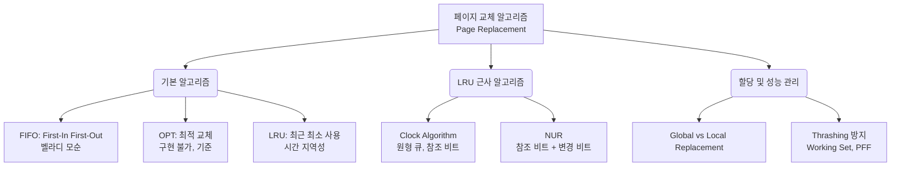

+++
title = "페이지 교체 알고리즘 (Page Replacement)"
weight = 300
+++

> **3-line Insight**
> - 페이지 교체 알고리즘(Page Replacement Algorithm)은 가상 메모리 관리에서 물리 메모리의 여유 공간이 부족할 때 디스크로 내보낼 희생 페이지(Victim Page)를 결정하는 최적화 전략이다.
> - 최적의 알고리즘은 미래의 메모리 참조 패턴을 예측하여 페이지 폴트율(Page Fault Rate)을 최소화함으로써 시스템의 처리량(Throughput)을 극대화하는 것을 목표로 한다.
> - FIFO의 벨라디의 모순(Belady's Anomaly)과 같은 한계를 극복하기 위해 지역성(Locality) 원칙에 기반한 LRU(Least Recently Used) 및 이를 근사하는 클럭(Clock) 알고리즘 등으로 발전해 왔다.

## Ⅰ. 페이지 교체의 필요성과 목표

페이지 교체(Page Replacement)는 운영체제(OS, Operating System)가 요구 페이징(Demand Paging) 환경에서 새로운 페이지를 메모리에 적재해야 하지만, 주 메모리(Main Memory) 내에 가용한 빈 프레임(Free Frame)이 없을 때 발생하는 필수적인 프로세스이다. 
메모리는 한정된 자원이므로, 모든 프로그램의 코드를 동시에 올려둘 수 없다. 따라서 현재 가장 덜 중요하거나 나중에 사용될 가능성이 가장 낮은 페이지를 식별하여 보조 기억 장치(Backing Store)인 디스크의 스왑 영역(Swap Space)으로 내보내고(Swap-out), 그 자리에 새로운 페이지를 들여와야(Swap-in) 한다.
페이지 교체 알고리즘의 핵심 목표는 **페이지 폴트(Page Fault) 발생 횟수를 최소화**하는 것이다. 디스크 I/O 작업은 CPU 처리 속도에 비해 매우 느리기 때문에, 잘못된 페이지를 교체하면 스래싱(Thrashing, 잦은 페이지 교체로 인한 심각한 성능 저하)이 발생하여 시스템이 마비될 수 있다.

> 📢 **섹션 요약 비유**
> 한정된 크기의 진열장(물리 메모리)에 새로운 신상품(새로운 페이지)을 전시하려면, 어떤 기존 상품(희생 페이지)을 창고(디스크)로 뺄지 결정하는 매니저의 선택 전략과 같습니다.

## Ⅱ. 페이지 교체 메커니즘과 아키텍처 (아키텍처)

페이지 교체는 페이지 폴트 처리 과정의 일부로서, 희생 페이지를 선정하고 디스크의 스왑 영역과 데이터를 교환하는 일련의 과정이다. 이 과정에서 변경(Modify) 비트(또는 Dirty Bit)가 활용되어 I/O 비용을 최적화한다.

```text
[Main Memory (Physical Frames)]         [Disk (Swap Space / Backing Store)]
  +-------+-------+-------+               +-----------------------+
  | Page A| Page B| Page C|               |                       |
  +-------+-------+-------+               |       [Page D]        |
          |       |                       |                       |
          v       v                       +-----------------------+
   [Victim Page Selection]
   (Page Replacement Algorithm)
             |
             +-- 1. Select 'Page B' as Victim
             |
             +-- 2. Check Modify (Dirty) Bit of 'Page B'
             |      - If Dirty (1): Write Page B to Disk (Swap-out) ----> (Disk I/O)
             |      - If Clean (0): Discard Page B (No Write needed)
             |
             +-- 3. Read 'Page D' from Disk to the freed Frame (Swap-in) <---- (Disk I/O)
             |
             +-- 4. Update Page Tables (Invalidate B, Validate D)
```

**수행 단계 요약:**
1. **희생자 선정:** 알고리즘을 통해 쫓아낼 프레임(희생 페이지)을 선택한다.
2. **디스크 쓰기(필요시):** 선택된 페이지의 수정 비트(Dirty Bit)를 확인하여, 메모리에 올라온 이후 내용이 변경되었다면 디스크에 변경된 내용을 기록한다. (Dirty Page 쓰기)
3. **새 페이지 읽기:** 요구된 새로운 페이지를 디스크에서 읽어 확보된 프레임에 로드한다.
4. **테이블 업데이트:** 기존 페이지의 페이지 테이블(Page Table) 유효 비트를 무효(Invalid)로, 새 페이지를 유효(Valid)로 갱신한다.

> 📢 **섹션 요약 비유**
> 진열장에서 뺄 상품을 고른 후(희생자 선정), 그 상품에 손때가 묻었으면 닦아서 창고에 넣고(Dirty Bit 확인 및 스왑 아웃), 새 상품을 그 자리에 채워 넣는(스왑 인) 과정입니다.

## Ⅲ. 주요 페이지 교체 알고리즘의 분류

페이지 폴트율을 낮추기 위해 다양한 알고리즘이 연구되었으며, 크게 과거의 사용 이력을 바탕으로 하는 방식과 단순 큐 기반, 그리고 이상적인 모델로 나눌 수 있다.

- **OPT (Optimal Replacement):** 앞으로 가장 오랫동안 사용되지 않을 페이지를 교체한다. 미래의 메모리 참조 패턴을 알아야 하므로 현실적으로 구현이 불가능(Unimplementable)하지만, 다른 알고리즘들의 성능을 평가하는 이상적인 기준(Upper Bound)으로 사용된다.
- **FIFO (First-In First-Out):** 메모리에 가장 먼저 들어온 페이지를 먼저 내보내는 방식이다. 큐(Queue)로 간단히 구현되지만, 자주 사용되는 페이지가 교체될 위험이 있으며, 할당된 프레임 수가 늘어나도 오히려 페이지 폴트가 증가하는 **벨라디의 모순(Belady's Anomaly)**이 발생할 수 있다.
- **LRU (Least Recently Used):** 최근에 가장 오랫동안 사용되지 않은 페이지를 교체한다. 시간 지역성(Temporal Locality) 원칙에 기반하며, 벨라디의 모순이 발생하지 않는 스택 알고리즘(Stack Algorithm)이다. 성능은 우수하나, 매 참조마다 시간(Timestamp)이나 리스트 구조를 업데이트해야 하므로 하드웨어 오버헤드가 크다.
- **LFU (Least Frequently Used) & MFU (Most Frequently Used):** 참조 횟수를 기반으로 교체하는 알고리즘. LFU는 참조 횟수가 가장 적은 것을 교체하고, MFU는 오히려 많이 참조된 것이 과거의 것이라고 판단해 교체한다. 구현이 복잡하고 초기 적재된 후 사용되지 않는 페이지 처리가 어려워 실무에서는 잘 쓰이지 않는다.

> 📢 **섹션 요약 비유**
> OPT는 미래를 보는 예언자, FIFO는 무조건 먼저 온 사람부터 쫓아내는 수위, LRU는 방명록을 보고 제일 오래전에 방문한 사람을 내보내는 똑똑한 관리자라 할 수 있습니다.

## Ⅳ. LRU 근사 알고리즘과 현실적 대안

순수한 LRU 알고리즘은 구현 비용이 너무 크기 때문에, 현대 운영체제는 하드웨어의 지원을 받는 LRU 근사 알고리즘(LRU Approximation Algorithm)을 주로 채택한다. 이는 참조 비트(Reference Bit)라는 하드웨어 플래그 하나만을 추가하여 오버헤드를 줄인다.

- **2차 기회 알고리즘 (Second-Chance Algorithm) / 클럭 알고리즘 (Clock Algorithm):** 기본적으로 FIFO 큐를 원형 큐(Circular Queue) 형태로 구성하며, 각 페이지에 참조 비트(Reference Bit)를 둔다. 페이지를 참조할 때 비트가 1로 설정되며, 교체 대상을 찾을 때 포인터(시계바늘)가 순회하면서 참조 비트가 1인 것은 0으로 바꾸어 한 번의 '기회'를 더 주고, 참조 비트가 0인 페이지를 찾아 교체한다.
- **NUR (Not Used Recently):** 클럭 알고리즘의 확장판으로, 참조 비트(Reference Bit)와 변형 비트(Modified/Dirty Bit) 두 개를 조합하여 페이지를 분류한다. (0,0) 즉 최근에 참조되지도 않고 수정되지도 않은 페이지를 1순위로 교체하여, 디스크 쓰기 비용(I/O Cost)까지 최적화하는 실용적인 접근법이다.

이러한 근사 알고리즘들은 완벽한 LRU와 거의 유사한 성능을 내면서도 하드웨어 구현이 매우 간단하여, Windows, Linux 등 대부분의 상용 OS에서 가상 메모리 관리의 핵심 로직으로 차용하고 있다.

> 📢 **섹션 요약 비유**
> 완벽한 장부 정리(순수 LRU)가 너무 힘드니, 관리자가 순찰을 돌면서 깃발이 꽂힌 상품은 깃발만 뽑아 한 번 봐주고, 깃발이 없는 상품을 발견하면 바로 빼버리는(클럭 알고리즘) 효율적인 순찰 방식입니다.

## Ⅴ. 페이지 프레임 할당(Allocation)과 스래싱(Thrashing)

훌륭한 페이지 교체 알고리즘을 사용하더라도, 프로세스에 할당된 절대적인 물리 프레임(Physical Frame)의 수가 부족하면 페이지 폴트가 급증하는 스래싱(Thrashing) 현상이 발생한다. 따라서 교체 알고리즘은 프레임 할당 정책과 맞물려 동작해야 한다.

- **지역 교체(Local Replacement) vs 전역 교체(Global Replacement):** 
  - **지역 교체:** 프로세스 자신에게 할당된 프레임 집합 안에서만 교체 대상을 찾는 방식이다. 다른 프로세스에 영향을 주지 않지만 메모리 낭비가 생길 수 있다.
  - **전역 교체:** 시스템 전체의 프레임을 대상으로 교체 대상을 선정한다. 한 프로세스가 다른 프로세스의 프레임을 빼앗아 올 수 있어 전체 메모리 효율은 좋으나, 특정 프로세스의 실행 시간이 예측 불가능해진다. 대부분의 OS는 전역 교체를 선호한다.
- **워킹 셋(Working Set) 모델 및 PFF(Page Fault Frequency):** 스래싱을 방지하기 위해 프로세스가 현재 활발하게 사용하는 페이지들의 집합(워킹 셋)을 추적하여 이만큼의 프레임을 동적으로 보장해 주거나, 페이지 폴트 빈도(PFF)를 모니터링하여 상한/하한선에 따라 프레임 할당량을 조절하는 메커니즘이 함께 사용되어야만 교체 알고리즘이 정상적으로 성능을 발휘할 수 있다.

> 📢 **섹션 요약 비유**
> 아무리 매니저(교체 알고리즘)가 똑똑해도 매장의 전체 공간(할당된 프레임)이 너무 좁으면 물건을 계속 창고에서 넣고 빼느라 장사를 망치게 되는데(스래싱), 이를 막기 위해 최소한의 적정 매장 크기를 보장해 주는 정책이 반드시 필요합니다.

---

### 💡 Knowledge Graph 및 Child Analogy



**👧 Child Analogy:**
네가 필통(메모리)에 색연필을 딱 5개만 넣을 수 있다고 생각해보자. 그림을 그리다 새로운 색연필이 필요한데 필통이 꽉 찼어. 그럼 어떤 걸 빼고 새 걸 넣을지 결정해야겠지?
- **FIFO:** 그냥 필통에 제일 먼저 들어온 색연필을 빼버리는 거야. (근데 그게 제일 좋아하는 검은색일 수도 있어!)
- **OPT:** 네가 앞으로 그릴 그림을 완벽하게 예상해서, 다 그릴 때까지 절대 안 쓸 색연필을 빼는 거야. (이건 마법사가 아니면 불가능하지.)
- **LRU:** 제일 오랫동안 손이 안 간 색연필을 빼는 거야. 보통 오랫동안 안 쓴 색깔은 당분간 안 쓸 확률이 높거든. 컴퓨터도 LRU 같은 방법을 가장 좋아하고 자주 쓴단다!
