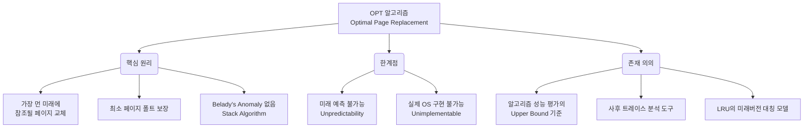

+++
title = "OPT (최적 교체)"
weight = 301
+++

> **3-line Insight**
> - OPT(Optimal Page Replacement)는 앞으로 가장 오랫동안 사용되지 않을 페이지를 교체 대상으로 선정하는 이론적이고 이상적인 페이지 교체 알고리즘이다.
> - 미래의 메모리 참조 패턴을 사전에 알아야 한다는 전제 조건 때문에 실제 운영체제 시스템에서는 구현이 불가능(Unimplementable)하다.
> - 그러나 가장 낮은 페이지 폴트율(Page Fault Rate)을 보장하므로, 다른 실용적인 페이지 교체 알고리즘들의 성능 한계를 측정하고 비교 평가하기 위한 절대적인 기준선(Upper Bound) 역할을 한다.

## Ⅰ. OPT 알고리즘의 정의와 핵심 개념

OPT 알고리즘(Optimal Page Replacement Algorithm), 또는 Belady's Optimal Algorithm(고안자인 Laszlo Belady의 이름을 땀)은 가상 메모리(Virtual Memory) 관리에서 페이지 부재(Page Fault)가 발생하여 페이지 교체가 필요할 때, **"앞으로 참조될 때까지의 시간이 가장 긴 페이지"**, 즉 미래에 가장 늦게 사용될 페이지를 식별하여 메모리에서 쫓아내는 전략을 말한다.
이 알고리즘은 수학적으로 증명된 최소 페이지 부재율을 보장한다. 특정 프로세스의 메모리 참조 시퀀스(Reference String)와 할당된 프레임(Frame)의 수가 정해져 있을 때, OPT보다 더 적은 페이지 폴트를 발생시키는 알고리즘은 존재하지 않는다. 
OPT는 FIFO(First-In First-Out) 알고리즘에서 할당된 프레임이 증가함에도 오히려 페이지 폴트가 증가하는 기현상인 **벨라디의 모순(Belady's Anomaly)**이 발생하지 않는 스택 알고리즘(Stack Algorithm)에 속한다.

> 📢 **섹션 요약 비유**
> 앞으로 어떤 일이 일어날지 전부 알고 있는 예언자가, 여행 가방(메모리)에 짐을 쌀 때 가장 나중에 필요해질 물건만 정확히 골라내어 버리고 당장 필요한 물건을 채워 넣는 완벽한 짐 싸기 방식과 같습니다.

## Ⅱ. OPT 알고리즘의 동작 메커니즘 (아키텍처)

OPT 알고리즘은 현재 시점(t) 이후의 참조 스트링(Reference String) 전체를 스캔하여 각 페이지가 다시 참조되는 미래의 시점을 계산하는 방식으로 시뮬레이션된다.

```text
[Reference String] : 7, 0, 1, 2, 0, 3, 0, 4, 2, 3, 0, 3, 2, 1, 2, 0, 1, 7, 0, 1
[Physical Memory Frames: 3]

Time Step:     t1   t2   t3   t4 (Page Fault!) -> Replace?
Reference:     7    0    1    2
               |    |    |    |
Frame 1:      [7]  [7]  [7]  [2]  <-- 7은 미래(t18)에 참조됨, 0(t5), 1(t14) 대비 가장 늦음
Frame 2:           [0]  [0]  [0]
Frame 3:                [1]  [1]

[미래 참조 시점 예측 메커니즘]
At t4 (Reference '2'):
- Current memory: {7, 0, 1}
- Future String: 0, 3, 0, 4, 2, 3, 0, 3, 2, 1, 2, 0, 1, 7, 0, 1
  -> '0' is used at t5 (Next step)
  -> '1' is used at t14
  -> '7' is used at t18 (Furthest in the future)
=> Victim Page = '7'. Replace 7 with 2.
```

**수행 단계 요약:**
1. **페이지 폴트 발생:** 메모리에 빈 프레임이 없고 새로운 페이지를 적재해야 할 때 발생.
2. **미래 참조 탐색:** 현재 메모리에 적재된 모든 페이지들에 대해, 미래의 참조 스트링을 처음부터 스캔한다.
3. **가장 먼 미래 식별:** 각 페이지가 처음으로 다시 등장하는 위치(거리)를 계산한다. 만약 미래에 다시는 참조되지 않는 페이지가 있다면 해당 페이지가 1순위 희생자(Victim)가 된다.
4. **교체 및 적재:** 거리가 가장 먼(가장 나중에 참조될) 페이지를 스왑 아웃(Swap-out)하고 새로운 페이지를 스왑 인(Swap-in)한다.

> 📢 **섹션 요약 비유**
> 테이블에 올려둔 책상 3칸(프레임)이 꽉 찼을 때, 앞으로 남은 전체 시간표를 쭉 훑어보고 "이 책은 이번 학기 맨 마지막에나 필요하네!" 하고 가장 나중에 볼 책을 뽑아내는 과정입니다.

## Ⅲ. 구현 불가능성 (Unimplementability)의 이유

이론적으로 완벽함에도 불구하고, OPT 알고리즘은 실제 운영체제(OS, Operating System) 환경에서는 구현이 불가능(Impossible to implement)하다. 

- **미래 예측 불가능 (Unpredictability of Future References):** CPU 스케줄링의 SJF(Shortest Job First) 알고리즘이 프로세스의 실제 버스트 시간(Burst Time)을 미리 알 수 없는 것처럼, OS는 특정 프로세스가 어떤 메모리 주소를 어떤 순서로 참조할지, 언제 조건 분기(Branch)를 통해 완전히 다른 메모리 영역으로 점프할지 실행 전에는 알 수 없다.
- **오프라인 알고리즘 (Offline Algorithm):** OPT는 전체 입력 데이터(참조 스트링)가 시작 전에 주어져야만 작동할 수 있는 오프라인 알고리즘이다. 반면, 실제 메모리 관리는 요청이 들어오는 대로 즉시 처리해야 하는 온라인 알고리즘(Online Algorithm)이어야 한다.
- **오버헤드 (Overhead):** 만약 미래를 완벽하게 예측하는 마법 같은 기법이 있다 하더라도, 매 페이지 폴트마다 수백만 개의 명령어 참조 스트링을 스캔하여 거리를 계산하는 연산량은 CPU 사이클을 심각하게 낭비하게 되어 배보다 배꼽이 더 큰 상황을 초래한다.

> 📢 **섹션 요약 비유**
> 주식 시장에서 '가장 수익률이 좋을 주식을 미리 사서, 가장 떨어질 주식을 미리 파는 완벽한 전략'과 같습니다. 이론적으로는 최고의 수익을 내지만, 미래의 주가를 아무도 정확히 알 수 없기에 현실에서 불가능한 것과 동일합니다.

## Ⅳ. OPT의 학술적/실무적 가치 (Upper Bound)

구현이 불가능함에도 OPT가 컴퓨터 아키텍처 및 운영체제 교과서에서 중요하게 다뤄지는 이유는 벤치마크(Benchmark)로서의 역할 때문이다.

- **절대적 기준선 (Performance Upper Bound):** 새로운 페이지 교체 알고리즘(예: LRU의 변형, 머신러닝 기반 알고리즘 등)을 개발했을 때, 이 알고리즘의 성능이 얼마나 '완벽에 가까운지'를 평가하는 척도가 된다. 예를 들어, LRU가 15번의 폴트를 내고, OPT가 10번의 폴트를 낸다면, LRU는 최적 성능의 66% 수준이라는 명확한 평가를 내릴 수 있다.
- **오프라인 분석 도구:** 프로그램 실행 후 생성된 메모리 참조 트레이스(Memory Reference Trace) 데이터를 수집한 뒤, 사후(Post-mortem) 분석 시에는 OPT를 실행할 수 있다. 이 시뮬레이션을 통해 컴파일러(Compiler) 최적화 기술이나 코드 재배치(Code Relocation) 기법이 페이지 폴트를 근본적으로 얼마나 줄일 수 있는지 분석하는 데 유용하게 쓰인다.

> 📢 **섹션 요약 비유**
> 100m 달리기에서 '물리학적으로 인간이 낼 수 있는 절대 한계 기록'을 정해놓는 것과 같습니다. 아무도 그 기록을 깰 수는 없지만, 현재 선수들의 기록이 궁극적인 한계치에 얼마나 가까워졌는지 평가하는 완벽한 잣대가 됩니다.

## Ⅴ. OPT와 LRU 알고리즘의 철학적 대칭성

OPT와 가장 널리 쓰이는 현실적 알고리즘인 LRU(Least Recently Used)는 시간 축을 기준으로 완벽한 대칭성(Symmetry)을 이룬다.

- **OPT는 미래(Future) 지향:** "앞으로" 가장 오랫동안 사용되지 "않을" 페이지를 찾는다. 
- **LRU는 과거(Past) 지향:** 시간 지역성(Temporal Locality) 원칙에 기반하여 "과거에" 가장 오랫동안 사용되지 "않은" 페이지를 찾는다. 즉, '과거의 패턴이 미래에도 반복될 것'이라는 가정을 바탕으로 과거를 통해 미래를 근사(Approximation)하는 방식이다.

만약 어떤 프로그램의 메모리 참조 패턴이 정확히 반복되는 루프(Loop) 형태라면, LRU는 마치 OPT처럼 동작하여 높은 효율을 보일 수 있다. 반면 참조 패턴이 완전히 무작위(Random)라면, LRU나 FIFO 등 어떤 알고리즘을 써도 큰 차이가 없으며 OPT만이 유일하게 최적의 결과를 낸다.

> 📢 **섹션 요약 비유**
> OPT가 앞유리(미래)를 보며 완벽한 길을 찾는 자율주행차라면, LRU는 백미러(과거)만 보고 지나온 길의 궤적을 바탕으로 앞으로의 코너를 예상하며 운전하는 베테랑 운전자와 같습니다.

---

### 💡 Knowledge Graph 및 Child Analogy



**👧 Child Analogy:**
네가 오늘 하루 종일 놀 장난감을 가방(메모리)에 3개만 넣을 수 있어. 가방이 꽉 찼는데 새로운 로봇 장난감을 넣고 싶어졌어. 
**OPT**라는 마법은 "저녁 먹기 전까지 절대 안 찾을 장난감"을 미래를 꿰뚫어 보고 가방에서 쏙 빼는 방법이야. 이러면 하루 종일 장난감을 뺐다 넣었다 하는 귀찮은 일(페이지 폴트)을 가장 적게 할 수 있지! 하지만 우리에겐 미래를 보는 수정구슬이 없으니까 현실에서는 쓸 수 없고, "아, 이렇게 하면 완벽했겠구나!" 하고 나중에 일기를 쓰며 점수를 매길 때만 쓰는 특별한 마법이란다.
