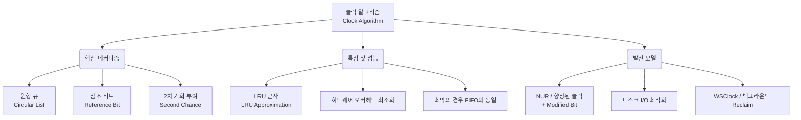

+++
title = "클럭 알고리즘 (Clock Algorithm)"
weight = 302
+++

> **3-line Insight**
> - 클럭 알고리즘(Clock Algorithm)은 완벽한 LRU(Least Recently Used) 알고리즘의 막대한 하드웨어 오버헤드를 줄이기 위해 고안된 효율적인 LRU 근사 알고리즘(LRU Approximation Algorithm)이다.
> - 원형 큐(Circular Queue) 형태의 프레임 리스트와 하드웨어가 지원하는 단일 참조 비트(Reference Bit)를 결합하여, 마치 시계바늘이 도는 것처럼 희생 페이지(Victim Page)를 탐색한다.
> - 구현이 매우 단순하면서도 성능이 LRU와 거의 유사하여, Windows와 Linux 등 현대의 상용 운영체제(OS)에서 가장 널리 채택된 실용적인 페이지 교체 기법이다. (Second-Chance 알고리즘으로도 불림)

## Ⅰ. 클럭 알고리즘의 등장 배경: LRU의 한계 극복

가상 메모리(Virtual Memory) 환경에서 시스템 성능을 좌우하는 페이지 교체(Page Replacement)의 이상적인 현실 대안은 LRU(Least Recently Used) 알고리즘이다. 지역성(Locality) 원칙에 따라 가장 오래전에 사용된 페이지를 교체하여 우수한 페이지 적중률을 보장한다.
그러나 순수한 LRU를 구현하려면 매 메모리 참조마다 페이지의 타임스탬프(Timestamp)를 기록하거나 링크드 리스트(Linked List)를 갱신해야 하는 막대한 오버헤드(Overhead)가 발생한다. 수 나노초 단위의 메모리 접근마다 이런 작업을 수행하는 것은 하드웨어 설계상 매우 비효율적이다.
이를 해결하기 위해 하드웨어 구조를 극도로 단순화하면서도 LRU의 효과를 근사(Approximate)하게 내기 위해 고안된 것이 **클럭 알고리즘(Clock Algorithm)**, 또는 **2차 기회 알고리즘(Second-Chance Algorithm)**이다. 페이지당 단 1비트의 정보만으로 교체 대상을 똑똑하게 식별해 낸다.

> 📢 **섹션 요약 비유**
> 방문자 명부를 매번 시간 단위로 꼼꼼히 적는 완벽주의 경비원(LRU) 대신, 방문자가 올 때마다 이름표에 스티커 하나만 붙여두고 나중에 스티커가 없는 사람만 골라내는 요령 좋은 경비원(Clock)이라 할 수 있습니다.

## Ⅱ. 클럭 알고리즘의 동작 메커니즘 (아키텍처)

클럭 알고리즘은 물리 메모리의 프레임들을 원형 리스트(Circular List) 형태로 연결하고, 각 프레임마다 1비트의 **참조 비트(Reference Bit / Use Bit)**를 유지한다. 페이지가 참조(읽기/쓰기)될 때마다 하드웨어(MMU)가 이 비트를 1로 설정한다.

```text
       [Circular Frame List (The Clock)]
             
             (Clock Pointer)
                  |
                  v
                +---+ (Reference Bit = 1)
             /         \
   (Ref=0) +---+     +---+ (Ref=1) -> CPU accesses this page -> HW sets Ref=1
           |             |
   (Ref=1) +---+     +---+ (Ref=0)
             \         /
                +---+ (Ref=1)

[Page Fault Occurs -> Algorithm Execution]
1. Pointer points to Page A (Ref=1).
2. Algorithm changes Ref to 0 (gives "Second Chance").
3. Pointer moves to next Page B (Ref=1).
4. Algorithm changes Ref to 0.
5. Pointer moves to next Page C (Ref=0).
6. Algorithm finds Ref=0 -> SELECT as Victim! -> Replace Page C.
7. Set new Page's Ref=1, and Pointer moves to next.
```

**수행 단계 요약:**
1. **참조 비트 세팅:** CPU가 페이지를 읽거나 쓸 때, 하드웨어가 자동으로 해당 페이지의 참조 비트를 `1`로 세팅한다.
2. **페이지 폴트 시 탐색 시작:** 교체할 페이지가 필요해지면, 시계바늘(Clock Pointer)이 가리키는 현재 위치에서부터 순회를 시작한다.
3. **2차 기회 부여 (Second Chance):** 포인터가 가리키는 프레임의 참조 비트가 `1`이라면, 최근에 사용되었다는 뜻이므로 비트를 `0`으로 바꾼 뒤 한 번의 기회를 더 주고 다음 프레임으로 이동한다.
4. **희생자 선정:** 포인터가 가리키는 프레임의 참조 비트가 `0`인 것을 발견하면, 최근에 한 바퀴를 도는 동안 한 번도 참조되지 않았다는 뜻이므로 즉시 희생 페이지(Victim Page)로 선정하여 스왑 아웃(Swap-out)한다.

> 📢 **섹션 요약 비유**
> 시곗바늘이 돌면서 "최근에 쓰였니(비트=1)?" 묻고, 쓰였다고 하면 "그럼 표시는 지울 테니(비트=0) 다음번 바퀴 때까지 또 쓰여라" 하며 한 번 봐줍니다. 만약 "표시가 지워져 있네(비트=0)?" 하면 가차 없이 쫓아내는 방식입니다.

## Ⅲ. 성능 특성과 LRU와의 비교

클럭 알고리즘은 극도로 적은 정보(1비트)만을 사용하지만, 실제 동작 결과는 완벽한 LRU와 놀라울 정도로 유사한 성능(낮은 페이지 폴트율)을 보여준다.

- **장점 (오버헤드 최소화):** 메모리 참조 시에는 MMU가 비트를 1로 바꾸는 하드웨어 연산 하나만 필요하므로 오버헤드가 사실상 0에 가깝다. 교체 대상을 찾을 때만 소프트웨어 루틴이 개입하므로 성능 저하가 극히 적다.
- **최악의 경우 분석:** 만약 모든 페이지가 너무 자주 사용되어 모든 프레임의 참조 비트가 1인 상태라면 어떻게 될까? 포인터는 한 바퀴를 돌면서 모든 비트를 0으로 바꾸고 원래 위치로 돌아오게 된다. 이 경우 결국 가장 처음 가리켰던 페이지가 교체되므로, 최악의 경우(Worst-case)에는 단순한 FIFO(First-In First-Out) 알고리즘과 똑같이 동작하게 된다.
- **최적화:** 클럭 알고리즘이 잘 동작하려면 전체 메모리의 참조 비트 중 0과 1이 적절히 섞여 있어야 한다. 이를 위해 OS 데몬은 페이지 폴트가 발생하지 않더라도 주기적으로 백그라운드에서 시계바늘을 돌리며 비트를 0으로 초기화(Clearing)하는 작업을 수행하기도 한다.

> 📢 **섹션 요약 비유**
> LRU가 모든 물건의 사용 시간을 초 단위로 기록하는 무거운 전자장부라면, 클럭 알고리즘은 물건을 만질 때 먼지만 털어주고, 나중에 먼지가 소복이 쌓인(비트=0) 물건만 골라서 버리는 가벼운 먼지떨이 기법입니다.

## Ⅳ. 변형: 향상된 클럭 알고리즘 (NUR / MAC)

기본 클럭 알고리즘을 더욱 발전시켜 성능을 끌어올린 변형들이 존재하며, 이는 디스크 I/O 비용까지 고려한 설계다.

- **수정 비트(Modified Bit / Dirty Bit)의 도입:** 페이지 교체 시, 내용이 수정된 페이지(Dirty)를 버리려면 디스크에 쓰기 작업을 해야 하므로 I/O 비용이 비싸다. 반면 수정되지 않은 페이지(Clean)는 그냥 덮어쓰면 되므로 빠르다.
- **NUR (Not Used Recently):** 이를 반영하여 참조 비트(R)와 수정 비트(M) 두 개의 비트를 사용한다. 포인터가 돌 때 교체 우선순위를 `(R=0, M=0)` -> `(R=0, M=1)` -> `(R=1, M=0)` -> `(R=1, M=1)` 순으로 매겨 탐색한다. 이렇게 하면 최근에 쓰이지도 않았고 내용도 안 바뀐 페이지를 최우선으로 버려 디스크 쓰기 연산을 최소화할 수 있다. (MAC, Modified Algorithm Clock 등으로도 불림)

이 향상된 클럭 방식은 리눅스(Linux)와 유닉스(Unix) 계열 커널에서 페이지 캐시 매니저의 핵심 아키텍처로 사용되며 실제 시스템 성능 최적화에 엄청난 기여를 한다.

> 📢 **섹션 요약 비유**
> 버릴 책을 고를 때, '최근에 안 본 책' 중에서도 '내가 낙서해서 다시 사려면 돈 드는 책(수정 비트=1)'은 피하고, '낙서 하나도 없는 깨끗한 책(수정 비트=0)'을 최우선으로 버려 쓰레기 처리 비용(I/O 비용)을 아끼는 똑똑한 방법입니다.

## Ⅴ. 클럭 알고리즘의 프레임 할당과의 연계

클럭 알고리즘은 전역 교체(Global Replacement) 환경과 지역 교체(Local Replacement) 환경 모두에 적용될 수 있으나, 보통 운영체제 전체의 물리 메모리 관리(전역 교체)에서 빛을 발한다.

- **전역 클럭 (Global Clock):** 운영체제가 관리하는 거대한 단일 원형 리스트에 모든 프로세스의 프레임이 묶여 있다. 포인터가 돌면서 프로세스 구분 없이 안 쓰이는 페이지를 거둬들인다. 시스템 전체의 메모리 활용도는 극대화되나, 특정 프로세스가 프레임을 빼앗겨 스래싱(Thrashing)에 빠질 수 있다.
- **지역 클럭 / WSClock (Working Set Clock):** 프로세스별로 독립적인 작은 시계(리스트)를 유지하거나, 워킹 셋(Working Set) 개념과 결합하여 해당 프로세스의 활성 페이지 상태를 모니터링한다. 이를 통해 각 프로세스에 필요한 최소 프레임 수를 동적으로 보장하면서 클럭 알고리즘을 적용해 안정성을 높인다.

현대 OS의 커널(Kernel)은 가용 메모리(Free Memory)가 일정 수준(Watermark) 이하로 떨어질 때 `kswapd` 같은 백그라운드 스레드를 깨워 이 클럭 알고리즘 기반의 페이지 회수(Page Reclaim) 작업을 비동기적으로 수행하여 시스템의 응답성을 유지한다.

> 📢 **섹션 요약 비유**
> 아파트 전체를 도는 청소 로봇(전역 클럭)이 집집마다 안 쓰는 물건을 싹 치워버리면 전체 공간은 넓어지지만 특정 집이 텅 빌 수 있습니다. 그래서 각자의 방마다 작은 로봇(지역 클럭)을 두거나, 기본 가구는 건드리지 않게(워킹 셋 보장) 똑똑하게 규칙을 정해두는 것입니다.

---

### 💡 Knowledge Graph 및 Child Analogy



**👧 Child Analogy:**
놀이공원에서 범퍼카를 타려고 친구들이 동그랗게 줄을 서 있어. 관리자 아저씨(시계바늘)가 뺑뺑 돌면서 표 검사를 해. 
친구들이 범퍼카를 타고 나오면 손등에 '참 잘했어요' 도장(참조 비트 1)을 찍어줘. 관리자 아저씨가 순서대로 돌다가 도장이 있는 친구를 보면, "오, 방금 탔구나. 이번엔 봐줄 테니 도장만 지워!" 하고 다음으로 넘어가(2차 기회). 그러다 도장이 없는 친구를 만나면 "넌 한동안 안 탔네! 이제 집에 갈 시간이야~" 하고 내보내고(희생자 선정), 새로운 친구를 빈자리에 채워 넣는 놀이란다. 
도장 하나만으로 누가 제일 안 놀았는지 쉽게 찾아내는 아주 빠르고 똑똑한 규칙이야!
