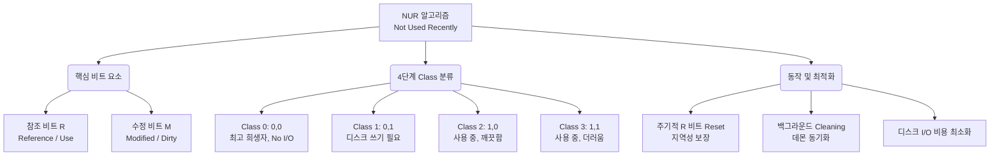

+++
title = "NUR (Not Used Recently)"
weight = 303
+++

> **3-line Insight**
> - NUR(Not Used Recently) 알고리즘은 클럭(Clock) 알고리즘을 확장하여 디스크 입출력(I/O) 오버헤드까지 최적화한 실용적인 페이지 교체 기법이다.
> - 하드웨어가 지원하는 참조 비트(Reference Bit)와 수정 비트(Modified/Dirty Bit) 두 가지 플래그를 조합하여 페이지의 교체 우선순위를 4단계의 클래스(Class)로 분류한다.
> - 최근에 사용되지 않았으면서 동시에 수정되지 않은 깨끗한(Clean) 페이지를 1순위로 버림으로써, 무거운 디스크 쓰기(Write-back) 작업을 최소화하여 시스템 성능을 극대화한다.

## Ⅰ. NUR 알고리즘의 설계 철학과 디스크 I/O 오버헤드

가상 메모리(Virtual Memory)의 요구 페이징(Demand Paging) 환경에서 페이지 부재(Page Fault) 처리 성능을 결정짓는 가장 큰 병목(Bottleneck)은 디스크 I/O 연산이다. 디스크는 주 메모리(Main Memory)보다 수만 배 느리기 때문이다.
LRU(Least Recently Used)나 기본 클럭 알고리즘(Clock Algorithm)은 오직 '시간적 지역성(얼마나 최근에 사용되었는가)'만을 고려하여 희생 페이지(Victim Page)를 선택한다. 하지만 만약 선택된 희생 페이지의 내용이 메모리에 올라온 이후 변경(Modified)되었다면, 해당 페이지를 버리기 전에 그 변경 사항을 반드시 디스크의 스왑 영역(Swap Space)에 기록(Write-back)해야만 데이터의 무결성이 유지된다. 이로 인해 교체 지연 시간이 2배로 늘어나게 된다.
NUR 알고리즘은 향상된 클럭 알고리즘(Enhanced Second-Chance Algorithm)으로도 불리며, **"디스크에 쓰기 작업을 해야 하는 수정된 페이지(Dirty Page)보다는, 그냥 덮어써도 되는 깨끗한 페이지(Clean Page)를 우선적으로 버린다"**는 실용적인 경제학적 철학을 추가한 것이다.

> 📢 **섹션 요약 비유**
> 방을 청소할 때, '오랫동안 안 본 책'을 버리되, 그중에서도 '내가 낙서해서 나중에 새로 사려면 돈 드는 헌책(Dirty Page)'은 가급적 남기고, '낙서 하나 없는 깨끗한 잡지(Clean Page)'를 먼저 버려 돈(I/O 시간)을 아끼는 똑똑한 청소법입니다.

## Ⅱ. 2개의 비트와 4가지 클래스 분류 메커니즘 (아키텍처)

NUR 알고리즘은 MMU(Memory Management Unit)가 자동 지원하는 두 가지 상태 비트를 활용하여 각 페이지 프레임을 4개의 등급(Class)으로 분류한다.

1. **참조 비트 (Reference Bit, R):** 페이지가 읽히거나 쓰일 때 하드웨어가 1로 설정한다. (주기적으로 OS가 0으로 클리어함)
2. **수정 비트 (Modified Bit / Dirty Bit, M):** 페이지에 데이터 쓰기(Write) 작업이 발생할 때 하드웨어가 1로 설정한다.

```text
[Page Frame Entry in Page Table]
+----------+-------+-------+--------------------+
| Frame #  | R Bit | M Bit | Other Attributes...|
+----------+-------+-------+--------------------+

[4 Classes for Victim Selection Priority]
우선순위 높음 (먼저 교체됨)
  | 
  |  Class 0: (R=0, M=0) -> "최근에 쓰이지도 않고, 깨끗함" (최고의 희생양)
  |                         : 그냥 버리면 됨 (No Disk Write)
  |
  |  Class 1: (R=0, M=1) -> "최근에 안 쓰였지만, 더러움"
  |                         : 버리기 아쉽지만 안 쓰니까 버림 (Needs Disk Write)
  |
  |  Class 2: (R=1, M=0) -> "최근에 활발히 쓰이지만, 깨끗함"
  |                         : 자꾸 쓰니까 가급적 살려둠 (No Disk Write)
  |
  v  Class 3: (R=1, M=1) -> "최근에 활발히 쓰이고, 더러움" (가장 늦게 교체됨)
우선순위 낮음               : 절대 안 버림 (Needs Disk Write + Used Often)
```

**수행 탐색 단계 (원형 큐 탐색 시):**
- **1차 스캔:** 포인터를 한 바퀴 돌면서 상태를 변경하지 않고 `Class 0 (0,0)`인 페이지를 찾는다. 찾으면 즉시 교체한다.
- **2차 스캔:** `Class 0`이 없으면 다시 한 바퀴 돌며 `Class 1 (0,1)`인 페이지를 찾는다. 이때 스캔하면서 지나가는 모든 페이지의 **R 비트를 0으로 초기화**한다. (다음 번의 기회를 부여)
- **3/4차 스캔:** 그래도 찾지 못했다면, 이미 2차 스캔에서 R 비트들이 모두 0으로 깎였으므로, 이제는 예전의 Class 2/3이 0/1 상태로 바뀌어 있다. 다시 1~2차 스캔을 반복하여 페이지를 찾아낸다.

> 📢 **섹션 요약 비유**
> 선생님이 징계할 학생을 고를 때, 1순위 "최근에 놀고(R=0) 말썽도 안 피운(M=0) 무존재감 학생"을 전학 보내고, 없으면 2순위 "최근엔 조용하지만(R=0) 예전에 사고 친(M=1) 학생"을 골라내며, 그동안 지켜본 애들 기록표를 한 번 쓱 리셋해주는 정교한 선별 과정입니다.

## Ⅲ. 주기적인 비트 초기화 (Resetting)의 중요성

NUR 알고리즘이 올바르게 작동하기 위해서는 참조 비트(R)의 '최근성'을 유지하는 것이 핵심이다. 시스템이 계속 실행되다 보면 결국 모든 페이지의 R 비트가 1이 되어버린다. 이렇게 되면 알고리즘은 모든 페이지를 '최근에 사용됨'으로 착각하여 변별력을 잃고 FIFO처럼 퇴화해 버린다.

- **타이머 인터럽트 활용:** 이를 막기 위해 운영체제(OS)는 일정 주기(예: 20ms 타이머 인터럽트 발생 시)마다 백그라운드 데몬(Daemon)을 깨워 모든 물리 프레임의 **R 비트를 일괄적으로 0으로 지워버린다(Clearing).**
- **M 비트의 영속성:** 주의할 점은 수정 비트(M)는 절대로 함부로 지우지 않는다는 것이다. M 비트는 오직 해당 페이지가 디스크에 실제로 기록(Write-back)되어 내용이 동기화되었을 때만 0으로 초기화할 수 있다.

이러한 주기적 리셋 메커니즘 덕분에 R 비트가 0인 것은 "가장 최근의 타이머 초기화 이후로 단 한 번도 접근되지 않은 페이지"라는 매우 명확한 시간적 의미를 갖게 되어 강력한 지역성 추정이 가능해진다.

> 📢 **섹션 요약 비유**
> 방문 기록(R 비트)을 영원히 남겨두면 누구나 다 VIP 손님처럼 보이므로, 매니저가 한 시간마다 칠판의 방문 기록을 싹 다 지워버려 진짜 방금 다녀간 사람만 가려내는 것과 같습니다. 단, 외상 장부(M 비트)는 빚을 갚기 전까진 절대 지우지 않습니다.

## Ⅳ. 성능과 실무적 적용 사례 (Unix/Linux)

NUR은 순수 LRU(오버헤드 큼)와 단순 클럭(I/O 무시)의 완벽한 절충점이다. 페이지 폴트 비율 자체는 LRU와 거의 동일하게 유지하면서도, 시스템 전체의 I/O 대역폭 소모를 극적으로 줄여주기 때문에 유닉스(Unix), 매킨토시(Mac OS), 일부 리눅스(Linux) 시스템 등 수많은 상용 OS에서 페이지 교체 서브시스템의 근간 기술로 차용되었다.

- **Paging Daemon (kswapd 등):** 실무에서는 빈 프레임이 아예 고갈될 때까지 기다리지 않는다. 시스템의 여유 메모리(Free Frame)가 특정 임계치(Low Watermark) 아래로 떨어지면 백그라운드 페이징 데몬이 깨어난다.
- **비동기 쓰기 (Asynchronous Write-back):** 데몬은 NUR 알고리즘을 사용해 백그라운드에서 천천히 `Class 1 (0,1)`이나 `Class 3 (1,1)`인 더러운 페이지들을 미리 디스크에 써서 `Class 0`이나 `Class 2`로 만들어 둔다(Cleaning). 덕분에 정작 사용자 프로세스에서 페이지 폴트가 발생했을 때는 I/O 대기 없이 즉각적으로 깨끗한 프레임(Class 0)을 할당받아 지연(Latency) 없이 실행을 이어갈 수 있다.

> 📢 **섹션 요약 비유**
> 손님이 식당에 꽉 차기 전에 직원이 뒤에서 미리 다 먹고 지저분해진 그릇(M=1)을 설거지해 깨끗하게(M=0) 세팅해 두는 비법입니다. 정작 새 손님(페이지 폴트)이 왔을 때는 설거지를 기다릴 필요 없이 즉시 깨끗한 자리를 내어줄 수 있습니다.

## Ⅴ. NUR의 한계와 현대 시스템에서의 변형

NUR 알고리즘은 훌륭하지만 완벽하지는 않다. 4개의 거친 등급으로만 나누기 때문에, 같은 등급 안에서는 어느 페이지가 더 오래되었는지 세밀하게 구분하지 못한다.

- **해결책 1 (추가적인 참조 비트 / Aging):** 이 해상도(Resolution) 문제를 해결하기 위해, 일부 시스템은 8비트짜리 히스토리 바이트(History Byte)를 두어 타이머 인터럽트마다 R 비트 값을 시프트(Shift)시켜 누적하는 에이징(Aging) 알고리즘을 결합해 사용한다.
- **해결책 2 (다중 리스트 / Active-Inactive Lists):** 최신 리눅스 커널 등에서는 단순히 하나의 원형 큐가 아니라, 자주 쓰이는 페이지(Active List)와 안 쓰이는 페이지(Inactive List)로 분리하고, 각 리스트 내부에서 NUR/LRU 유사 기법을 섞어 쓰는 복합적인 2단계 구조를 채택하여 성능과 정확도를 더욱 높이고 있다.

> 📢 **섹션 요약 비유**
> 4단계로만 사람을 나누다 보니(수, 우, 미, 양), 같은 '우' 등급 안에서 누가 더 잘하는지 모르는 단점이 생깁니다. 그래서 최신 시스템들은 성적표에 과거 점수들(에이징)까지 누적해서 기록하거나, 우열반(다중 리스트)을 따로 나누어 더 정밀하게 관리합니다.

---

### 💡 Knowledge Graph 및 Child Analogy



**👧 Child Analogy:**
네가 책상 위에 여러 권의 스케치북을 펴놓고 그림을 그리고 있어. 책상이 꽉 차서 스케치북 하나를 책장에 꽂아야(페이지 교체) 해.
- **Class 0:** 최근에 펴보지도 않았고, 그림도 안 그린 **'빈 스케치북'**. (그냥 바로 책장에 넣으면 돼. 제일 편하지!)
- **Class 1:** 최근엔 안 봤지만, 예전에 멋진 그림을 그려둔 **'그림 있는 스케치북'**. (버릴 순 없으니 사진으로 찍어두고(디스크 저장) 넣어야 해서 시간이 좀 걸려.)
- **Class 2/3:** 방금 전까지 계속 보던 스케치북들. (이건 지금 계속 써야 하니까 가급적 놔두는 게 좋아.)
**NUR**이라는 정리법은 항상 '가장 최근에 안 봤으면서 빈 페이지'인 Class 0부터 쏙쏙 찾아내서 치우는 방법이야. 그래야 귀찮게 사진 찍는 일(디스크 쓰기) 없이 제일 빨리 방을 치울 수 있거든!
