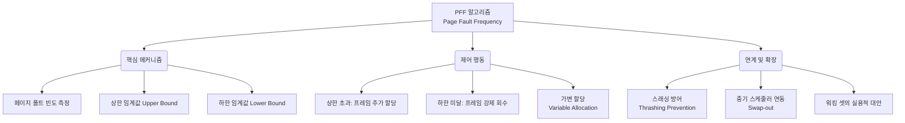

+++
title = "PFF (Page Fault Frequency)"
weight = 306
+++

> **3-line Insight**
> - PFF(Page Fault Frequency, 페이지 부재 빈도)는 다중 프로그래밍 환경에서 각 프로세스에 할당할 물리 프레임(Frame)의 수를 동적으로 조절하여 스래싱(Thrashing)을 방지하는 메모리 관리 알고리즘이다.
> - 시스템의 직접적인 성능 저하 지표인 '페이지 폴트 발생 비율'을 직접 모니터링하여, 상한선(Upper Bound)을 넘으면 프레임을 더 주고 하한선(Lower Bound) 밑으로 떨어지면 프레임을 회수한다.
> - 워킹 셋(Working Set) 모델과 함께 지역성(Locality)을 기반으로 한 가변 할당(Variable Allocation) 정책의 핵심 메커니즘으로, 시스템 자원의 활용도를 극대화하면서 안정성을 보장한다.

## Ⅰ. PFF 알고리즘의 등장 배경: 고정 할당의 한계와 스래싱

가상 메모리(Virtual Memory) 시스템에서 여러 프로세스가 동시에 실행될 때, 각 프로세스에 물리 프레임을 어떻게 분배(Frame Allocation)할 것인가는 매우 중요한 문제이다. 모든 프로세스에 동일한 수의 프레임을 고정적으로 할당하는 방식(Equal/Fixed Allocation)은 특정 프로세스는 메모리가 남아돌고 다른 프로세스는 심각한 메모리 부족에 시달리는 비효율을 초래한다.
프로세스에 프레임이 부족해지면 자주 사용하는 페이지까지 교체 대상이 되어 빈번하게 디스크 입출력이 발생하고, 결국 CPU는 일은 안 하고 페이지 교체 대기만 하는 상태, 즉 **스래싱(Thrashing)**에 빠져 시스템 전체 성능이 붕괴된다.
이를 해결하기 위해 데닝(Peter Denning)의 워킹 셋(Working Set) 개념이 등장했으나, 매 메모리 참조마다 워킹 셋을 추적하는 것은 오버헤드가 크다. 이에 대한 보다 직접적이고 효율적인 대안으로, 눈에 띄는 명확한 지표인 **'페이지 폴트 발생 빈도수(PFF)' 자체를 직접 측정하여 프레임 수를 동적으로 가감하는 직관적인 피드백 제어 시스템**이 바로 PFF 알고리즘이다.

> 📢 **섹션 요약 비유**
> 직원들에게 매달 똑같은 예산을 주는 고정 할당 대신, 직원이 "결재판(프레임)이 부족해서 계속 창고에 다녀와야 해요!(페이지 폴트)"라고 불평하는 횟수를 직접 세어보고, 불평이 많으면 결재판을 더 사주고 조용하면 도로 뺏어오는 실용적인 성과 기반 예산 분배법입니다.

## Ⅱ. PFF 메커니즘과 동작 아키텍처 (아키텍처)

PFF 알고리즘은 두 개의 임계값, 즉 상한 임계값(Upper Threshold)과 하한 임계값(Lower Threshold)을 설정하고, 일정 시간(또는 가상 시간) 단위로 프로세스별 페이지 폴트율을 모니터링하여 동작한다.

```text
[Page Fault Frequency Control Mechanism]

         Page Fault Rate (Faults / time)
               ^
               |   [Thrashing Zone - Process needs MORE frames]
 Upper Bound --+==============================================
               |       /\
               |      /  \  <- (1) Fault rate rises above Upper Bound
  Acceptable   |     /    \    => Action: Allocate additional frame to process
  Zone         |    /      \
 (Sweet Spot)  |   /        \  <- (2) Fault rate falls below Lower Bound
               |  /          \ => Action: Remove unused frames from process
 Lower Bound --+==============================================
               | [Waste Zone - Process has TOO MANY frames]
               |
               +--------------------------------------------> Time

[OS Feedback Loop]
Page Fault Occurs -> Calculate time since last fault (Δt)
If (1 / Δt) > Upper_Bound : 
    -> Increase resident set size (Add frame)
Else If (1 / Δt) < Lower_Bound :
    -> Evict pages not referenced during Δt (Reduce frames)
Else :
    -> Do nothing (Maintain current allocation)
```

**수행 단계 요약:**
1. **임계값 설정:** 운영체제(OS)는 최적의 시스템 성능을 유지하기 위한 페이지 폴트율의 상한선(U)과 하한선(L)을 미리 정의한다.
2. **빈도 측정:** 페이지 폴트가 발생할 때마다, 이전 폴트와의 시간 간격(Δt)을 측정하여 현재의 폴트 빈도를 계산한다.
3. **상한선 초과 (Δt가 너무 짧음):** 잦은 페이지 폴트로 스래싱 위험이 높다는 뜻이다. OS는 가용 프레임 풀(Free Frame Pool)에서 해당 프로세스에 빈 프레임을 추가로 할당해 준다. 만약 전체 가용 프레임이 없다면 시스템 보호를 위해 일부 프로세스를 일시 중지(Suspend/Swap-out)시킨다.
4. **하한선 미달 (Δt가 너무 긺):** 폴트가 거의 발생하지 않는다는 것은 해당 프로세스가 필요 이상으로 많은 프레임을 점유하여 메모리를 낭비하고 있다는 뜻이다. OS는 그동안 참조되지 않은 페이지들을 해당 프로세스의 할당에서 회수하여 가용 프레임 풀로 반환한다.

> 📢 **섹션 요약 비유**
> 자동차의 크루즈 컨트롤 시스템처럼 작동합니다. 속도(폴트율)가 설정된 제한속도를 넘으면 엑셀을 밟아(프레임 추가) 속도를 맞추고, 너무 느려지면 브레이크를 밟아(프레임 회수) 항상 가장 편안한 주행 상태(Sweet Spot)를 유지하게 만드는 자동 조절 장치입니다.

## Ⅲ. PFF와 워킹 셋(Working Set) 모델의 비교

PFF와 워킹 셋 모델은 모두 스래싱 방지와 가변 프레임 할당(Variable Allocation)을 목적으로 하지만 접근 방식에 차이가 있다.

- **워킹 셋(Working Set) 모델:** 프로세스가 과거 일정 시간(Δ) 동안 **실제로 참조한 페이지들의 집합**을 지속적으로 추적한다. 정확도는 매우 높으나, 매 메모리 참조마다 타임스탬프를 갱신해야 하므로 소프트웨어 오버헤드가 극심하다. 이론적 베이스에 가깝다.
- **PFF 알고리즘:** 페이지를 참조할 때는 아무 일도 하지 않고, **오직 페이지 폴트가 발생했을 때만** 빈도를 계산하여 개입한다. 오버헤드가 현저히 낮아 하드웨어 지원이 적은 시스템에서도 쉽게 소프트웨어로 구현할 수 있는 매우 실용적인 대안(Heuristic)이다.
- **한계점의 공통분모:** 두 모델 모두 프로그램의 실행 단계가 급격히 변하는 단계 전환(Phase Transition) 시기(예: 초기화 로직이 끝나고 메인 루프에 진입할 때)에는 새로운 지역성이 형성되면서 일시적으로 페이지 폴트가 급증하는 오작동(과도한 프레임 할당)이 발생할 수 있다.

> 📢 **섹션 요약 비유**
> 워킹 셋 모델이 학생이 10분마다 무슨 교재를 꺼내 보는지 옆에서 일일이 감시하며 책상을 넓혀주는 극성 부모라면, PFF는 평소엔 놔두다가 학생이 "엄마, 다른 책 좀 주세요!" 하고 소리칠 때마다 빈도수를 세어보고 책상 크기를 늘려주거나 줄여주는 실용적인 부모 방식입니다.

## Ⅳ. 시스템 스케줄러(Scheduler)와의 유기적 통합

PFF 알고리즘이 시스템의 안정성을 극대화하려면 단순히 메모리 관리자(Memory Manager)를 넘어 중기 스케줄러(Medium-term Scheduler)와 긴밀하게 연동되어야 한다.

- **다중 프로그래밍 정도 (Degree of Multiprogramming) 제어:** PFF의 상한선을 넘는 프로세스가 많아 프레임을 더 주어야 하는데 시스템에 남은 여유 메모리(Free Memory)가 전혀 없다면 대책이 없다. 이때 스케줄러가 개입하여 시스템 내의 프로세스 중 하나를 무작위로 또는 우선순위가 낮은 것을 골라 완전히 디스크로 쫓아내어(Suspend & Swap-out) 대량의 빈 프레임을 확보한다. 이를 통해 다중 프로그래밍의 정도를 낮춰 전체 시스템의 스래싱을 방어한다.
- **적응형 임계값 (Adaptive Thresholds):** 최신 시스템에서는 상한선과 하한선이 고정된 상수가 아니라, 디스크 I/O 대기 큐의 길이나 CPU의 유휴 상태(Idle) 비율 등을 종합적으로 고려하여 동적으로 조절되는 머신러닝/휴리스틱 기법이 적용되기도 한다.

> 📢 **섹션 요약 비유**
> 극장에 손님이 너무 많아 의자(프레임) 추가 요청(PFF 상한선 초과)이 빗발치는데 여분의 의자가 아예 없다면, 관리자(스케줄러)가 과감하게 입장객 수 자체를 줄이거나 일부 손님을 밖으로 잠시 내보내어(Swap-out) 극장이 난장판이 되는 것을 막는 방어 시스템과 결합되어 있습니다.

## Ⅴ. 현대 클라우드와 가상화 환경에서의 응용

PFF의 '동적 자원 할당 메커니즘' 철학은 오늘날 단일 OS를 넘어 가상 머신(VM, Virtual Machine)과 클라우드 컴퓨팅(Cloud Computing) 환경의 핵심 기술로 진화했다.

- **VM 메모리 벌루닝 (Memory Ballooning):** 하이퍼바이저(Hypervisor)가 여러 VM을 구동할 때, 특정 VM에서 페이지 폴트(또는 메모리 부족 신호)가 급증하면 해당 VM에 동적으로 물리적 메모리(RAM)를 더 할당해 주고, 유휴 상태인 VM에서는 메모리를 풍선 바람 빼듯 회수하는 기술은 PFF의 거시적 확장판이다.
- **컨테이너 오토스케일링 (Container Auto-scaling):** 쿠버네티스(Kubernetes) 등에서 HPA(Horizontal Pod Autoscaler)가 파드(Pod)의 CPU나 메모리 사용률을 모니터링하여 임계값을 넘으면 컨테이너 복제본을 늘리고 부족하면 줄이는 로직 역시, 지표만 달라졌을 뿐 PFF의 상한/하한 피드백 루프 아키텍처와 정확히 일치한다.

> 📢 **섹션 요약 비유**
> PFF의 지혜는 컴퓨터 한 대를 넘어, 클라우드 데이터센터에서 방문자가 몰리는 쇼핑몰 서버에는 즉각적으로 성능을 빵빵하게 밀어주고, 새벽에 조용한 서버에서는 자원을 회수해 비용을 아끼는 거대한 자동화 마법의 기초 원리가 되었습니다.

---

### 💡 Knowledge Graph 및 Child Analogy



**👧 Child Analogy:**
네가 레고 성을 만들 때 엄마(운영체제)가 처음에 레고 상자(프레임)를 3개 줬어. 
네가 "엄마! 필요한 블록이 상자에 없어서 계속 창고 가야 해요!"라고 너무 자주 소리치면(PFF 상한선 초과), 엄마가 짠해서 빈 상자를 하나 더 주셔. 그럼 창고에 덜 가도 되겠지? 
반대로 네가 한참 동안 찍소리도 안 하고 혼자 잘 만들고 있으면(PFF 하한선 미달), 엄마가 보시기에 "얘는 상자를 다 안 쓰고 있네?" 하고 빈 상자 하나를 다시 뺏어가서 다른 동생이 놀 수 있게 주는 거야. 
이렇게 네가 얼마나 자주 불평하는지를 듣고 알아서 상자 개수를 딱 알맞게 맞춰주는 아주 편리하고 공평한 마법의 시스템이란다!
