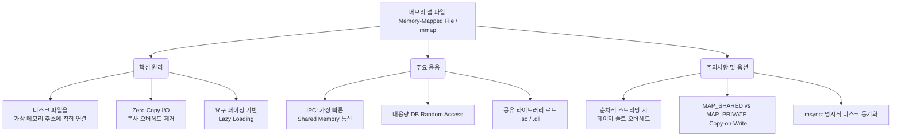

+++
title = "메모리 맵 파일 (Memory-Mapped File)"
weight = 308
+++

> **3-line Insight**
> - 메모리 맵 파일(Memory-Mapped File, mmap)은 운영체제의 가상 메모리 주소 공간을 디스크 상의 파일 일부 또는 전체와 직접 매핑(Mapping)하는 혁신적인 I/O 최적화 기법이다.
> - 전통적인 시스템 콜(read/write)을 우회하여 디스크의 데이터를 일반적인 배열이나 메모리 변수처럼 접근할 수 있게 함으로써, 커널 버퍼와 유저 공간 사이의 메모리 복사 오버헤드를 극적으로 제거한다.
> - 대용량 데이터베이스 처리, 고속 파일 검색, 그리고 프로세스 간 통신(IPC, Inter-Process Communication)에서 압도적인 성능 향상을 제공하는 현대 시스템 프로그래밍의 핵심 기술이다.

## Ⅰ. 메모리 맵 파일의 탄생 배경: 전통적 I/O의 한계

전통적인 방식(Standard I/O)에서 디스크에 있는 파일을 읽기 위해서는 프로세스가 `read()` 시스템 콜을 호출해야 한다. 이 과정은 심각한 성능 오버헤드를 유발한다. 디스크에서 데이터를 커널(Kernel) 내부의 파일 시스템 캐시(Page Cache)로 가져온 뒤, 이를 다시 사용자(User) 공간의 버퍼로 일일이 복사(Copy)하는 중복 작업이 발생하기 때문이다. 또한 빈번한 시스템 콜 호출에 따른 사용자 모드와 커널 모드 간의 컨텍스트 스위칭(Context Switching) 비용도 막대하다.
이러한 병목 현상을 해결하기 위해 등장한 것이 **메모리 맵 파일(Memory-Mapped File)**이다. 이는 디스크의 파일 블록들을 프로세스의 논리적 가상 메모리 공간(Virtual Memory Space)에 직접 '매핑(연결)'시켜버린다. 
결과적으로 프로세스는 마치 처음부터 파일이 메모리 위에 존재했던 것처럼 포인터(Pointer)를 사용해 바이트 단위로 직접 접근(Direct Access)할 수 있게 되며, 가상 메모리 서브시스템의 요구 페이징(Demand Paging) 메커니즘이 알아서 필요한 부분만 디스크에서 읽어오고 변경사항을 동기화한다.

> 📢 **섹션 요약 비유**
> 전통적인 I/O가 도서관 직원을 통해 책의 복사본을 내 책상으로 배달받아 읽는(느리고 중복되는) 방식이라면, 메모리 맵 파일은 내 책상 서랍을 열면 마법처럼 도서관 서가의 원본 책과 공간이 연결되어 바로 넘겨볼 수 있는 직통 차원문과 같습니다.

## Ⅱ. mmap의 아키텍처와 동작 메커니즘 (아키텍처)

Unix/Linux 환경에서는 `mmap()` 시스템 콜을 통해 이 메커니즘이 구현된다. 파일이 매핑되면 운영체제의 페이지 테이블(Page Table)이 파일 데이터를 가리키도록 업데이트된다.

```text
[User Process Virtual Address Space]
+----------------------+
|        Stack         |
+----------------------+
|        ...           |
+----------------------+  <--- Pointer returned by mmap()
| Memory Mapped Region |=======(1) Maps to=======+
| (Looks like RAM)     |                         |
+----------------------+                         |
|        Heap          |                         |
+----------------------+                         v
|        Data          |               [Kernel Page Cache]
+----------------------+                 +----------------+
|        Code          |                 | Cached Page 1  |===(2) Backed by===> [Disk File (foo.txt)]
+----------------------+                 +----------------+                     +----------------+
                                         | Cached Page 2  |                     |  Block 1       |
                                         +----------------+                     +----------------+
                                                 |                              |  Block 2       |
                                                 v                              +----------------+
                                     [Page Fault Mechanism]

* 동작 과정:
1. 프로세스가 mmap 영역의 주소 배열(예: ptr[0])을 읽으려 시도.
2. 아직 RAM에 안 올라왔다면 페이지 폴트(Page Fault) 발생.
3. OS가 파일에서 해당 블록(Block 1)을 Kernel Page Cache로 읽어옴. (Direct I/O)
4. User Process의 Page Table을 이 커널 캐시 프레임에 직접 연결함 (No Copy!).
5. 이후 접근 시 메모리 속도로 즉각적인 파일 조작 가능.
```

**수행 단계 요약:**
1. **매핑 요청:** `mmap()`을 호출하여 파일 디스크립터(fd)와 매핑할 크기를 OS에 전달한다. OS는 가상 주소 공간의 일부를 할당하고 포인터를 반환한다. (이때 디스크 접근은 아직 일어나지 않는다. Lazy Loading)
2. **페이지 폴트 유발:** 반환된 포인터를 통해 데이터를 읽거나 쓰려 하면 MMU가 페이지 폴트를 발생시킨다.
3. **요구 페이징 개입:** OS의 가상 메모리 관리자가 디스크 파일의 해당 부분을 읽어 물리 메모리(Page Cache)에 적재하고 페이지 테이블을 업데이트한다.
4. **Zero-Copy I/O:** 이후 프로세스는 커널 버퍼 공간의 복사 과정(Zero-Copy) 없이 메모리 명령(Load/Store)만으로 파일을 초고속으로 조작한다. 변경된 내용은 백그라운드 스레드(bdflush/pdflush)에 의해 디스크로 자동 동기화(Write-back)된다.

> 📢 **섹션 요약 비유**
> 서류를 보려면 팩스로 요청해서 종이로 복사본을 받는 대신(일반 I/O), 클라우드 공유 폴더(mmap) 링크를 열어 바로 문서를 수정하면 뒤에서 알아서 원본 파일에 저장되는 구글 독스(Google Docs)의 실시간 연동 방식과 똑같습니다.

## Ⅲ. 프로세스 간 통신 (IPC: Inter-Process Communication)과 공유 메모리

메모리 맵 파일의 가장 강력한 응용 중 하나는 여러 프로세스가 동일한 파일을 맵핑하여 데이터를 초고속으로 공유하는 **공유 메모리(Shared Memory)** 기법이다.

- **데이터 공유 아키텍처:** 프로세스 A와 프로세스 B가 동일한 파일(또는 익명 파일)을 `mmap`으로 열면, 두 프로세스의 서로 다른 가상 주소가 하나의 동일한 물리 프레임(Page Cache)을 가리키게 된다.
- **IPC 성능 극대화:** 프로세스 A가 매핑된 변수 값을 바꾸면, 커널의 개입이나 메시지 패싱(Message Passing), 파이프(Pipe) 전송 없이 프로세스 B가 즉시 바뀐 값을 읽을 수 있다. 현존하는 IPC 기법 중 데이터 복사가 전혀 발생하지 않는 가장 빠른 통신 방법이다.
- **공유 라이브러리 (Shared Library / DLL):** 현대 운영체제에서 `.so`나 `.dll` 같은 라이브러리 파일들도 이 방식으로 로드된다. 수백 개의 프로세스가 표준 C 라이브러리(libc)를 사용해도, 물리 메모리에는 딱 하나의 메모리 맵 파일 사본만 존재하여 메모리를 극적으로 절약한다.

> 📢 **섹션 요약 비유**
> 두 부서(프로세스)가 메신저나 우편(전통적 IPC)으로 자료를 주고받는 대신, 두 사무실 사이에 뚫린 커다란 유리창을 통해 하나의 화이트보드(공유 메모리)를 같이 보며 즉각적으로 글을 쓰고 지우며 소통하는 방식입니다.

## Ⅳ. 성능적 이점과 주의해야 할 치명적 단점

메모리 맵 파일은 만능이 아니다. 특정 워크로드(Workload)에서는 최고의 성능을 내지만, 파일 특성에 따라 오히려 치명적인 독이 될 수 있다.

- **장점 (압도적 효율성):** 파일 크기가 매우 크고, 임의 접근(Random Access)이 빈번하게 일어나는 데이터베이스 파일이나 검색 엔진 인덱스 등의 조작에서 시스템 콜 오버헤드를 획기적으로 줄여준다.
- **단점 1 (페이지 폴트 폭탄):** 대용량 파일을 순차적으로 한 번만 읽고 버리는 스트리밍(Sequential Scan) 작업의 경우, 일반 `read()` 시스템 콜의 미리 읽기(Read-ahead) 최적화가 더 빠를 수 있다. mmap은 접근할 때마다 무수한 페이지 폴트 인터럽트를 발생시켜 오히려 CPU를 혹사시킬 수 있다.
- **단점 2 (가상 메모리 단편화 및 제한):** 32비트 아키텍처에서는 가상 주소 공간 자체가 4GB로 제한되므로 4GB 이상의 큰 파일을 매핑할 수 없다. 64비트 환경에서도 수많은 작은 파일을 매핑하면 페이지 테이블의 심각한 단편화(Fragmentation)와 TLB 캐시 미스를 유발한다.

> 📢 **섹션 요약 비유**
> 백과사전의 여기저기를 뒤져볼 때(Random Access)는 직통 차원문(mmap)이 최고지만, 소설책을 처음부터 끝까지 쭉 읽을 때(Sequential)는 차원문을 조금씩 열 때마다 발생하는 번쩍임(페이지 폴트) 때문에 그냥 책을 한 권 다 빌려와서 읽는 게 낫습니다.

## Ⅴ. 메모리 보호, 동기화 및 mmap의 최적 사용 전략

메모리 맵 파일을 안전하고 효율적으로 사용하기 위해서는 운영체제가 제공하는 추가적인 동기화 및 보호 메커니즘을 이해해야 한다.

- **msync (Memory Sync):** 변경된 메모리 데이터를 OS의 비동기적 플러시에만 의존하지 않고, 데이터베이스 시스템처럼 안정성이 중요한 경우 명시적으로 즉각 디스크에 강제 저장(Force Flush)하도록 명령하는 시스템 콜이다.
- **접근 권한 보호 (Protection):** 매핑 시 읽기 전용(PROT_READ)이나 쓰기 가능(PROT_WRITE) 권한을 설정할 수 있다. 만약 권한에 어긋나는 접근을 시도하면 즉시 `SIGSEGV` (세그멘테이션 폴트) 시그널이 발생하여 프로세스가 종료된다.
- **MAP_PRIVATE vs MAP_SHARED:** 
  - `MAP_SHARED`: 변경 사항이 원본 디스크 파일과 다른 매핑된 프로세스에게 공유된다 (일반적 용도).
  - `MAP_PRIVATE`: Copy-on-Write(CoW) 방식으로 매핑된다. 쓰기를 시도하는 순간 프로세스만을 위한 독립적인 복사본이 메모리에 생성되어 원본 파일은 손상되지 않는다. 설정 파일 로딩 등에 주로 쓰인다.

> 📢 **섹션 요약 비유**
> 화이트보드를 같이 쓸 때, 다른 사람이 볼 수 있게 진짜로 매직으로 쓰는 것(MAP_SHARED)과, 내 눈에만 보이는 투명 필름을 덮고 그 위에 혼자 연습장처럼 쓰는 것(MAP_PRIVATE, Copy-on-Write)을 선택할 수 있는 보안 철저한 마법의 칠판입니다.

---

### 💡 Knowledge Graph 및 Child Analogy



**👧 Child Analogy:**
네가 아주 두꺼운 동화책(파일)을 보고 싶어. 원래는 도서관 아저씨한테 부탁해서 복사기로 책의 페이지를 한 장씩 복사해서(시스템 콜 read) 네 책상으로 가져와야 했지. 이건 너무 느리고 복사 용지도 아까워!
**메모리 맵 파일**은 마법사가 네 책상 위에 특별한 '투명 창문(mmap)'을 열어주는 거야. 이 창문을 들여다보면 책상에서 도서관에 있는 진짜 동화책이 바로 보여! 네가 창문 너머로 책에 색칠을 하면 도서관에 있는 진짜 책에도 색이 칠해지는 거지. 복사할 필요도 없고, 동생이랑 같이 같은 창문을 보면서 그림을 그릴 수도 있는(공유 메모리) 정말 빠르고 멋진 마법이란다.
