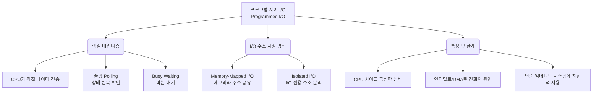

+++
title = "프로그램 제어 I/O (Programmed I/O)"
weight = 312
+++

> **3-line Insight**
> - 프로그램 제어 I/O(Programmed I/O, PIO)는 CPU가 직접 개입하여 모든 입출력(I/O) 연산을 제어하고 데이터 전송을 관장하는 가장 기본적이고 초창기의 컴퓨터 I/O 방식이다.
> - CPU가 I/O 장치의 상태 레지스터(Status Register)를 반복적으로 읽어(Polling) 준비 상태를 확인하기 때문에 대량의 CPU 사이클이 낭비되는 심각한 오버헤드를 유발한다.
> - 현대 고성능 시스템에서는 인터럽트(Interrupt)나 DMA(Direct Memory Access) 방식으로 대체되었으나, 하드웨어가 극도로 단순하거나 아주 적은 양의 데이터를 다루는 임베디드 시스템 등에서는 여전히 쓰인다.

## Ⅰ. 프로그램 제어 I/O의 정의와 근본적 작동 원리

프로그램 제어 I/O(Programmed I/O, PIO)는 데이터가 CPU(Central Processing Unit)와 주변장치(I/O Device) 간에 이동할 때, 하드웨어적인 신호(인터럽트)나 전담 컨트롤러(DMA)의 도움 없이 **오직 CPU가 실행하는 소프트웨어 명령어(Program Code)에 의해 데이터의 흐름과 타이밍이 완전히 통제되는 방식**이다.
주변 장치의 속도는 CPU의 연산 속도에 비해 수천에서 수백만 배 느리다. PIO 방식에서 CPU는 I/O 명령을 내린 후, 장치가 데이터를 보낼(또는 받을) 준비가 될 때까지 다른 작업을 하지 못하고 오로지 장치의 상태(Status)를 계속해서 확인하는 무한 루프 상태에 빠지게 된다. 이를 폴링(Polling) 또는 바쁜 대기(Busy Waiting)라고 부른다. 
결과적으로, CPU가 데이터 버스(Data Bus)를 통해 1바이트씩 직접 메모리로 실어 나르는 "단순 배달부" 역할까지 전담하게 되므로, 시스템 전체의 처리량(Throughput)이 심각하게 저하되는 구조적 한계를 지닌다.

> 📢 **섹션 요약 비유**
> 사장님(CPU)이 공장(I/O 장치)에 물건을 주문해 놓고, 비서나 전화(인터럽트)를 쓰지 않은 채 공장 문 앞에 직접 서서 "물건 다 됐나요? 다 됐나요?"를 1초마다 물어보는 답답하고 비효율적인 업무 방식과 같습니다.

## Ⅱ. PIO의 동작 아키텍처 및 폴링 루프 (아키텍처)

프로그램 제어 I/O의 동작 과정은 철저히 CPU의 통제하에 이루어진다. 이 과정은 I/O 모듈의 제어 레지스터(Control), 상태 레지스터(Status), 데이터 레지스터(Data)를 조작하는 방식으로 진행된다.

```text
[CPU Execution Flow in Programmed I/O (Read Operation)]

     (CPU)                        (I/O Module / Device Controller)
       |                                   |
       |--- 1. Send I/O Read Command ----->| [Control Register]
       |                                   |  (Device starts reading data mechanically)
       v                                   |
+-> 2. Read Status Register <--------------| [Status Register] (Busy / Ready bit)
|      |                                   |
|      v                                   |
+-< 3. Is Data Ready? (Busy Waiting)       |  <--- (This is the POLLING LOOP)
       | (No)                              |
       |                                   |
       | (Yes)                             |
       v                                   |
    4. Read Data Register <----------------| [Data Register]
       |                                   |
       v                                   |
    5. Write Data to Memory                |
       |                                   |
       v                                   |
    6. End of File/Block? ---------------->+ (Loop back to 1 if more data)
```

**수행 단계 요약:**
1. **명령 하달:** CPU가 I/O 모듈의 제어 레지스터에 특정 명령(예: 읽기)을 기록한다.
2. **폴링 (Polling) 루프 시작:** CPU는 I/O 모듈의 상태 레지스터 값을 지속적으로 읽어들인다.
3. **바쁜 대기 (Busy Waiting):** 데이터가 준비되지 않았다면, CPU는 계속해서 상태 레지스터만 확인하며 루프를 맴돈다. (CPU 자원 100% 낭비)
4. **데이터 수신:** 상태 레지스터가 '준비 완료(Ready)'를 나타내면, CPU는 모듈의 데이터 레지스터에서 데이터를 꺼내 CPU 내부 레지스터로 가져온다.
5. **메모리 기록:** CPU는 레지스터에 담긴 데이터를 주 메모리(Main Memory)의 특정 주소로 저장(Store)한다. 데이터를 한 덩어리 전송할 때마다 이 전체 과정이 반복된다.

> 📢 **섹션 요약 비유**
> 택배기사가 물건을 내릴 때마다 사장님이 직접 1번 창고 창문(상태 레지스터)을 들여다보고, "다 내렸군!" 확인한 다음 물건(데이터)을 직접 들고 2번 창고(메모리)로 걸어가서 내려놓는 과정을 수천 번 반복하는 구조입니다.

## Ⅲ. I/O 명령어의 두 가지 구현 방식: Memory-Mapped vs Isolated I/O

CPU가 I/O 장치의 레지스터(포트)에 접근하기 위해 주소를 할당하는 방식에는 두 가지 컴퓨터 아키텍처 설계가 존재한다.

- **메모리 맵 I/O (Memory-Mapped I/O):**
  - 메모리(RAM) 주소 공간의 일부를 I/O 장치에 할당한다. 
  - I/O 포트는 메모리 주소처럼 취급되며, 일반적인 메모리 접근 명령어(예: `MOV`, `LOAD`, `STORE`)를 동일하게 사용하여 I/O 작업을 수행한다.
  - ARM, MIPS 등 대부분의 RISC 아키텍처가 이 방식을 사용한다. 프로그래밍이 일관성 있고 편리하지만, RAM이 사용할 수 있는 주소 공간이 그만큼 줄어든다는 단점이 있다.
- **고립형 I/O (Isolated I/O / Port-Mapped I/O):**
  - 메모리 주소 공간과 완전히 독립된 별도의 I/O 포트 주소 공간을 갖는다.
  - 이를 위해 CPU는 일반 메모리 접근 명령어가 아닌, I/O 전용 특수 명령어(예: x86의 `IN`, `OUT`)를 사용해야 하고, 하드웨어 핀 설계도 분리되어야 한다.
  - 인텔(Intel) x86 아키텍처가 대표적이며, 메모리 공간을 전혀 낭비하지 않는 장점이 있다.

> 📢 **섹션 요약 비유**
> Memory-Mapped I/O가 아파트 단지 내에 상가 주소를 아파트 동 번호와 똑같이 부여하는 방식(동일한 주소 체계)이라면, Isolated I/O는 주거용(메모리)과 상업용(I/O) 주소를 아예 다른 시/구 번호로 완전히 분리해 놓고 우체부도 별도로 두는 방식입니다.

## Ⅳ. PIO의 한계와 인터럽트(Interrupt) 구동 I/O로의 진화

프로그램 제어 I/O는 하드웨어 구현이 극도로 단순하여 부품 단가가 싸고, 오류 추적이 매우 직관적이라는 장점이 있다. 하지만 시스템 성능 면에서는 치명적인 단점들을 내포한다.

- **CPU 자원의 극심한 낭비 (CPU Wasting):** 폴링(Busy Waiting) 루프를 도는 동안 CPU는 다른 어떤 유용한 연산이나 다른 프로세스를 처리할 수 없다. I/O 속도가 느릴수록 이 낭비는 기하급수적으로 커진다.
- **다중 프로그래밍 불가능 (Poor Multiprogramming):** 여러 작업을 동시에 진행해야 하는 현대 운영체제에서, 한 프로세스가 I/O를 위해 CPU를 독점하고 대기하는 PIO 방식은 시스템 전체의 응답성(Responsiveness)을 마비시킨다.
- **해결책의 등장:** 이러한 한계를 돌파하기 위해 **인터럽트 기반 I/O (Interrupt-Driven I/O)**가 등장했다. CPU는 I/O 명령을 내린 후 곧바로 다른 작업을 하러 떠나고, I/O 장치가 작업이 끝나면 CPU에게 전기적 신호(Interrupt)를 보내 알려주는 "콜백(Callback)" 메커니즘으로 진화하였다.

> 📢 **섹션 요약 비유**
> 요리가 다 될 때까지 주방에서 멍하니 서 있는 것(PIO)을 포기하고, 주문을 넣은 뒤 자리로 돌아가 다른 일을 하다가 진동벨(인터럽트)이 울리면 그때 음식을 가지러 가는 똑똑한 시스템으로 발전하게 되었습니다.

## Ⅴ. 현대 시스템에서의 PIO 위상과 활용

인터럽트와 DMA(Direct Memory Access, 메모리 직접 접근)의 보편화로 인해 고성능 PC나 서버 환경에서 PIO는 디스크나 네트워크 전송 같은 대규모 I/O에는 절대 사용되지 않는다. 하지만 여전히 사라지지 않고 특수한 목적에서 명맥을 유지하고 있다.

- **극도의 단순성이 필요한 임베디드(Embedded) 시스템:** 8비트 마이크로컨트롤러(MCU)나 아두이노(Arduino) 같이 하드웨어 자원이 극히 제한적인 초소형 환경에서는 LED 점멸, 스위치 입력 확인 등의 매우 단순한 작업에 PIO가 적합하다.
- **초고속 저지연 (Ultra-Low Latency) 요구 환경:** 매우 특이하게도, 초당 수천만 번의 트랜잭션을 처리하는 고빈도 거래(HFT) 네트워크 카드에서는 오히려 인터럽트 컨텍스트 스위칭(Context Switching) 시간조차 아까워 의도적으로 고성능 CPU 코어 하나를 100% PIO(폴링) 모드로 고정시켜버리는 최적화(User-space Polling Mode Driver) 기법이 최신 아키텍처에서 부활하여 사용되기도 한다.

> 📢 **섹션 요약 비유**
> 커다란 트럭으로 수백 개의 택배를 옮길 때는 지게차(DMA)를 부르지만, 내 책상 옆에 있는 작은 휴지통에 종이 쪼가리 하나를 버릴 때는 굳이 누구를 부르지 않고 내 손(PIO)으로 직접 버리는 것이 가장 빠르고 직관적인 것과 같은 이치입니다.

---

### 💡 Knowledge Graph 및 Child Analogy



**👧 Child Analogy:**
네가 심부름으로 전자레인지에 우유를 데우려고 해. 
**프로그램 제어 I/O (PIO)** 방식은 전자레인지 버튼을 누른 다음에, 전자레인지 앞을 절대 떠나지 않고 안을 계속 뚫어지게 쳐다보면서 "다 됐나? 다 됐나?" 하고 내내 기다리는 거야. 이 시간 동안 너는 책도 못 읽고 장난감도 못 가지고 놀아(CPU 낭비).
하지만 나중에 똑똑해지면, 버튼을 누르고 방에 돌아가서 책을 읽다가 전자레인지가 "띠띠띠~!" 하고 소리(인터럽트)를 내면 그때 우유를 가지러 가게 될 텐데, PIO는 아주 옛날, 알람 소리가 없던 시절의 답답한 기다림 방식이란다.
