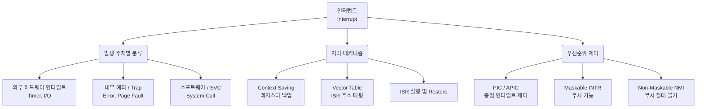

+++
title = "인터럽트 (Interrupt)"
weight = 315
+++

> **3-line Insight**
> - 인터럽트(Interrupt)는 CPU가 현재 실행 중인 프로세스를 잠시 중단하고 시스템에 발생한 비동기적(Asynchronous) 이벤트나 예외 상황을 즉각적으로 처리하도록 강제하는 하드웨어 및 소프트웨어 메커니즘이다.
> - 폴링(Polling) 방식의 치명적인 비효율성을 극복하여 다중 프로그래밍(Multiprogramming)과 효율적인 입출력(I/O) 제어를 가능하게 만든 현대 운영체제 아키텍처의 근간이다.
> - 하드웨어 장치가 보내는 외부 인터럽트, 프로그램 오류 시 발생하는 내부 인터럽트(Trap/Exception), 운영체제 서비스를 호출하는 소프트웨어 인터럽트(SVC) 등으로 세분화된다.

## Ⅰ. 인터럽트의 개념과 탄생 배경

인터럽트(Interrupt)는 컴퓨터 아키텍처에서 중앙 처리 장치(CPU)의 정상적인 명령어 실행 흐름(Execution Flow)을 가로채고, 긴급하게 처리해야 할 다른 작업의 주소로 실행 지점을 일시적으로 옮기는 하드웨어 신호(Signal) 또는 소프트웨어 명령어이다. 
초기의 프로그램 제어 I/O(Programmed I/O) 방식에서는 CPU가 I/O 장치의 상태를 계속해서 확인(Polling)해야 했으므로 엄청난 사이클 낭비가 발생했다. 이러한 문제를 해결하기 위해 고안된 것이 인터럽트 기반 시스템(Interrupt-driven System)이다. CPU는 I/O 작업을 명령한 후 자신의 본래 연산을 수행하고, I/O 장치가 작업을 완료하면 CPU에 "작업 끝났습니다"라는 전기적 신호(Interrupt Request, IRQ)를 보내어 CPU가 개입하도록 한다.
인터럽트는 단순히 입출력을 넘어, 타이머(Timer)를 통한 프로세스 선점(Preemption), 0으로 나누기 같은 치명적 연산 오류(Fault) 처리, 시스템 콜(System Call) 구현 등 현대 운영체제(OS)가 하드웨어를 제어하고 다중 작업을 조율하는 핵심 '심장 박동(Heartbeat)'과도 같다.

> 📢 **섹션 요약 비유**
> 식당 요리사(CPU)가 오븐 앞을 계속 지켜보는 대신(폴링), 타이머나 오븐의 알람 소리(인터럽트)가 울리면 하던 칼질을 잠깐 멈추고 요리를 꺼낸 뒤 다시 원래 하던 칼질로 돌아오는 매우 효율적인 주방 관리 시스템입니다.

## Ⅱ. 인터럽트 처리 메커니즘의 아키텍처 (아키텍처)

인터럽트가 발생하면 하드웨어와 운영체제가 협력하여 현재 상태를 보존(Context Saving)하고, 인터럽트 핸들러(Interrupt Handler / ISR)를 실행한 뒤 다시 원래 상태로 복귀(Restore)하는 정교한 루틴을 수행한다.

```text
[CPU Execution Timeline]

User Process Executing  --> Instruction i
                             |
                   [Hardware Interrupt Signal occurs via IRQ Line]
                             v
Context Saving          -->  CPU Completes Instruction i.
                             Saves Processor State (PC, Registers) to Control Stack (or TCB).
                             v
Interrupt Vector        -->  Reads Interrupt Vector Table using IRQ number
                             to find address of the ISR.
                             v
Interrupt Service       -->  Jump to Interrupt Service Routine (ISR) in OS Kernel.
Routine (ISR)                Execute OS code to handle the device/error.
                             v
Context Restoring       -->  Load saved Processor State from Stack.
                             v
User Process Resumes    -->  Return from Interrupt (IRET instruction).
                             Resume at Instruction i + 1.
```

**수행 단계 요약:**
1. **발생 및 인지:** CPU의 명령어 사이클 마지막(Fetch-Decode-Execute 다음의 Interrupt Check 단계)에 인터럽트 라인이 활성화되었는지 확인한다.
2. **컨텍스트 저장 (Context Save):** 현재 프로세스의 프로그램 카운터(PC)와 주요 레지스터 값을 메모리 스택(Stack)이나 프로세스 제어 블록(PCB)에 백업한다.
3. **벡터 테이블 참조 (Vectoring):** 인터럽트 컨트롤러(PIC)가 전달한 인터럽트 번호를 기반으로, 메모리 상의 인터럽트 벡터 테이블(Interrupt Vector Table, IVT)을 조회하여 해당 인터럽트를 처리할 코드의 시작 주소를 찾는다.
4. **ISR 실행 (Interrupt Service Routine):** 커널 모드(Kernel Mode)로 전환되어 인터럽트 핸들러(ISR) 코드를 실행해 실질적인 요구사항(데이터 수신 등)을 처리한다.
5. **상태 복원 및 복귀 (Context Restore & IRET):** 처리가 끝나면 백업해 둔 레지스터 값을 복원하고, 중단되었던 명령어의 다음 주소로 되돌아가 프로세스 실행을 재개한다.

> 📢 **섹션 요약 비유**
> 책을 읽다가 전화가 오면, 지금 읽던 페이지에 책갈피를 꽂아두고(상태 저장), 전화번호부를 찾아 누군지 확인한 뒤(벡터 테이블 참조), 전화를 받고(ISR 실행), 전화가 끝나면 다시 책갈피를 편 곳부터 책을 이어서 읽는(복원 및 복귀) 자연스러운 과정입니다.

## Ⅲ. 인터럽트의 분류 (Classification of Interrupts)

인터럽트는 그 발생 원인과 주체에 따라 크게 외부, 내부, 소프트웨어 인터럽트 3가지로 명확히 분류된다.

- **외부 인터럽트 (External Interrupt / Hardware Interrupt):** 
  - CPU 외부의 하드웨어 장치에서 전기적 신호로 발생한다. 타이머(Timer) 만료, I/O 장치(키보드 입력, 디스크 완료 등) 신호, 전원 공급 이상(Power Fail) 등이 이에 속한다. 비동기적(Asynchronous)으로 발생한다.
- **내부 인터럽트 (Internal Interrupt / Trap / Exception):**
  - CPU가 명령어(Instruction)를 실행하는 도중에 내부 연산 장치에서 발생한 예외 상황이다. 0으로 나누기(Divide by Zero), 페이지 부재(Page Fault), 잘못된 메모리 주소 참조(Segmentation Fault) 등이 포함되며, 명령어 실행 결과로 생기는 동기적(Synchronous) 이벤트이다.
- **소프트웨어 인터럽트 (Software Interrupt / System Call / SVC):**
  - 사용자 프로그램이 운영체제의 커널 서비스(파일 쓰기, 프로세스 생성 등)를 요청하기 위해 의도적으로 프로그래밍 코드 안에 삽입한 특수 명령어(예: x86의 `INT 0x80` 또는 `SYSCALL`)를 실행할 때 발생한다. 

> 📢 **섹션 요약 비유**
> 밖에서 택배 기사님이 벨을 누르는 건 '외부 인터럽트', 내가 요리하다 손을 베여서 아플 때 멈추는 건 '내부 인터럽트', 내가 직접 콜센터에 전화를 걸어 도움을 요청하는 건 '소프트웨어 인터럽트'에 해당합니다.

## Ⅳ. 인터럽트 우선순위 (Priority)와 마스킹 (Masking)

시스템에서는 여러 개의 인터럽트가 동시에 발생하거나, 하나의 인터럽트를 처리하는 중에 다른 인터럽트 신호가 들어오는 상황(중첩 인터럽트, Nested Interrupts)이 빈번하게 발생한다. 이를 제어하기 위해 하드웨어적인 우선순위 체계가 필요하다.

- **우선순위 부여:** 전원 이상(가장 높음) > 타이머 인터럽트 > 디스크 I/O > 프린터 I/O(가장 낮음)와 같이 시스템의 치명도와 속도 요구사항에 따라 하드웨어 인터럽트 컨트롤러(PIC, APIC)가 우선순위를 결정한다. 동시에 발생하면 우선순위가 높은 것부터 CPU에 전달된다.
- **마스커블 vs 논-마스커블 (Maskable vs Non-Maskable):**
  - **Maskable Interrupt (INTR):** CPU가 플래그 레지스터(Interrupt Enable 플래그 등)를 설정하여 '무시(Mask)'하거나 지연시킬 수 있는 일반적인 인터럽트다. 중요한 작업을 하는 도중 방해받고 싶지 않을 때 끈다.
  - **Non-Maskable Interrupt (NMI):** CPU가 어떤 상황에서도 절대 무시할 수 없는 초고도 우선순위의 인터럽트다. 시스템 전원 장애(Power Failure)나 심각한 하드웨어 에러 시 발생하며, 시스템 붕괴를 막기 위한 긴급 조치 코드만을 실행한다.

> 📢 **섹션 요약 비유**
> 회의 중에 친구에게서 오는 카톡 알림은 무음으로 꺼둘 수 있지만(마스커블 인터럽트), 건물에 불이 났다는 화재경보기 소리는 절대 끄거나 무시할 수 없고 무조건 튀어나가야 하는(논-마스커블 인터럽트) 것과 같습니다.

## Ⅴ. 인터럽트의 한계 보완: DMA (Direct Memory Access)

인터럽트 방식이 폴링(Polling)보다 월등히 우수하지만, 대량의 데이터(예: 기가바이트 단위의 디스크 파일)를 메모리로 전송할 때 1바이트마다 인터럽트가 발생한다면, CPU는 계속 하던 일을 멈추고 짐을 옮기느라 또 다른 병목(Interrupt Storm)에 시달리게 된다.

- **DMA의 등장:** 이를 해결하기 위해 메모리와 I/O 장치 간의 데이터 전송만을 전담하는 별도의 특수 하드웨어 컨트롤러인 **DMA(Direct Memory Access)**가 등장했다.
- **인터럽트와의 협업:** CPU는 DMA 컨트롤러에게 "디스크의 A 주소부터 데이터 100MB를 메모리 B 주소로 옮겨놔라"라고 명령만 내리고 작업을 완전히 위임한다. DMA 컨트롤러가 CPU의 개입 없이 버스(Bus)를 장악하여 메모리로 데이터를 다 옮기고 나면, 전송이 모두 "완료된 시점에 딱 한 번" CPU에게 인터럽트(완료 보고)를 발생시킨다. 
이를 통해 CPU는 단순 데이터 복사 작업에서 완전히 해방되어 인터럽트의 횟수를 극적으로 줄이면서도 시스템 성능을 극대화할 수 있다.

> 📢 **섹션 요약 비유**
> 사장님(CPU)이 택배 박스가 하나씩 올 때마다 인터럽트를 받아 직접 창고로 나르는 대신, 지게차 전문 기사(DMA 컨트롤러)를 고용하여 수백 개의 상자를 다 옮기도록 시킨 뒤, 기사가 "작업 다 끝났습니다!" 하고 한 번만 보고(종료 인터럽트)하게 만들어 사장님은 편하게 다른 결재 업무를 보는 완벽한 분업 시스템입니다.

---

### 💡 Knowledge Graph 및 Child Analogy



**👧 Child Analogy:**
네가 방에서 아주 집중해서 레고 조립(CPU의 명령어 실행)을 하고 있어.
- 갑자기 엄마가 "밥 먹어라~" 하고 부르셔. 이건 밖에서 신호가 온 거니까 **외부 인터럽트**야. 
- 조립하다가 실수로 레고 설명서가 찢어져서 어쩔 줄 모르고 멈췄어. 이건 네 안에서 문제가 생긴 거니까 **내부 인터럽트(예외)**야.
- 부품이 모자라서 네가 직접 엄마한테 "엄마, 새 블록 좀 찾아주세요!" 하고 소리쳤어. 이건 네가 스스로 도움을 요청한 **소프트웨어 인터럽트**야!
어떤 경우든 네가 레고 조립을 잠깐 멈추고 상황을 해결한 다음, 아까 조립하던 위치를 정확히 기억(Context Saving)했다가 그 부분부터 다시 조립을 이어나가는 과정이 바로 컴퓨터의 '인터럽트' 메커니즘이란다.
