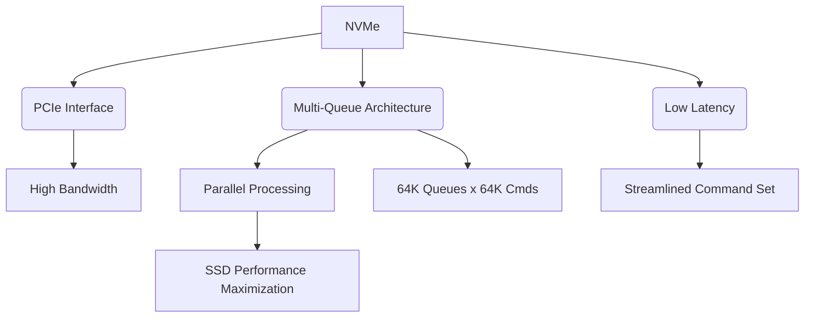

+++
title = "NVMe (Non-Volatile Memory Express)"
weight = 342
+++

> **Insight**
> - NVMe(Non-Volatile Memory Express)는 PCIe(Peripheral Component Interconnect Express) 버스를 통해 SSD(Solid State Drive)와 통신하기 위해 설계된 최적화된 논리적 디바이스 인터페이스 규격입니다.
> - 기존 AHCI(Advanced Host Controller Interface)의 한계를 극복하고, 병렬 처리와 다중 큐(Multiple Queues)를 활용하여 초고속 데이터 전송 및 지연 시간 최소화를 달성합니다.
> - 엔터프라이즈 서버, 데이터센터, 그리고 고성능 컴퓨팅(HPC) 환경에서 스토리지 병목 현상을 해소하는 핵심 기술로 자리잡고 있습니다.

## Ⅰ. NVMe의 개요 및 등장 배경

### 1. NVMe(Non-Volatile Memory Express)의 정의
NVMe는 플래시 메모리 기반의 SSD를 위해 특별히 설계된 고성능, 확장 가능한 호스트 컨트롤러 인터페이스 및 스토리지 프로토콜입니다. CPU(Central Processing Unit)와 스토리지 장치 간의 통신을 PCIe 인터페이스를 통해 직접 연결함으로써, 기존 SATA(Serial ATA)나 SAS(Serial Attached SCSI) 인터페이스가 가졌던 대역폭 및 지연 시간의 한계를 혁신적으로 극복합니다.

### 2. 등장 배경
과거의 스토리지 프로토콜인 AHCI는 회전하는 자기 디스크(HDD)를 위해 설계되었습니다. AHCI는 단일 큐(Queue)와 큐당 32개의 명령어(Command)만을 지원하여, 병렬 처리 능력이 뛰어난 낸드 플래시(NAND Flash) 기반 SSD의 성능을 온전히 활용할 수 없었습니다. 이에 따라 SSD의 잠재력을 극대화하고 CPU와의 통신 오버헤드를 줄이기 위해 밑바닥부터 새롭게 설계된 NVMe 프로토콜이 등장하게 되었습니다.

> 📢 **섹션 요약 비유:**
> 기존 AHCI가 왕복 1차선 도로(단일 큐)에 차를 32대만 세울 수 있는 톨게이트였다면, NVMe는 왕복 64,000차선 도로에 각 차선마다 64,000대의 차를 대기시킬 수 있는 초대형 하이패스 톨게이트입니다.

## Ⅱ. NVMe의 아키텍처 및 핵심 기술

### 1. NVMe 큐잉 모델 (Queuing Model)
NVMe의 가장 큰 특징은 멀티 코어(Multi-Core) CPU 아키텍처에 최적화된 다중 큐 지원입니다. 호스트(Host)와 컨트롤러(Controller) 간의 효율적인 통신을 위해 Submission Queue(SQ)와 Completion Queue(CQ) 쌍을 사용합니다.

```ascii
[ CPU Core 0 ]     [ CPU Core 1 ] ... [ CPU Core N ]
      |                  |                  |
[ SQ0 | CQ0 ]      [ SQ1 | CQ1 ]      [ SQN | CQN ]  <-- Host Memory (NVMe Queues)
      |                  |                  |
===================================================== PCIe Bus
      |                  |                  |
      +------------------+------------------+
               [ NVMe Controller ]
               [ Flash Translation Layer ]
               [ NAND Flash Chips ]
```

### 2. 핵심 기술 요소
* **다중 큐 (Multiple Queues):** 최대 64K(65,536)개의 큐를 지원하며, 각 큐는 64K개의 명령어를 포함할 수 있습니다. 이는 I/O 병렬성을 극대화합니다.
* **MSI-X 인터럽트 지원:** 락(Lock) 경합 없이 각 CPU 코어가 자신의 인터럽트를 독립적으로 처리할 수 있게 하여 오버헤드를 최소화합니다.
* **명령어 집합 간소화 (Streamlined Command Set):** 스토리지 작업에 필수적인 최소한의 명령어 세트(약 13개)만 정의하여 명령어 디코딩 및 실행 속도를 높였습니다.
* **PRP(Physical Region Page) 및 SGL(Scatter Gather List):** 데이터를 메모리 버퍼와 효율적으로 매핑하여 DMA(Direct Memory Access) 전송 효율을 극대화합니다.

> 📢 **섹션 요약 비유:**
> 각 CPU 코어마다 전담 비서(전용 큐)를 배치하여, 사장님(CPU)들이 결재판(명령어)을 넘길 때 다른 사장님을 기다릴 필요 없이 즉각적으로 처리하는 스마트 오피스 시스템과 같습니다.

## Ⅲ. NVMe vs AHCI 비교 분석

NVMe는 AHCI 대비 압도적인 성능 지표를 보여줍니다.

| 비교 항목 | AHCI (Advanced Host Controller Interface) | NVMe (Non-Volatile Memory Express) |
| :--- | :--- | :--- |
| **설계 목적** | HDD (회전형 매체) 최적화 | SSD (플래시 메모리) 최적화 |
| **지원 인터페이스** | SATA | PCIe |
| **큐(Queue) 개수** | 1개 | 최대 64,000개 |
| **큐당 명령어 수** | 32개 | 최대 64,000개 |
| **인터럽트 (Interrupt)** | 단일 인터럽트, 오버헤드 높음 | MSI-X (멀티 코어 인터럽트), 오버헤드 낮음 |
| **지연 시간 (Latency)** | 수십 마이크로초 (High) | 수 마이크로초 (Low, PCIe 직접 연결) |

> 📢 **섹션 요약 비유:**
> AHCI는 빠른 스포츠카(SSD)를 비포장 도로(SATA)에서 구형 엔진 제어기(단일 큐)로 달리는 것이라면, NVMe는 스포츠카를 F1 전용 트랙(PCIe)에서 최신 전자 제어 시스템(다중 큐)으로 달리는 것과 같습니다.

## Ⅳ. NVMe의 엔터프라이즈 응용 및 발전: NVMe 폼팩터

NVMe는 다양한 물리적 폼팩터(Form Factor)를 통해 개인용 PC부터 엔터프라이즈 스토리지까지 폭넓게 적용되고 있습니다.

1. **M.2 (NGFF):** 주로 노트북이나 데스크톱 PC 메인보드에 직접 장착되는 소형 폼팩터입니다. 공간 효율성이 뛰어납니다.
2. **U.2 (SFF-8639):** 엔터프라이즈 서버 환경에서 기존 2.5인치 드라이브 베이를 활용하면서 PCIe 4-lane의 대역폭을 모두 사용할 수 있도록 설계된 핫스왑(Hot-Swap) 지원 폼팩터입니다.
3. **E1.S / E3.S (EDSFF):** 최신 데이터센터를 위해 설계된 Enterprise and Datacenter Standard Form Factor로, 방열 성능과 스토리지 밀도를 극대화한 구조입니다.
4. **AIC (Add-In Card):** 그래픽 카드처럼 PCIe 슬롯에 직접 꽂는 형태로, 최대 성능과 용량이 필요할 때 사용됩니다.

> 📢 **섹션 요약 비유:**
> NVMe 기술이라는 강력한 엔진을 용도에 맞게 경차(M.2), 트럭(U.2), 버스(EDSFF) 등 다양한 차체(폼팩터)에 탑재하여 운용하는 것과 같습니다.

## Ⅴ. NVMe의 진화와 미래 동향

### 1. NVMe over Fabrics (NVMe-oF)
NVMe의 빠른 속도를 로컬 PCIe 버스를 넘어 이더넷(Ethernet), 파이버 채널(Fibre Channel), 인피니밴드(InfiniBand) 등 네트워크 패브릭으로 확장한 기술입니다. 이를 통해 분산된 스토리지 자원을 마치 로컬 디스크처럼 초저지연으로 사용할 수 있게 합니다.

### 2. ZNS (Zoned Namespaces)
SSD의 물리적 특성(블록 지우기, 가비지 컬렉션 등)을 호스트 OS가 직접 제어할 수 있게 하여 쓰기 증폭(Write Amplification)을 줄이고 수명과 성능의 일관성을 획기적으로 향상시키는 최신 기술입니다.

### 3. 컴퓨테이셔널 스토리지 (Computational Storage)
스토리지 장치 내부에 연산 능력을 부여하여, 데이터가 저장된 위치에서 직접 데이터 필터링이나 압축 등을 수행함으로써 CPU 부하와 데이터 이동을 줄이는 방향으로 발전하고 있습니다.

> 📢 **섹션 요약 비유:**
> NVMe가 내 컴퓨터 안의 초고속 저장소라면, 이제는 네트워크를 통해 지구 반대편의 저장소도 내 컴퓨터처럼 빠르게 쓰게(NVMe-oF) 진화하고 있습니다.

---

### 💡 Knowledge Graph & Child Analogy



> **👶 Child Analogy (어린이 비유):**
> 예전 창고(AHCI)는 문이 하나라서 물건을 넣고 뺄 때 사람들이 줄을 길게 서야 했어요. 하지만 새로운 마법의 창고(NVMe)는 문이 6만 개나 있고, 각 문마다 일꾼이 대기하고 있어서 아무리 많은 물건(데이터)이 와도 눈 깜짝할 사이에 척척 정리해 준답니다!
