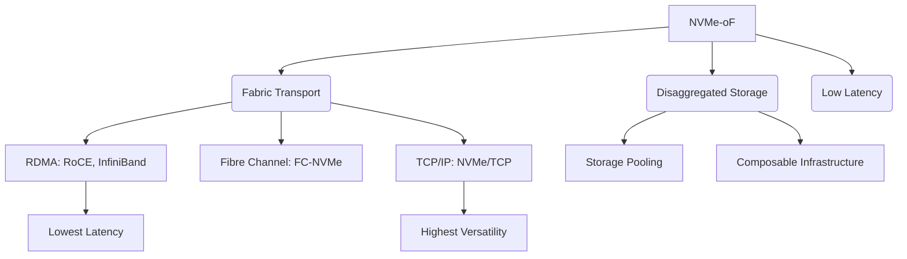

+++
title = "NVMe-oF (NVMe over Fabrics)"
weight = 343
+++

> **Insight**
> - NVMe-oF(NVMe over Fabrics)는 로컬 PCIe 버스에 국한되었던 NVMe 프로토콜을 이더넷(Ethernet), 파이버 채널(Fibre Channel), 인피니밴드(InfiniBand) 등의 네트워크 패브릭(Network Fabric)으로 확장한 기술입니다.
> - 서버와 스토리지 간의 네트워크 통신 오버헤드를 극적으로 줄여, 원격 스토리지를 마치 로컬 NVMe SSD처럼 초저지연(Ultra-low Latency)과 고대역폭으로 사용할 수 있게 합니다.
> - 데이터센터의 스토리지 자원을 중앙 집중화하고 유연하게 풀링(Pooling)하는 컴포저블 인프라(Composable Infrastructure) 구현의 핵심 기반 기술입니다.

## Ⅰ. NVMe-oF의 개요 및 등장 배경

### 1. NVMe-oF(NVMe over Fabrics)의 정의
NVMe-oF는 NVMe(Non-Volatile Memory Express) 프로토콜의 캡슐화(Encapsulation) 표준으로, NVMe 명령어와 데이터를 네트워크 패브릭을 통해 전송할 수 있도록 정의한 규격입니다. 이를 통해 호스트(Host) 시스템은 네트워크를 통해 연결된 원격 스토리지 타겟(Target) 내의 NVMe 네임스페이스에 투명하게 접근할 수 있습니다.

### 2. 등장 배경
기존의 iSCSI(Internet Small Computer Systems Interface)나 FCP(Fibre Channel Protocol)와 같은 네트워크 스토리지 프로토콜은 SCSI 명령어 셋을 기반으로 하여 프로토콜 변환 오버헤드와 지연 시간이 발생했습니다. 로컬 스토리지가 HDD에서 초고속 NVMe SSD로 전환됨에 따라, 네트워크 프로토콜 자체가 스토리지 병목(Bottleneck)의 원인이 되었습니다. 이를 해결하기 위해 NVMe의 효율적인 명령어 구조와 다중 큐 아키텍처를 네트워크 상에서 그대로 유지하려는 목적으로 NVMe-oF가 탄생했습니다.

> 📢 **섹션 요약 비유:**
> 서울(CPU)에서 부산(스토리지)까지 택배를 보낼 때, 중간에 여러 물류센터(iSCSI 등 프로토콜 변환)를 거치며 지연되던 것을, 서울에서 부산까지 직통으로 뚫린 KTX 전용선(NVMe-oF)을 놓아 로컬 배송처럼 빠르게 만든 것입니다.

## Ⅱ. NVMe-oF의 아키텍처 및 전송 기술

### 1. NVMe-oF 아키텍처 개념
NVMe-oF는 호스트의 NVMe Submission Queue(SQ)에서 생성된 명령을 네트워크 패브릭 캡슐에 담아 타겟으로 전송하고, 타겟의 NVMe 컨트롤러가 이를 실행한 후 결과를 다시 네트워크를 통해 호스트의 Completion Queue(CQ)로 반환하는 구조를 가집니다.

```ascii
[ Host System ]                                 [ Target Storage Array ]
+---------------+                               +----------------------+
| Applications  |                               |   NVMe Subsystem     |
|-------------  |                               |----------------------|
| NVMe Driver   |                               | NVMe Driver/Control  |
| (SQ / CQ)     |                               | (SQ / CQ)            |
|-------------  |                               |----------------------|
| Fabric Trans- | <====== Network Fabric =====> | Fabric Trans-        |
| port (RDMA/FC)|       (RoCE, iWARP, FC,       | port (RDMA/FC)       |
|               |         TCP/IP)               |                      |
+---------------+                               +----------------------+
                                                         | |
                                                  [ NVMe SSDs ]
```

### 2. 주요 패브릭 전송 기술 (Transport Bindings)
NVMe-oF는 네트워크 인프라에 따라 다양한 전송 방식을 지원합니다.

* **NVMe over RDMA (RoCE, iWARP, InfiniBand):** RDMA(Remote Direct Memory Access) 기술을 활용하여 CPU 개입 없이 메모리 간 데이터를 직접 복사합니다. 가장 지연 시간이 낮고 성능이 뛰어납니다. (주로 RoCEv2 사용)
* **NVMe over Fibre Channel (FC-NVMe):** 기존의 스토리지 전용 네트워크인 파이버 채널(FC) 인프라를 그대로 활용하면서 NVMe의 성능 이점을 누릴 수 있는 방식입니다. 기존 SAN(Storage Area Network) 환경의 업그레이드에 유리합니다.
* **NVMe over TCP (NVMe/TCP):** 가장 보편적인 이더넷 네트워크와 TCP/IP 프로토콜을 사용합니다. 별도의 특수 하드웨어(RDMA NIC 등) 없이 기존 인프라에 쉽게 적용할 수 있어 확장성과 도입 용이성이 매우 높습니다.

> 📢 **섹션 요약 비유:**
> 목적지(NVMe SSD)로 가는 직통 화물 열차(NVMe 명령어)를, 최첨단 자기부상열차 궤도(RDMA), 기존 철도망(Fibre Channel), 또는 일반 고속도로(TCP) 등 다양한 인프라 위에 얹어서 달릴 수 있게 하는 기술입니다.

## Ⅲ. NVMe-oF의 핵심 장점 및 기대 효과

1. **초저지연 (Ultra-low Latency):** 프로토콜 변환(SCSI to NVMe)이 없고 패브릭을 통한 오버헤드가 추가로 10마이크로초(µs) 미만으로 발생하므로, DAS(Direct Attached Storage)와 거의 동일한 응답 속도를 제공합니다.
2. **높은 대역폭 및 확장성 (High Throughput & Scalability):** 다중 큐 아키텍처를 네트워크로 확장하여 수백, 수천 개의 노드가 스토리지 풀에 동시 접근해도 성능 저하가 적습니다.
3. **CPU 부하 감소 (Reduced CPU Utilization):** 특히 RDMA를 사용할 경우 호스트와 타겟 서버의 CPU 개입을 최소화하여 시스템 리소스를 애플리케이션 처리에 더 많이 할당할 수 있습니다.
4. **스토리지 자원 풀링 (Storage Pooling):** 서버에 종속된 스토리지(DAS)의 한계를 벗어나, 전체 스토리지 자원을 네트워크 상에 공유 풀(Pool)로 구성하고 필요에 따라 동적으로 할당할 수 있습니다.

> 📢 **섹션 요약 비유:**
> 직원(서버)마다 개인 책상 서랍(로컬 SSD)을 쓰다가 남거나 부족해지는 문제를 해결하기 위해, 사무실 한가운데에 누구나 1초 만에 물건을 넣고 뺄 수 있는 초대형 마법의 공용 서랍장(스토리지 풀링)을 만든 것과 같습니다.

## Ⅳ. NVMe-oF의 활용 사례 (Use Cases)

1. **컴포저블 디스어그리게이티드 인프라 (CDI, Composable Disaggregated Infrastructure):** 컴퓨팅 노드와 스토리지 노드를 물리적으로 분리(Disaggregation)하고, 소프트웨어를 통해 논리적으로 결합하여 유연한 인프라를 구성합니다.
2. **고성능 데이터베이스 및 빅데이터 분석:** Oracle, SAP HANA, Hadoop 등 대량의 I/O와 초저지연이 요구되는 애플리케이션의 스토리지 티어로 활용됩니다.
3. **AI/ML 모델 학습:** GPU 기반 서버들이 방대한 학습 데이터에 동시에 빠르게 접근할 수 있도록 고성능 공유 스토리지를 제공합니다. 고가의 GPU가 데이터 대기(I/O Wait)로 인해 낭비되는 것을 방지합니다.

> 📢 **섹션 요약 비유:**
> 마치 레고 블록처럼, 필요할 때마다 CPU 블록과 스토리지 블록을 네트워크라는 튼튼한 조인트로 순식간에 조립해서 맞춤형 슈퍼컴퓨터를 만들어내는 기술 기반입니다.

## Ⅴ. NVMe-oF 구현 시 고려사항 및 미래

* **네트워크 인프라 요구사항:** RDMA 기반(RoCE) 구현 시 무손실 네트워크(Lossless Network) 구성을 위해 PFC(Priority Flow Control) 등을 지원하는 고성능 스위치와 호환성 검증이 필요합니다.
* **보안 및 접근 제어:** 공유 스토리지 모델이므로 타겟 및 네임스페이스 레벨에서의 강력한 인증과 데이터 암호화(In-flight, At-rest)가 필수적입니다.
* **미래 동향:** NVMe/TCP의 채택이 급증하며 클라우드 환경의 표준 스토리지 프로토콜로 자리잡고 있으며, DPU(Data Processing Unit) / SmartNIC과의 결합을 통해 네트워크 처리 부하를 오프로딩(Offloading)하는 아키텍처가 대세가 되고 있습니다.

> 📢 **섹션 요약 비유:**
> 최고급 스포츠카(NVMe-oF)를 온전히 즐기려면 그에 걸맞은 매끄러운 전용 도로(고품질 네트워크 스위치)와 확실한 톨게이트 보안 시스템(접근 제어)이 뒷받침되어야 합니다.

---

### 💡 Knowledge Graph & Child Analogy



> **👶 Child Analogy (어린이 비유):**
> 예전에는 장난감을 찾으려면 내 방 서랍(로컬 연결)에서만 금방 찾을 수 있고, 거실 서랍(기존 네트워크 연결)에 있는 걸 가져오려면 시간이 오래 걸렸어요. 하지만 NVMe-oF는 내 방 서랍과 거실 서랍을 연결하는 '마법의 텔레포트 파이프'예요. 거실에 있는 장난감도 내 방에 있는 것처럼 1초 만에 쏙 꺼내서 놀 수 있게 해준답니다!
