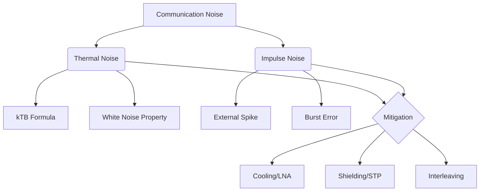

+++
title = "NW #28 충격 잡음 (Impulse Noise) 및 열 잡음 (Thermal Noise)"
date = 2026-03-14
[extra]
categories = "studynote-network"
+++

# NW #28 충격 잡음 (Impulse Noise) 및 열 잡음 (Thermal Noise)

> **핵심 인사이트**: 열 잡음(Thermal Noise)은 모든 통신 시스템에 기본적으로 깔려 있는 예측 가능한 배경 소음인 반면, 충격 잡음(Impulse Noise)은 비정기적이고 강력한 진폭을 가져 디지털 데이터의 버스트 에러(Burst Error)를 유발하는 치명적인 장애 요인이다.

---

## Ⅰ. 열 잡음 (Thermal Noise): 피할 수 없는 배경 소음

### 1. 정의 및 발생 원인
- 도체 내의 전자가 온도로 인해 불규칙하게 운동하며 발생하는 잡음.
- 절대 온도 0K(-273.15℃)가 아닌 모든 환경에서 발생하며, 주파수 전 대역에 고르게 분포(백색 잡음)한다.

### 2. 산출 공식
$$N = k \cdot T \cdot B$$
- $k$: 볼츠만 상수 ($1.38 \times 10^{-23} J/K$)
- $T$: 절대 온도 (K)
- $B$: 대역폭 (Hz)

📢 **섹션 요약 비유**: 열 잡음은 '아무도 없는 조용한 방에서도 들리는 공기의 미세한 흐름 소리'와 같습니다. 기계가 켜져 있는 한 항상 존재합니다.

---

## Ⅱ. 충격 잡음 (Impulse Noise): 디지털 통신의 주적

### 1. 정의 및 발생 원인
- 짧은 시간 동안 발생하는 비연속적이고 불규칙한 고전압의 펄스성 잡음.
- 번개(낙뢰), 전동기 가동, 스위칭 노이즈, 인접 회선의 전기적 충격 등에 의해 발생한다.

### 2. 영향 (Burst Error)
- 아날로그 통신(음성)에서는 잠시 "틱" 하는 소리로 들리나, 디지털 통신에서는 순간적으로 수십~수백 비트의 데이터를 뭉개버려 **버스트 에러**를 유발한다.

```ascii
[ Thermal vs. Impulse Noise ]

    Amplitude
      ^
      |      |  <--- Impulse Noise (High Peak, Short Duration)
      |      |
      | ~~~~~~~~~~~~~~~ <--- Thermal Noise Floor (Constant)
      +------------------------> Time
```

📢 **섹션 요약 비유**: 충격 잡음은 '조용히 공부하는데 갑자기 옆에서 풍선이 펑 터지는 소리'와 같습니다. 너무 커서 그 순간의 정보를 완전히 놓치게 만듭니다.

---

## Ⅲ. 두 잡음의 특성 비교 및 대책

| 구분 | 열 잡음 (Thermal) | 충격 잡음 (Impulse) |
|:---:|:---|:---|
| **발생 주기** | 상시 (Continuous) | 일시적 (Transient) |
| **예측 가능성** | 높음 (공식에 의해 산출) | 낮음 (무작위 발생) |
| **주요 피해** | SNR 저하, 전송 속도 제한 | 데이터 프레임 파손, 버스트 에러 |
| **대응 방법** | 증폭기 냉각, 대역폭 최적화 | **인터리빙(Interleaving)**, 차폐(Shielding) |

📢 **섹션 요약 비유**: 열 잡음은 '안개' 같아서 시야를 조금 흐리게 하지만, 충격 잡음은 '폭탄' 같아서 길 자체를 끊어버립니다.

---

## Ⅳ. 전문가 제언: 인터리빙(Interleaving)의 마법

충격 잡음으로 인한 버스트 에러는 일반적인 오류 정정(FEC) 코드로 복구하기 어렵다. 이를 해결하기 위해 데이터를 섞어서 보내는 **인터리빙(Interleaving)** 기술을 사용한다. 데이터를 흩어 놓으면 충격 잡음이 발생해도 수신측에서 다시 정렬했을 때 에러가 여러 곳으로 분산되어(Random Error), FEC가 이를 충분히 수정할 수 있게 된다. 현대의 ADSL, LTE, 5G 통신에서 인터리빙이 필수인 이유가 바로 이 충격 잡음 때문이다.

---

## 💡 개념 맵 (Knowledge Graph)



---

## 👶 어린이 비유
- **열 잡음**: 라디오를 켰을 때 들리는 아주 작은 "스으으~" 하는 바람 소리예요.
- **충격 잡음**: 갑자기 밖에서 "쾅!" 하고 천둥이 치는 소리예요.
- **결론**: 바람 소리는 작아서 말을 알아들을 수 있지만, 천둥소리가 나면 친구의 말이 하나도 안 들리죠? 그래서 우리는 천둥소리에 대비해 말을 나누어서 여러 번 해줘야 한답니다!
