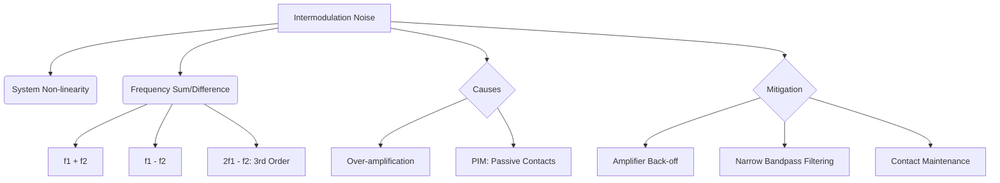

+++
title = "NW #29 상호변조 잡음 (Intermodulation Noise)"
date = 2026-03-14
[extra]
categories = "studynote-network"
+++

# NW #29 상호변조 잡음 (Intermodulation Noise)

> **핵심 인사이트**: 상호변조 잡음(Intermodulation Noise)은 전송 시스템의 비선형(Non-linear) 특성으로 인해 서로 다른 두 개 이상의 주파수 성분이 결합하여 새로운 주파수 성분을 만들어내고, 이것이 다른 채널의 신호를 간섭하는 현상이다.

---

## Ⅰ. 상호변조 잡음의 발생 원리와 비선형성

시스템이 완벽하게 선형적이지 않을 때 신호들이 서로 섞이면서 발생한다.

### 1. 발생 메커니즘
- 주파수 $f_1$과 $f_2$를 동시에 전송할 때, 시스템의 비선형성으로 인해 이들의 합($f_1 + f_2$)과 차($f_1 - f_2$) 및 고조파 성분이 생성된다.
- 이 원치 않는 주파수 성분이 마침 다른 데이터 채널의 주파수 대역에 위치하면 잡음으로 작용한다.

### 2. 비선형 소자의 예
- 과도하게 증폭된 트랜지스터(Amplifier), 노후화된 커넥터, 부식된 안테나 접점 등이 비선형 소자 역할을 한다.

```ascii
[ Frequency Domain View: IM Noise ]

   Original Signals        New IM Components
         |    |              |      |
         |    |   ----->  ---|--|---|--|---
         f1   f2          (f2-f1)  (f1+f2)
```

📢 **섹션 요약 비유**: 상호변조 잡음은 'A와 B가 동시에 소리를 질렀는데, 그 소리들이 공중에서 섞여서 C라는 전혀 다른 소리가 만들어져 방해를 주는 것'과 같습니다.

---

## Ⅱ. 상호변조 왜곡(IMD)과 차수(Order)

상호변조 잡음은 발생한 주파수 조합의 복잡도에 따라 차수를 나눈다.

### 1. 2차 상호변조 (2nd-order IMD)
- $f_1 \pm f_2$
- 원래 신호와 주파수 차이가 커서 필터링이 상대적으로 쉽다.

### 2. 3차 상호변조 (3rd-order IMD)
- $2f_1 - f_2$ 또는 $2f_2 - f_1$
- **가장 치명적임.** 원래 주파수 $f_1, f_2$ 바로 옆에 붙어 있어 필터로 걸러내기가 매우 어렵고 인접 채널을 심각하게 간섭한다.

📢 **섹션 요약 비유**: 3차 잡음은 '나란히 걷는 친구들 바로 옆에 따라붙는 깍두기 같은 존재'라서 떼어내기가 아주 힘듭니다.

---

## Ⅲ. 상호변조 잡음의 영향 및 방지 대책

| 전략 구분 | 상세 내용 | 기대 효과 |
|:---:|:---|:---|
| **증폭기 선형성 확보** | LNA(Low Noise Amplifier)의 백오프(Back-off) 설계 | 비선형 구간 진입 차단으로 IMD 발생 억제 |
| **필터링 (Filtering)** | 대역 통과 필터(BPF) 적용 | 발생한 불필요한 주파수 성분 차단 |
| **주파수 간격 조정** | 인접 채널 간의 주파수 간격(Guard Band) 확보 | IMD 성분이 유효 채널과 겹치지 않게 설계 |
| **부식 및 접점 관리** | 안테나 접점의 부식 방지 (PIM 방지) | 수동 소자에 의한 상호변조(PIM) 제거 |

📢 **섹션 요약 비유**: 마이크 볼륨을 너무 크게 키우면 소리가 찢어지는 것처럼, 통신 장비도 너무 무리하게 출력(증폭)을 높이지 않아야 소리(신호)가 섞이지 않습니다.

---

## Ⅳ. 전문가 제언: PIM (Passive Intermodulation)의 위협

최근 5G와 같은 초고주파 통신에서는 능동 소자뿐만 아니라 안테나나 커넥터 같은 **수동 소자(Passive)**에서의 상호변조인 **PIM** 문제가 대두되고 있다. 금속의 미세한 부식이나 느슨한 결합이 다중 주파수 환경에서 비선형성을 유발하여 수신 감도를 급격히 떨어뜨리기 때문이다. 따라서 현장 엔지니어는 단순한 장비 고장뿐만 아니라 물리적인 **'접점의 청결과 견고함'**이 통신 품질의 핵심 변수가 될 수 있음을 인지해야 한다.

---

## 💡 개념 맵 (Knowledge Graph)



---

## 👶 어린이 비유
- **상호변조**: 파란색 물감과 노란색 물감이 섞여서 내가 원하지 않는 초록색이 생겨버린 거예요.
- **방해**: 나는 파란색 그림만 그리고 싶은데, 자꾸 초록색이 튀어나와서 그림을 망치고 있어요.
- **결론**: 물감이 서로 섞이지 않게 조심해서 칠하거나(필터), 붓을 너무 세게 누르지 말아야(출력 조절) 예쁜 그림을 그릴 수 있답니다!
