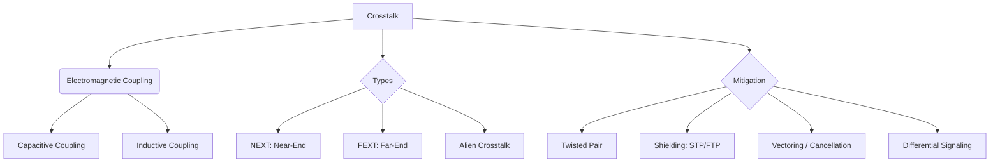

+++
title = "NW #30 누화 (Crosstalk, 혼선)"
date = 2026-03-14
[extra]
categories = "studynote-network"
+++

# NW #30 누화 (Crosstalk, 혼선)

> **핵심 인사이트**: 누화(Crosstalk)는 인접한 두 전송 선로 사이의 전자기적 결합(Coupling)으로 인해 한 선로의 신호가 다른 선로로 유입되어 간섭을 일으키는 현상이며, 주파수가 높을수록 결합 강도가 커져 통신 품질 저하와 정보 유출의 원인이 된다.

---

## Ⅰ. 누화의 발생 메커니즘과 유형

인접한 케이블 간의 상호 인덕턴스(Inductance)와 커패시턴스(Capacitance)에 의해 발생한다.

### 1. 근단 누화 (NEXT: Near-End Crosstalk)
- 송신측 부근에서 인접한 수신 선로로 신호가 유입되는 현상.
- 신호가 감쇠되기 전이므로 영향이 매우 크며, 가장 치명적인 누화이다.

### 2. 원단 누화 (FEXT: Far-End Crosstalk)
- 송신된 신호가 선로를 따라 이동하며 멀리 있는 인접 수신측에 영향을 주는 현상.
- 이동 중 신호가 감쇠되므로 NEXT보다는 상대적으로 작다.

```ascii
[ Crosstalk Visualization ]

     Sender A ----( Signal )-------------------> Receiver A
                      \ (Crosstalk)
     Receiver B <------\------------------------ Sender B
                (NEXT)          (FEXT)
```

📢 **섹션 요약 비유**: 누화는 '옆방에서 하는 비밀 이야기(신호)가 얇은 벽(전자기 결합)을 타고 내 방까지 들려오는 것'과 같습니다.

---

## Ⅱ. 누화 억제를 위한 물리적 설계 기술

통신 엔지니어는 선로 설계 시 누화를 최소화하기 위한 다양한 기법을 적용한다.

### 1. 트위스티드 페어 (Twisted Pair)
- 두 선을 서로 꼬아서 전자기장이 상쇄되도록 유도 (상호 인덕턴스 최소화).
- 꼬임 횟수가 많을수록 누화 방지 성능이 우수함.

### 2. 차폐 (Shielding)
- 케이블 주위를 금속박(Foil)이나 망(Braid)으로 감싸 전자기적 유입을 물리적으로 차단 (STP, FTP 케이블).

### 3. 선로 간 거리 확보 및 배치
- 고속 신호선 사이의 간격을 넓히거나(S/H ratio), 신호선 사이에 그라운드(GND) 가드를 배치.

📢 **섹션 요약 비유**: 옆방 소리를 안 들리게 하려고 '벽을 두껍게 하거나(차폐)', '멀리 떨어져 앉는(거리 확보)' 방법들입니다.

---

## Ⅲ. 디지털 통신에서의 누화 보정 (Vectoring)

초고속 DSL(VDSL, G.fast) 등에서는 다중 회선에서 발생하는 누화를 능동적으로 제거한다.

| 기술 명칭 | 핵심 메커니즘 | 기대 효과 |
|:---:|:---|:---|
| **Vectoring** | 인접 회선의 누화 패턴을 분석하여 역위상 신호를 주입 | 누화 상쇄 (Noise Cancellation) |
| **Differential Signaling** | 두 선의 전위차를 이용해 신호 전송 | 공통 모드 잡음(누화 포함) 효과적 제거 |

📢 **섹션 요약 비유**: '노이즈 캔슬링 이어폰'처럼 주변 소음을 분석해 반대되는 소리를 내어 소음을 없애는 마법 같은 기술입니다.

---

## Ⅳ. 전문가 제언: 고속 통신과 외단 누화 (Alien Crosstalk)

Cat 6a 이상의 10G 이더넷 환경에서는 케이블 내부뿐만 아니라 **'다른 케이블 뭉치'**에서 유입되는 **외단 누화(Alien Crosstalk)**가 주요 병목이 된다. 이는 예측이 불가능한 외부 간섭이므로, 단순한 꼬임만으로는 해결이 어려워 피복 자체를 금속으로 차폐하거나 케이블 외피를 두껍게 설계해야 한다. 엔지니어는 대역폭을 높일수록 눈에 보이지 않는 전자기적 '간섭 반경'이 넓어짐을 인지하고 물리적 계층(L1)의 무결성을 최우선으로 확보해야 한다.

---

## 💡 개념 맵 (Knowledge Graph)



---

## 👶 어린이 비유
- **누화**: 나는 엄마랑 전화하고 싶은데, 전화기 너머로 모르는 옆집 아저씨의 말소리가 작게 들리는 거예요.
- **꼬인 선**: 전화선을 꽈배기처럼 꼬아놓으면 신기하게도 옆집 아저씨 목소리가 사라진답니다.
- **결론**: 선을 잘 꼬거나 튼튼한 껍데기를 씌우면 우리끼리만 비밀 이야기를 정확하게 할 수 있어요!
