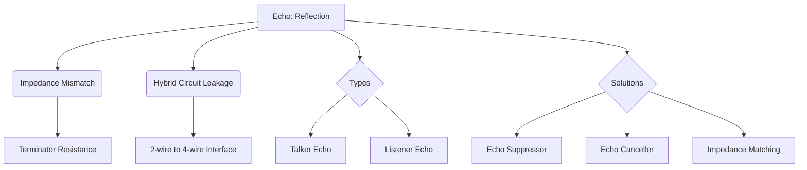

+++
title = "NW #31 에코 (Echo, 반향)"
date = 2026-03-14
[extra]
categories = "studynote-network"
+++

# NW #31 에코 (Echo, 반향)

> **핵심 인사이트**: 에코(Echo, 반향)는 신호 전송 과정에서 임피던스 불일치(Impedance Mismatch)나 하이브리드 회로의 결함으로 인해 송신된 신호의 일부가 반사되어 되돌아오는 현상이며, 데이터의 신뢰성을 떨어뜨리고 음성 통신에서 화자의 집중력을 흐트러뜨리는 주요 간섭 요인이다.

---

## Ⅰ. 에코의 발생 원인과 물리적 메커니즘

신호가 매끄럽게 흐르지 못하고 '벽'에 부딪혀 튕겨 나가는 현상이다.

### 1. 임피던스 불일치 (Impedance Mismatch)
- 서로 다른 매체(예: 동축 케이블과 커넥터)를 연결할 때 저항(Impedance) 값이 다르면, 에너지의 일부가 통과하지 못하고 송신측으로 반사된다.

### 2. 하이브리드 회로 (Hybrid Circuit) 결함
- 2선식 선로(가입자 망)와 4선식 선로(교환기 백본)를 결합할 때, 신호 분리가 완벽하지 않아 송신 신호가 수신 선로로 새어 나가는 현상.

```ascii
[ Echo Reflection Mechanism ]

    Sender ---> [ Interface (Mismatch) ] ---> Receiver
      ^                 |
      |                 v
    [ Echo (Reflection) ]  <--- Same signal returns
```

📢 **섹션 요약 비유**: 에코는 '거울 앞에서 소리를 지르는 것'과 같습니다. 내가 한 말이 벽에 부딪혀 내 귀로 다시 돌아오는 현상입니다.

---

## Ⅱ. 에코의 유형과 지연의 상관관계

에코의 영향력은 지연 시간(Delay)에 비례한다.

| 에코 유형 | 특징 및 영향 | 지연 시간 관점 |
|:---:|:---|:---|
| **직접 에코** | 송신 즉시 되돌아옴 | 무시 가능하거나 측음(Side-tone)으로 활용 |
| **지연 에코** | 장거리 전송 후 반사되어 돌아옴 | 통신 품질에 치명적 (1/4초 이상 시 대화 불가) |
| **청취자 에코** | 반사된 신호가 다시 반사되어 수신측에 도달 | 데이터 왜곡 및 중복 수신 유발 |

📢 **섹션 요약 비유**: 메아리가 바로 옆에서 들리면 괜찮지만, 한참 뒤에 들리면 내가 지금 무슨 말을 하고 있는지 헷갈리게 되는 것과 같습니다.

---

## Ⅲ. 에코 억제 및 제거 기술 (Suppression & Cancellation)

| 기술 명칭 | 핵심 메커니즘 | 기대 효과 |
|:---:|:---|:---|
| **에코 억제기 (Echo Suppressor)** | 신호가 흐르는 한쪽 방향의 통로를 일시적으로 차단 | 단순한 반사 차단 (반이중 통신 유발 가능) |
| **에코 제거기 (Echo Canceller)** | 송신 신호를 복제(Adaptive Filter)하여 반사파와 상쇄 | 전이중 통신 유지 및 정교한 제거 |
| **임피던스 매칭** | 모든 연결 부위의 임피던스를 규격(예: 75Ω, 50Ω)에 맞춤 | 근본적인 반사 발생 원인 제거 |

```ascii
[ Echo Canceller Logic ]

    Sent Signal (x) ----> [ Subtraction ] ----> Result (Clean)
                              ^
    Echo Return (x') --------/   (x - x' = 0)
```

📢 **섹션 요약 비유**: 에코 억제기는 '남이 말할 때 내 입을 막는 것'이고, 에코 제거기는 '내 귀에 들리는 메아리 소리만 쏙 골라내어 지워주는 마법'입니다.

---

## Ⅳ. 전문가 제언: VoIP와 에코의 전쟁

현대 네트워크의 주류인 **VoIP(Voice over IP)** 환경에서는 에코 관리가 더욱 까다롭다. 패킷화 지연과 버퍼링 지연이 더해지면서 에코가 돌아오는 시간이 길어지기 때문이다. 따라서 엔지니어는 단순한 아날로그 임피던스 매칭을 넘어, **AEC (Acoustic Echo Cancellation)** 알고리즘의 탭(Tap) 길이를 충분히 확보하고, **지터 버퍼**를 최적화하여 패킷 네트워크에서도 자연스러운 대화가 가능하도록 설계해야 한다.

---

## 💡 개념 맵 (Knowledge Graph)



---

## 👶 어린이 비유
- **에코**: 산 정상에서 "야호!" 하고 외치면 조금 뒤에 "야호!" 하고 다시 들리는 소리예요.
- **방해**: 전화기로 친구랑 이야기하는데 내 목소리가 자꾸 내 귀에 다시 들리면 정신이 없겠죠?
- **결론**: 전화기 속에 '지우개 기계'를 넣어서 내 목소리가 다시 돌아오는 걸 슥슥 지워주면 깨끗하게 들린답니다!
