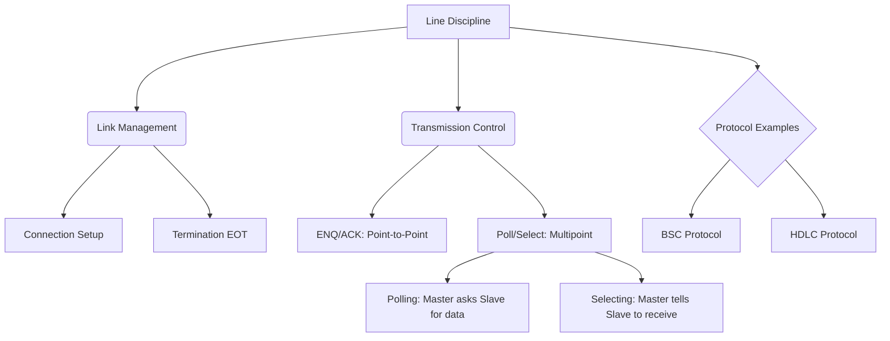

+++
title = "NW #32 회선 제어 규약 (Line Discipline)"
date = 2026-03-14
[extra]
categories = "studynote-network"
+++

# NW #32 회선 제어 규약 (Line Discipline)

> **핵심 인사이트**: 회선 제어 규약(Line Discipline)은 두 개 이상의 통신 장치가 공유하는 링크에서 '누가, 언제 데이터를 보낼 것인가'를 결정하는 규칙이며, ENQ/ACK 방식(점대점)과 Polling/Selection 방식(다중점)을 통해 충돌 없는 효율적인 데이터 교환을 보장한다.

---

## Ⅰ. 회선 제어 규약의 필요성

여러 장치가 하나의 통신 회선을 공유할 때 질서가 없다면 충돌이 발생한다.

### 1. 주요 관리 항목
- **접속 (Connection)**: 물리적 회선 확보.
- **권한 제어 (Discipline)**: 전송권을 누구에게 줄지 결정.
- **해제 (Termination)**: 데이터 전송 완료 후 회선 반납.

### 2. 세션 제어 방식의 분류
- **ENQ/ACK (Enquiry/Acknowledgement)**: 전용 회선(Point-to-Point)에서 주로 사용.
- **Poll/Select**: 주국(Master)-종국(Slave) 구조의 다중점(Multipoint) 환경에서 사용.

```ascii
[ Line Discipline Concept ]

     Station A <----( Protocol )----> Station B
          |                               |
    "Can I send?" --( ENQ )-------------->|
          |<----------( ACK )-- "Yes, OK!"|
    "Data..." ----( DATA )--------------->|
          |<----------( ACK )-- "Got it!" |
    "End." -------( EOT )---------------->|
```

📢 **섹션 요약 비유**: 회선 제어 규약은 '회의실(회선) 예약 시스템'과 같습니다. 누가 먼저 회의실을 쓸지 정하는 약속입니다.

---

## Ⅱ. 핵심 전송 제어 방식 (ENQ/ACK vs. Poll/Select)

### 1. ENQ/ACK 방식 (Peer-to-Peer)
- 전송할 데이터가 있는 쪽이 먼저 **ENQ(Enquiry)**를 보내 상대방의 수신 가능 여부를 묻는다.
- 상대가 **ACK(Acknowledgement)**를 보내면 데이터를 전송하고, 완료 시 **EOT(End of Transmission)**를 보낸다.

### 2. Poll/Select 방식 (Master-Slave)
- **Polling (수신권 부여)**: 주국이 종국에게 "너 보낼 데이터 있니?"라고 묻는 과정.
- **Selection (송신권 통보)**: 주국이 특정 종국에게 "데이터 보낼 테니 준비해!"라고 통보하는 과정.

📢 **섹션 요약 비유**: ENQ/ACK는 '친구 집에 가기 전 전화로 약속 잡기'이고, Poll/Select는 '학교 선생님이 번호순으로 발표시킬 사람을 정하는 것'과 같습니다.

---

## Ⅲ. 회선 제어의 상태 전이 및 절차

1. **회선 연결 (Circuit Establishment)**: 물리적 통로 확보 (다이얼업 등).
2. **링크 확립 (Data Link Establishment)**: ENQ/ACK 또는 Polling을 통한 논리적 전송권 확보.
3. **데이터 전송 (Data Transfer)**: 실제 정보 교환.
4. **링크 해제 (Data Link Termination)**: EOT를 통한 논리적 연결 종료.
5. **회선 절단 (Circuit Termination)**: 물리적 연결 해제.

| 절차 구분 | 전송 제어 문자 | 비고 |
|:---:|:---|:---|
| **조사/문의** | **ENQ** | 전송권 요청 |
| **긍정 응답** | **ACK** | 수신 준비 완료 |
| **부정 응답** | **NAK** | 수신 불가 또는 에러 |
| **전송 완료** | **EOT** | 링크 해제 |

📢 **섹션 요약 비유**: 대화의 시작은 "계세요?", 끝은 "다음에 봐요!"라고 인사하는 예의 범절과 같습니다.

---

## Ⅳ. 전문가 제언: 현대 네트워크와 회선 제어의 진화

과거 메인프레임 중심의 **IBM SDLC**나 **HDLC** 같은 고전적 프로토콜에서는 이 회선 제어가 매우 중요했다. 하지만 오늘날의 **CSMA/CD(이더넷)**나 **CSMA/CA(Wi-Fi)** 같은 분산형 네트워크에서는 중앙 통제(Poll) 대신 스스로 비어 있는 회선을 감지하는 방식으로 진화했다. 그럼에도 불구하고, 엄격한 실시간성이 요구되는 **산업용 이더넷**이나 **TDM 기반 위성 통신**에서는 여전히 Polling 기반의 결정론적(Deterministic) 회선 제어가 성능의 핵심이다.

---

## 💡 개념 맵 (Knowledge Graph)



---

## 👶 어린이 비유
- **회선 제어**: 친구들이랑 마이크 하나를 같이 쓸 때, 누가 먼저 노래할지 정하는 규칙이에요.
- **ENQ/ACK**: "나 노래해도 돼?" 물어보고, "응!" 하면 부르는 거예요.
- **Polling**: 사회자 선생님이 "1번 친구, 할 말 있니?" 하고 물어보는 거예요.
- **결론**: 규칙이 있어야 친구들이랑 안 싸우고 차례차례 재미있게 노래할 수 있답니다!
